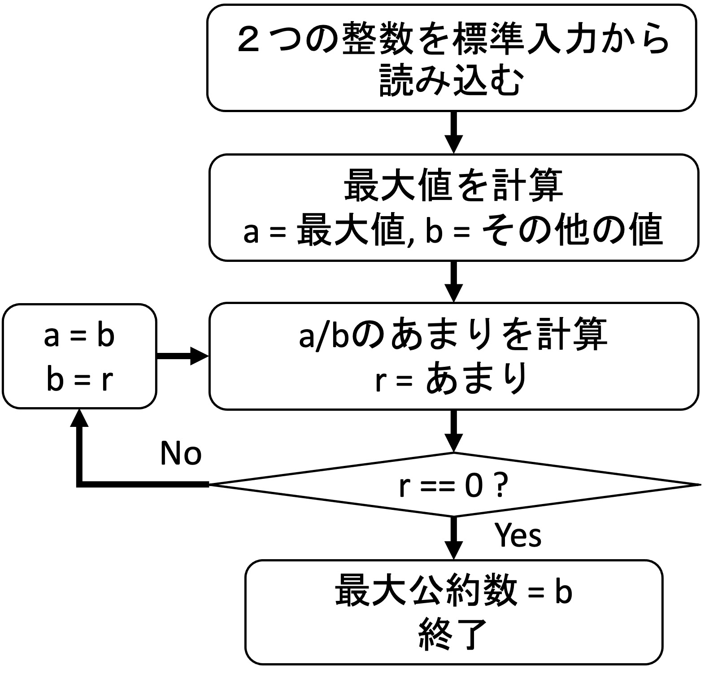
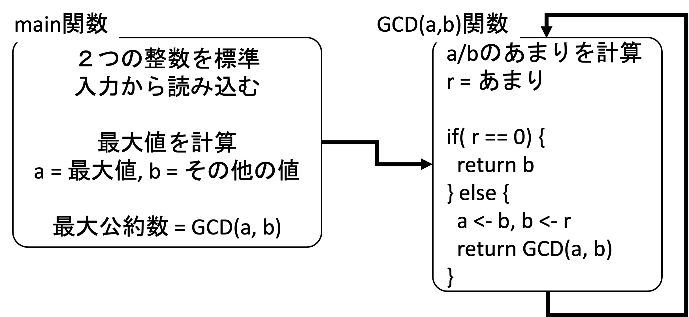

## 学習内容と関連問題
---
1. [関数](https://www.ppa.riec.tohoku.ac.jp/ppa/practice/function1)，[関数（配列引数）](https://www.ppa.riec.tohoku.ac.jp/ppa/practice/function2)
1. [関数の再帰呼び出し](https://www.ppa.riec.tohoku.ac.jp/ppa/practice/recursion)
1. 第４章「編集距離」のうち「編集距離（再帰手続き版）」（p4-1）と「編集距離（再帰＋メモ化）」（p4-2），第５章「ソート」のうち「マージソート」（p5-2）で再帰呼び出しを使う予定．

---
## 関数について
---
### 関数とは？
プログラミングでいう関数とは，与えられた入力（引数）に対してある特定の処理を行い，出力（返り値）を返すブロックのことである．C言語における関数定義の一般的な形式は以下のとおりである：

```
return_type function_name (parameter_list) {
  return_type return_value;
  
  ...function_body...
  
  return return_value;
}
```

- `parameter_list`は関数の”引数”（入力）のリストである．引数の個数は0個でもよいし，複数個でもよい．一つの引数につき，その型と変数名を指定する．
- `return_type`は”返り値”の型であり，`int`，`char`，`double`などの型を指定する．値を返さずに必要な操作を関数内で実行したい場合は，`return_type`には`void`と書く．
- `return_value`は”返り値”を格納するための変数である．
- `function_name`は関数名であり，関数を呼び出すときに使用される．`printf`，`scanf`，`fgets`も関数である．
- `function_body`は関数の動作を定義する文である．引数を使って処理を行い，返り値を計算する．
- `return`は返り値を返すための文法である．標準的なケースでは関数の最後に書かれるが，for文やif文の中で書いてもよく，その場合は`return`文が書かれた行でその関数呼び出しは終了する．
- 引数は何個でも取ることができるが，返り値は１つしか指定できないことに注意．

### 関数の例
以下の関数は，整数`x`と正の整数`n`を引数に取って，`x`の`n`乗を計算し，その値を返す：

```
int pow (int x, int n) {
  int ret;

  ret = 1;
  while(n > 0) {
    ret = ret * x;
    n = n - 1;
  }

  return ret;
}
```

以下の関数は，整数配列`x`を引数に取って，0~2番目の要素の二乗を計算し，それぞれを`x`に代入する．C言語の仕様上，関数の返り値は１つしか指定できないため，関数で複数の値を計算させたい場合は，配列を引数に渡して，その配列（あるいは別の配列）に計算結果を格納させる．こういった場合，関数の返り値は不要なので，型は`void`型で，”何も返さない”ことを意味する`return;`を関数の最後あるいは途中に書く（省略することも可能）．

```
void powArray (int x[]) {
  x[0] = x[0] * x[0];
  x[1] = x[1] * x[1];
  x[2] = x[2] * x[2];
  
  return;
}
```

返り値用の新しい変数は必ずしも必要ではなく，以下の引数`a`と`b`の和を返す関数のように，計算式を直接`return`の後に書いてもOK．

```
double add(double a, double b){
  return a+b;
}
```

引数も返り値も使わない関数もありうる．以下の関数はエラーメッセージを標準出力する関数である．

```
void print_errmsg(){
  printf("ERROR!\n");
}
```

### 関数の宣言・定義・呼び出し

これまで書いてきた
```
int main(){
   ...
   return 0;
}
```
は`main`関数と呼ばれ，C言語のプログラムでは必ず１つだけ定義する必要がある，特殊な関数である．（`main`関数の引数や返り値についてはこの授業では触れない．）１つのファイルでプログラムを完結させる場合は，`main`関数以外の関数は，`main`関数の前方に”宣言”される必要があり（前方宣言），それらの”定義”は`main`関数の後方でされることが推奨される．

関数の宣言とは，中身を書かずに返り値の型，関数名，引数リストのみを明記しておくことを意味する．書き方は以下のとおり：
```
return_type function_name (parameter_list);
```

C言語ではプログラムは上の行から順にコンパイルされるため，`main`関数で使用される前に「こういう書式の関数を使う予定ですよ」ということをコンパイラに宣言（言い換えると，予告）する必要がある．

関数の定義とは，「関数とは？」で記載したように関数の中身も全て書くことを意味する．前方宣言と同時に定義をすることも可能だが，見やすさ・書きやすさの観点から，本演習では関数の後方定義を仕様としている．

関数を実際に使うことを関数の”呼び出し”と言い，以下のように返り値と引数を指定して行う：
```
  int a = 10, b;
  b = pow(a, 4);
```

引数は変数でも，固定の値でも，計算式（`pow(2*a, 2+3)`など）でもよい．

以下に，関数宣言・定義・呼び出しの例を挙げる．

#### 例1
```
#include <stdio.h>

int pow (int x, int n);

int main () {
  int a = 3, n = 4, b;

  b = pow(a, n);
  printf("%d^%d = %d\n", a, n, b);

  return 0;
}

int pow (int x, int n) {
   // 「関数とは？」で既出なので省略
}
```
[〈このコードを実行する〉](https://www.ppa.riec.tohoku.ac.jp/ppa/practice/function1)

#### 例1の出力

```
3^4 = 81
```


#### 例2

```
#include <stdio.h>

void powArray (int x[]);

int main () {
  int a[] = {1, 2, 3};

  printf("%d, %d, %d\n", a[0], a[1], a[2]);
  powArray(a);
  printf("%d, %d, %d\n", a[0], a[1], a[2]);
  powArray(a);
  printf("%d, %d, %d\n", a[0], a[1], a[2]);

  return 0;
}

void powArray (int x[]) {
  ... // 「関数とは？」で既出なので省略
}
```
[〈このコードを実行する〉](https://www.ppa.riec.tohoku.ac.jp/ppa/practice/function2)

#### 例2の出力

```
1, 2, 3
times powArray called = 1
1, 4, 9
times powArray called = 2
1, 16, 81
```

---
## 導入文
---
**ユークリッドの互除法**とは２つの自然数の最大公約数（greatest common divisor）を効率的に求める方法である．2つの自然数 $a, b (a \geq b)$ について、$a$の$b$による剰余を $r$ とすると、$a$と$b$ の最大公約数は$b$と$r$との最大公約数に等しいという性質が成り立つ．この性質を利用して、$b$を$r$で割った剰余、 除数 $r$ をその剰余で割った剰余、と剰余を求める計算を逐次繰り返す．剰余が$0$になった時の除数が$a$と$b$との最大公約数となる．

まず，具体例を考える．以下の例では$7722$と$2520$の最大公約数の求め方を具体的に示す．ここでは，ステップ２と３は繰り返し実行されることがわかる．
- ステップ１ : $a = 7722$, $b = 2520$
- ステップ２ : $7722 \div 2520 = 3$, あまり$r=162$
- ステップ３ : $r \neq 0$なので，$a=2520$, $b=162$とする
- ステップ２ : $2520 \div 162 = 15$, あまり$r=90$
- ステップ３ : $r \neq 0$なので, $a=162$, $b=90$とする
- ステップ２ : $162 \div 90 = 1$, あまり$r=72$
- ステップ３ : $r \neq 0$なので, $a=90$, $b=72$とする
- ステップ２ : $90 \div 72 = 1$, あまり$r=18$
- ステップ３ : $r \neq 0$なので, $a=72$, $b=18$とする
- ステップ２ : $72 \div 18 = 4$, あまり$r=0$
- ステップ３ : $r = 0$なので, **最大公約数 $=b=18$**．終了．


ユークリッドの互除法のアルゴリズムを図１のフローチャートに示す．ここでは`r==0`になるまで繰り返す部分の実装方法として，ループを使う方法と再帰的呼び出しを使う方法がある．この問題では，再帰的呼び出しにより実装する．
<p align="center">
  
  <figcaption align = "center"><b>図１ - ユークリッドの互除法アルゴリズムのフローチャート</b></figcaption>
</p>

図２では，初期入力データ整理の部分と繰り返す部分に分けて表現されている．データ整理のブロックを`main`関数，また，繰り返し処理ブロックを`GCD`関数とする．`GCD`関数の中から自分自身を再帰的に呼び出している．`r==0`の条件で再帰が終了される．このブロック図に基づいてcプログラムを構築することができる．
<p align="center">
  
  <figcaption align = "center"><b>図２ - main関数と再帰的呼び出し</b></figcaption>
</p>

実際の再帰呼び出し関数の書き方については，階乗（$n! = n*(n-1)*...*2*1$）を再帰呼び出しで計算するコード[〈こちら〉](https://www.ppa.riec.tohoku.ac.jp/ppa/practice/recursion)を参照のこと．


---
## 問題
---

図２に基づいて，`main`関数と`GCD(int a, int b)`関数を完成させ，ユークリッドの互除法を実装せよ．

---
## 仕様
---

- 図１のフローチャートに従って実装すること．
- `int GCD(int a, int b)`関数を再帰的に呼び出すこと．
- 下記の表示方法のとおりに出力すること．最大公約数の出力の後は必ず改行を入れること．空白`⊔`と改行`↩︎`が仕様通り出力されていないと不正解になる．

- 表示方法
  1. 入力データの表示
     入力の順番に数値を並べる．
      ```
      INIT:::::::::::⊔入力1,⊔入力2↩︎
      ```
      ”入力1”と”入力2”は標準入力から受け取る2つの数字である．次に述べるGCDの中と異なり，桁は揃えなくてよい．
  2. 途中結果の表示
     ```
     GCD(大きい値,⊔小さい値)⊔r⊔=⊔あまり↩︎
     例：
     GCD(2520,  162) r = 90↩︎
     ```
     GCDの中の２つの数値は，４桁に揃えて出力させること（`,`のあとは必ず空白文字1個を入ること）．値が３桁以下の場合は，前に空白を入れて表示する．そのためには，`printf`の中に`%4d`記述を用いる．まず`printf("%4d, %4d\n", a, b);`と書いて動作を確認すること．
     
  3. 答え（最大公約数）の表示
      ```
      DONE:::::::::::↩︎
      18↩︎
      ```

---
## 実行例
---
---
### 実行例(1)
---
- 入力データ
```
7722 2520
```
- 出力例
```
INIT::::::::::: 7722, 2520
GCD(7722, 2520) r = 162
GCD(2520,  162) r = 90
GCD( 162,   90) r = 72
GCD(  90,   72) r = 18
GCD(  72,   18) r = 0
DONE:::::::::::
18
```

---
### 実行例(2)
---
- 入力データ
```
345 6789
```
- 出力例
```
INIT::::::::::: 345, 6789
GCD(6789,  345) r = 234
GCD( 345,  234) r = 111
GCD( 234,  111) r = 12
GCD( 111,   12) r = 3
GCD(  12,    3) r = 0
DONE:::::::::::
3
```

---
### 実行例(3)
---
- 入力データ
```
73 331
```
- 出力例
```
INIT::::::::::: 73, 331
GCD( 331,   73) r = 39
GCD(  73,   39) r = 34
GCD(  39,   34) r = 5
GCD(  34,    5) r = 4
GCD(   5,    4) r = 1
GCD(   4,    1) r = 0
DONE:::::::::::
1
```
