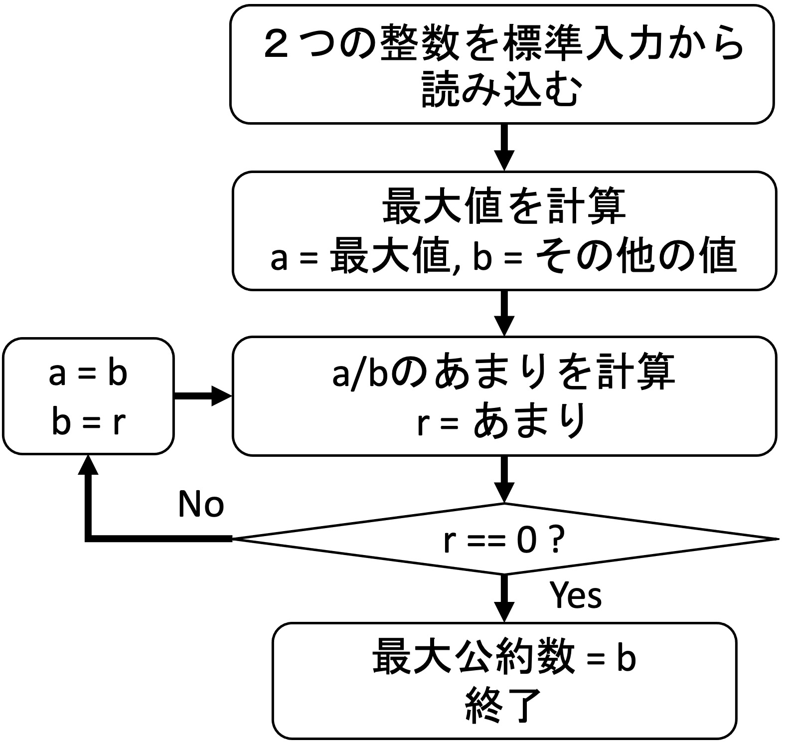
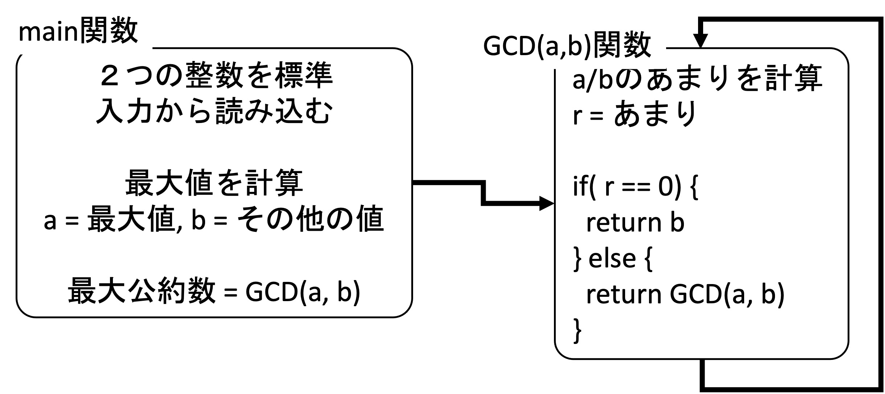

**ユークリッドの互除法**とは２つの自然数の最大公約数（greatest common divisor）を効率的に求める方法である．2つの自然数 $a, b (a \geq b)$ について、$a$の$b$による剰余を $r$ とすると、$a$と$b$ の最大公約数は$b$と$r$との最大公約数に等しいという性質が成り立つ．この性質を利用して、$b$を$r$で割った剰余、 除数 $r$ をその剰余で割った剰余、と剰余を求める計算を逐次繰り返す．剰余が$0$になった時の除数が$a$と$b$との最大公約数となる．

まず，具体例を考える．以下の例では$7722$と$2520$の最大公約数の求め方を具体的に示す．ここでは，ステップ２と３は繰り返し実行されることがわかる．
- ステップ１ : $a = 7722$, $b = 2520$
- ステップ２ : $7722 \div 2520 = 3$, あまり$r=162$
- ステップ３ : $r \neq 0$なので，$a=2520$, $b=162$とする
- ステップ２ : $2520 \div 162 = 15$, あまり$r=90$
- ステップ３ : $r \neq 0$なので, $a=162$, $b=90$とする
- ステップ２ : $162 \div 90 = 1$, あまり$r=72$
- ステップ３ : $r \neq 0$なので, $a=90$, $b=72$とする
- ステップ２ : $90 \div 72 = 1$, あまり$r=18$
- ステップ３ : $r \neq 0$なので, $a=72$, $b=18$とする
- ステップ２ : $72 \div 18 = 4$, あまり$r=0$
- ステップ３ : $r = 0$なので, **最大公約数 $=b=18$**．終了．


ユークリッドの互除法のアルゴリズムを図１のフローチャートに示す．ここでは`r==0`になるまで繰り返す部分の実装方法として，ループを使う方法と再帰的呼び出しを使う方法がある．この問題では，再帰的呼び出しにより実装する．
<p align="center">
  
  <figcaption align = "center"><b>図１ - ユークリッドの互除法アルゴリズムのフローチャート</b></figcaption>
</p>

図２では，初期入力データ整理の部分と繰り返す部分に分けて表現されている．データ整理のブロックを`main`関数，また，繰り返し処理ブロックを`GCD`関数とする．`GCD`関数の中から自分自身を再帰的に呼び出している．`r==0`の条件で再帰が終了される．このブロック図に基づいてcプログラムを構築することができる．
<p align="center">
  
  <figcaption align = "center"><b>図２ - main関数と再帰的呼び出し</b></figcaption>
</p>


---
## 問題
---

図２に基づいて，`main`関数と`GCD(int a, int b)`関数を完成させ，ユークリッドの互除法を実装せよ．

---
## 仕様
---

- 図１のフローチャートに従って実装すること．
- `int GCD(int a, int b)`関数を再帰的に呼び出すこと．
- 下記の表示方法のとおりに出力すること．最大公約数の出力の後は必ず改行を入れること．空白`⊔`と改行`↩︎`が仕様通り出力されていないと不正解になる．

- 表示方法
  1. 入力データの表示
     入力の順番に数値を並べる．
      ```
      INIT:::::::::::⊔入力1,⊔入力2↩︎
      ```
      ”入力1”と”入力2”は標準入力から受け取る2つの数字である．次に述べるGCDの中と異なり，桁は揃えなくてよい．
  2. 途中結果の表示
     ```
     GCD(大きい値,⊔小さい値)⊔r⊔=⊔あまり↩︎
     例：
     GCD(2520,  162) r = 90↩︎
     ```
     GCDの中の２つの数値は，４桁に揃えて出力させること（`,`のあとは必ず空白文字1個を入ること）．値が３桁以下の場合は，前に空白を入れて表示する．そのためには，`printf`の中に`%4d`記述を用いる．まず`printf("%4d, %4d\n", a, b);`と書いて動作を確認すること．
     
  3. 答え（最大公約数）の表示
      ```
      DONE:::::::::::↩︎
      18↩︎
      ```

---
## 実行例
---
---
### 実行例(1)
---
- 入力データ
```
7722 2520
```
- 出力例
```
INIT::::::::::: 7722, 2520
GCD(7722, 2520) r = 162
GCD(2520,  162) r = 90
GCD( 162,   90) r = 72
GCD(  90,   72) r = 18
GCD(  72,   18) r = 0
DONE:::::::::::
18
```

---
### 実行例(2)
---
- 入力データ
```
345 6789
```
- 出力例
```
INIT::::::::::: 345, 6789
GCD(6789,  345) r = 234
GCD( 345,  234) r = 111
GCD( 234,  111) r = 12
GCD( 111,   12) r = 3
GCD(  12,    3) r = 0
DONE:::::::::::
3
```

---
### 実行例(3)
---
- 入力データ
```
73 331
```
- 出力例
```
INIT::::::::::: 73, 331
GCD( 331,   73) r = 39
GCD(  73,   39) r = 34
GCD(  39,   34) r = 5
GCD(  34,    5) r = 4
GCD(   5,    4) r = 1
GCD(   4,    1) r = 0
DONE:::::::::::
1
```
