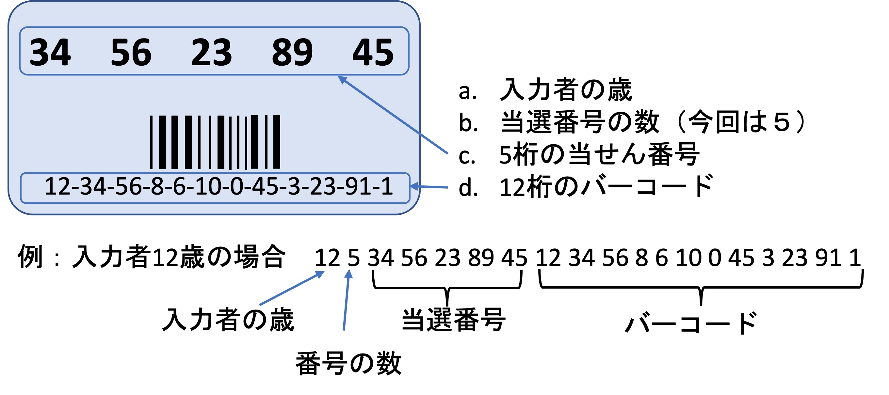

プログラムの中に発生するエラー（バグ）は以下の４種類に分類できる．
- 構文エラー
- リンカーエラー
- ランタイムエラー（実行時エラー）
- 論理エラー

これらのエラーを直すことは<font color="red"><b>デバッグ</b></font>と呼ばれる．この中でリンカーエラーとは複数のバイナリをリンクするときのエラーであり、プログラミング演習Aの対象範囲外であるので触れない．

本問題では、残る３つのエラーについて取り扱う．それぞれの説明を以下の表に示す．

<table border="1">
    <tr>
      <th>エラーの種類</th>
      <th>エラーの説明</th>
      <th>エラーの発見方法</th>
    </tr>
    <tr>
      <td>構文エラー</td>
      <td>言語の構文や規則に違反</td>
      <td>コンパイルが失敗することで発見</td>
    </tr>
    <tr>
      <td>ランタイムエラー</td>
      <td>実行の失敗に関するエラー</td>
      <td>プログラムの強制終了，または異常な動作により実行時に発見</td>
    </tr>
    <tr>
      <td>論理エラー</td>
      <td>期待と異なる出力</td>
      <td>テストパターン（テスト入力）を入れ，期待と異なる動作を確認することで発見</td>
    </tr>
</table>
<br> 
<span style="color:red">この問題全体では、すでに書かれている初期コードが自動採点システムの中のエディタ上に表示されるようになっている．
自分で仕様に書かれているコードを手入力するのではなく、自動採点システムのエディタ上に用意された初期コードを修正して、問題を解くことに注意せよ．
また、修正の途中で初期コードに戻りたい場合は”初期コードのロード”ボタンを押す．</span>
初期コードの一番上には以下のような文章が表示され、エラーを含む初期コードであることを表す．
```
//////////////////////////////////////////////////////
//  東北大学　プログラミング演習A           
//  問題 p23a 用のエラーを含む初期コードです。         
//  この初期コードを修正し問題を解いてください．  
//////////////////////////////////////////////////////
```
本問題には3つのステップがあが、それぞれのステップがお互いに独立している．一つのステップがおわり次のステップに行くと、そのステップの初期コードが自動的に現れる．
正しい初期コードになっているかを確認するため各初期コードの先頭のコメントを確認せよ．

---
## 問題ａ (ステップ1/3)
---

この問題は構文エラーのデバッグについての演習問題である．この問題のプログラムは，標準入力から受け取る8個の数値に対して処理を行う．
数値が4より小さい場合、４に等しい場合、５と8の間にある場合、それ以外の場合のいずれかに分類し、その分類結果を出力する．


---
### 仕様
---

- 以下は構文エラーを含む初期コードであり、このままコンパイルするとコンパイルが失敗する．
  ```
  #include <stdio.h>

  int main() {
    int b[8];
    int i;

    for(i=0; i<8: i++) {                    //8個の数字を標準入力から受け取る
      scanf("%d", &b[i]);
    }

    for(i=0; i<8; i++) {
      if(b[i] < 4) {                        //4より小さい場合の判定
        printf("Value[%d] < 4\n", i)
      }
       else if(b[i] == 4) {                  //4に等しい場合の判定
          printf("Value[%d] == 4\n", i);
        }
        else if(b[i] < 8) {                 //5以上7以下の場合の判定 
          printf("5 <= Value[%d] < 8\n", i);
        }
        else {                              //8以上の場合の判定
          printf("Value[%d] >= 8\n", i);
        }
      }
    }

    return 0
  }
  ```
- プログラムの正しい動作を以下に示す．ここで”$”は0から７の数字のいずれかである．
  - 値が4より小さい場合は以下のように出力される
  ```
  Value[$] < 4↩︎
  ```
  - ４に等しい場合は以下のように出力される
  ```
  Value[$] == 4↩︎
  ```
  - ５と8の間にある場合は以下のように出力される
  ```
  5 <= Value[$] < 8↩︎
  ```
  - 8以上の場合は以下のように出力される
  ```
  Value[$] >= 8↩︎
  ```
  

---
### 手順
---

以下はこの問題に限らず、一般的なデバッグ方法の一部である．

1. まずはコードのインデントが揃うように書き直す．この段階でも間違いが見つかる可能性がある．
2. コンパイルし、エラーの出る行番号を確認する．
3. 一番上のエラーから直していく．
4. 実際のエラーはコンパイル結果の行ではなく，その前の行にある場合もあるので注意が必要．
5. 一つの間違いにより複数の箇所にエラー表示が出る場合もある．このような混乱を防ぐためエラーを直すたびにコンパイルし，その結果を見て次のデバッグを行うほうが良い．


---
### 実行例
---

---
#### 実行例(1)
---
- 入力データ
```
9 8 0 2 5 12 5 1
```
- 出力例
```
Value[0] >= 8↩︎
Value[1] >= 8↩︎
Value[2] < 4↩︎
Value[3] < 4↩︎
5 <= Value[4] < 8↩︎
Value[5] >= 8↩︎
5 <= Value[6] < 8↩︎
Value[7] < 4↩︎
```

---
#### 実行例(2)
---
- 入力データ
```
0 50 23 1 4 8 5 6
```
- 出力例
```
Value[0] < 4↩︎
Value[1] >= 8↩︎
Value[2] >= 8↩︎
Value[3] < 4↩︎
Value[4] == 4↩︎
Value[5] >= 8↩︎
5 <= Value[6] < 8↩︎
5 <= Value[7] < 8↩︎
```

******************


---
## 問題b (ステップ2/3)
---

この問題ではVLA（Variable-Length Array; 可変長配列）の範囲外アクセスによるランタイムエラーのデバッグを行う．

C言語では配列の範囲外アクセスにより、プログラムの強制終了や予測不能な動作だけでなく、コンパイル済のプログラムの書き換えというセキュリティの問題まで起きる可能性がある．一方で、直接的に範囲外アクセスをしたことが分からないケースがほとんどで、ランタイムエラーが出ても原因の特定が非常に難しいため，細心の注意が必要である．
この問題では宝くじの当選番号をチェックするシステムのサンプルプログラムのデバッグを行う．

サンプルプログラムの範囲外アクセスのため、ソースコードに書かれている”1等賞”の番号が実行中に変更されていることにも着目せよ．
宝くじの表面には以下の図1に示すように，当選番号，２次元バーコードとバーコード関連の数字が書かれている．
<p align="center">
  
  <figcaption align = "center"><b>図１ - 宝くじの表面と入力データフォーマット</b></figcaption>
</p>
当選番号のチェックのため以下の順番にシステムに入力する
1. 入力者の歳
2. 当選番号の数
3. 当選番号
4. バーコードの12桁の数字


---
### 仕様
---

- 以下のサンプルコードからデバッグを開始する．
  ```
  #include <stdio.h>

  int main() {
    int N, M;
    scanf("%d%d", &M, &N);                                    //年齢と番号の数を標準入力から受け取る

    int yourNumber[N];                                        //入力の当選番号用の可変長配列
    int winningNumber[5] = {10,23,44,45,21};                  //１等賞の番号を記憶するための配列
    int barcode[12];                                          //バーコード保存用の配列
    int minAge = 10;                                          //入力者の最小年齢

    if(M < minAge) {                                          //年齢チェック
      printf("You are not eligible\n");
    }
    else if(N != 5) {                                         //当選番号の数が異なる
      printf("Ticket not found\n");
    }
    else {                           
      int match = 1;

      for(int i=0; i<M; i++) {                                //当選番号を標準入力から受け取る
        scanf("%d", &yourNumber[i]);
      }

      for(int i=0; i<5; i++) {                                //当選番号と１等賞番号の比較
        if(yourNumber[i] != winningNumber[i]) {
          match = 0;
          break;
        }
      }

      for(int i=0; i<12; i++) scanf("%d", &barcode[i]);       //バーコードを標準入力から受け取る

      printf("=== Enshu Loto Jumbo 2023 ===\n");
      printf("Winning numbers : ");
      for(int i=0; i<5; i++) printf("%d ", winningNumber[i]); //１等賞番号の出力
      printf("\n");
      printf("-----------------------------\n");

      printf("Your barcode : ");
      for(int i=0; i<10; i++) printf("%d-", barcode[i]);      //バーコードの出力
      printf("%d\n", barcode[11]);

      if(match == 0) {                                        //一致する場合の判定
        printf("You won 1,000,000,000\n");
      }
      else {                                                  //不一致の場合の判定
        printf("You lose\n");
      }
    }

    return 0;
  }
  ``` 
- サンプルプログラムには構文エラーは含まれていないが、ランタイムエラーと論理エラーが複数含まれている．
- １等賞の番号で配列が初期化されている．
  ```
  int winningNumber[5] = {10,23,44,45,21};                  //１等賞の番号を記憶するための配列
  ```
- 入力される当選番号を保存するため可変長配列を用意する．色々な宝くじに対応するように可変長配列が使われており，入力される当選番号の数に合わせて配列の長さが実行時に設定される．
また，バーコード番号を保存するためにも長さ12の配列を用意する．
- 入力に対してシステムが以下の処理をする
  - 入力者の年が10歳以下の場合以下のように出力され，プログラムが終了される．
    ```
    You are not eligible↩︎
    ```
  - 当選番号の数が５でない場合は以下のように表示され，終了される．
    ```
     Ticket not found↩︎
    ```
  - 当選番号の数が５の場合１等の番号と入力された番号を比較される．また，バーコード番号も標準入力から受け取る．その後以下のように出力される．
    ```
    ===  Enshu Loto Jumbo 2023  ===↩︎  	
    Winning numbers :	10 23 44 45 21↩︎
    -----------------------------------↩︎
    Your barcode    :  12-34-56-8-6-10-0-45-3-23-91-1↩︎
    ```
    - 一致した場合は以下のように表示される．
      ```
      You won 1,000,000,000↩︎
      ```
    - 一致しない場合は以下のように表示される．
      ```
       You lose↩︎
      ```
  
---
### 手順
---

1. コンパイルして実行例に対して正しく動くのかを確認する．
2. 初期コードには構文エラーが含まれていないので、デバッグ途中でコンパイルが失敗した場合は、ステップ1/3の手順に従って構文エラーを直す．
3. 実行例に対して正しく動かない場合はデバッグする．
4. デバッグする際に配列外にアクセスされているのかを確認する．そのため配列のインデックスをprintfを使って出力してみることができる．
5. 論理エラーに関してもデバッグする．必要に応じてprintfを使って途中結果を出力する．
6. 動作確認が通らない場合、さらにデバッグを行う

---
### 実行例
---

---
#### 実行例(1)
---
- 入力データ
```
17 5 6 76 55 45 33 8 89 9 5 19 49 17 6 76 55 45 33
```
- 出力例
```
=== Enshu Loto Jumbo 2023 ===↩︎
Winning numbers : 10 23 44 45 21↩︎
-----------------------------↩︎
Your barcode : 8-89-9-5-19-49-17-6-76-55-45-33↩︎
You lose↩︎
```

---
#### 実行例(2)
---
- 入力データ
```
42 5 10 23 44 45 21 12 3 88 9 9 51 45 78 7 61 87 56
```
- 出力例
```
=== Enshu Loto Jumbo 2023 ===↩︎
Winning numbers : 10 23 44 45 21↩︎
-----------------------------↩︎
Your barcode : 12-3-88-9-9-51-45-78-7-61-87-56↩︎
You won 1,000,000,000↩︎
```


---
#### 実行例(3)
---
- 入力データ
```
9 5 45 67 34 12 98 98 4 56 78 3 49 34 3 29 54 37 28 11
```
- 出力例
```
You are not eligible↩︎
```

******************

---
## 問題c (ステップ3/3)
---

この問題の目的は、アクセス不可能なメモリ領域にアクセスしようとするときに起こる”Segmentation fault”エラーのデバッグである．ここで言う”アクセス可能／不可能”とは、実行しているプログラムに対してOSが使用を許可している（割り当てている）メモリ領域の範囲内であればアクセスは可能、範囲外であればアクセスは不可能、という意味である。

<span style="color:red">本問題では配列のメモリ領域を実行時に確保するため、”動的メモリ確保”を利用している．動的メモリ確保については第3章の問題p32で詳しく学習するので、今は詳細は触れない．</span>配列を利用するときには今まで通りの配列と同じ使い方で問題ない．

配列の領域外にアクセスしてもその領域がアクセス可能であれば、実行されるある入力パターンに対して正しく動く場合もある．しかしながら、別の入力パターンに対して不明な動作が出る場合があり、非常にデバッグが困難な問題になる．配列の領域外にアクセスし、その領域はアクセス不可能な場合”Segmentation fault”が発生し，プログラムが強制終了される．この場合はアクセス不可能なメモリ領域にアクセスされていることは確実にわかるので、比較的容易にデバッグできる．

サンプルプログラムでは学生の成績により合格判定し並べる処理を行う．
標準入力から受け取る学生の成績は学籍番号に並べられている．成績の受け取る順と学籍番号の関係は以下に示す．
```
|  成績の順  |  9  |  8  |  0  |  2  |  5  | 12  |  5  |  1  |
|  -------------------------------------------------------  |
|  学籍番号  |  1  |  2  |  3  |  4  |  5  |  6  |  7  |  8  | 
```


---
### 仕様
---

- 以下の初期コードからデバッグを始める．
  ```
  #include <stdio.h>
  #include <stdlib.h>

  int main() {
    int nStudents;

    scanf("%d", &nStudents);                             //???
    int* seseki = (int*)malloc(sizeof(int)*nStudents);   //成績を記憶する配列の動的確保
    int* bangou = (int*)malloc(sizeof(int)*nStudents);   //学籍番号を記憶する配列の動的確保

    for(int i=0; i<nStudents; i++) {                     //???
      scanf("%d", &seseki[i]);
    }

    int end = nStudents - 1;
    int begin = 0;
    for(int i=0; i<nStudents; i++) {                     
      if(seseki[i] >= 60) {                              //???
        bangou[end] = i+1;                               //???
        end--;                                           //???
      }
      else {                                             //???
        bangou[begin] = i;                               //???
        begin++;                                         //???
      }
    }

    printf("Failed students\n");
    for(int i=0; i<=end; i++) {                          //???
      printf("Gakuseki bangou = %d, Marks = %d\n", bangou[i], seseki[bangou[i]]);
    }

    printf("\nPassed students\n");
    for(int i=nStudents-1; i>end; i++) {                 //???
      printf("Gakuseki bangou = %d, Marks = %d\n", bangou[i], seseki[bangou[i]]);
    }

    free(seseki);                                        //確保したメモリ領域を開放
    free(bangou);                                        //確保したメモリ領域を開放

    return 0;
  }
  ``` 
- サンプルプログラムではまず学生の数を標準入力から受け取り，学生の成績を入れる配列と学籍番号を入れる配列を動的メモリ確保する．動的メモリ確保する箇所（`malloc`という関数を呼び出している行）およびそのメモリ領域を解放する箇所（`free`という関数を呼び出している行）に関してはエラーは含まれていない．
- 学籍番号順になっている学生の成績を標準入力から受け取り，その成績を配列に保存する．ここで学籍番号は１から始まり、１、２、３…と順番になっていると仮定する．
- 次に成績の配列の最初から順番に見ながら，６０点以上で合格した学生の学籍番号は，学籍番号の配列の最後から左へ詰めていく．
- 不合格の学生の学籍番号は，学籍番号の配列の最初から右へ詰めていく．
- 次に不合格の学生は学籍番号の小さい方から順番に表示する．
- 最後に合格の学生は学籍番号が小さい方から順番に表示する．  
- プログラムコードの'???'のところにコメントを追加する．
- インデントと行間は適切に入れる．


---
### 手順
---

1. 左下にある”回答例のロード”ボタンをクリックすると解答例がロードされる．解答例にはコンパイルエラーは含まれていない．
2. 実行例に関してプログラムを実行し，エラーを確認する．
3. どの配列のどこに範囲外アクセスになっているのかを確認しデバッグする．
  - 一つのデバッグ手法としては，コードを部分ごとにコメントアウトしエラーを確認することである．
  - しかしながら，コメントアウトのためコンパイラーの最適化により実際にアクセスしないように実行される場合もある．
  - 別の手法としては，配列のアクセスるインデックスを出力して確認する方法もある．
  - 部分実行とンデックスを出力することは一緒に利用すると効率よくデバッグできる．
4.  その他にも論理エラーがあればデバッグする．


---
### 実行例
---


---
#### 実行例(1)
---
- 入力データ
```
13 45 100 56 34 89 98 9 34 67 88 43 0 77
```
- 出力例
```
Failed students↩︎
Gakuseki bangou = 1, Marks = 45↩︎
Gakuseki bangou = 3, Marks = 56↩︎
Gakuseki bangou = 4, Marks = 34↩︎
Gakuseki bangou = 7, Marks = 9↩︎
Gakuseki bangou = 8, Marks = 34↩︎
Gakuseki bangou = 11, Marks = 43↩︎
Gakuseki bangou = 12, Marks = 0↩︎
↩︎
Passed students↩︎
Gakuseki bangou = 2, Marks = 100↩︎
Gakuseki bangou = 5, Marks = 89↩︎
Gakuseki bangou = 6, Marks = 98↩︎
Gakuseki bangou = 9, Marks = 67↩︎
Gakuseki bangou = 10, Marks = 88↩︎
Gakuseki bangou = 13, Marks = 77↩︎
```


---
#### 実行例(2)
---
- 入力データ
```
5 33 25 10 47 59
```
- 出力例
```
Failed students↩︎
Gakuseki bangou = 1, Marks = 33↩︎
Gakuseki bangou = 2, Marks = 25↩︎
Gakuseki bangou = 3, Marks = 10↩︎
Gakuseki bangou = 4, Marks = 47↩︎
Gakuseki bangou = 5, Marks = 59↩︎
↩︎
Passed students↩︎
```


---
#### 実行例(3)
---
- 入力データ
```
7 87 67 90 99 100 88 90
```
- 出力例
```
Failed students↩︎
↩︎
Passed students↩︎
Gakuseki bangou = 1, Marks = 87↩︎
Gakuseki bangou = 2, Marks = 67↩︎
Gakuseki bangou = 3, Marks = 90↩︎
Gakuseki bangou = 4, Marks = 99↩︎
Gakuseki bangou = 5, Marks = 100↩︎
Gakuseki bangou = 6, Marks = 88↩︎
Gakuseki bangou = 7, Marks = 90↩︎
```
