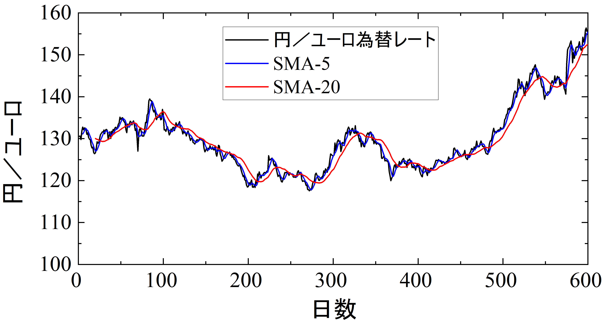

[単純移動平均 (SMA: Simple Moving Average)](https://ja.wikipedia.org/wiki/%E7%A7%BB%E5%8B%95%E5%B9%B3%E5%9D%87)を用いた金融データ（為替レート）の分析を体験しよう．

単純移動平均は，時系列データの傾向を調べる際しばしば用いられる手法であり，$N$日分の観測値からなる時系列データ$x_1, x_2, ..., x_N$に対して，日付$t$における$M$日の単純移動平均は次式で定義される：

$$ {\rm SMA}^{(M)}_t = \frac{x_t + x_{t-1} + ... + x_{t-M+1}}{M} \qquad (1)$$

簡単に言えば，時系列データの各時点$t$における「当日から$M-1$日前までの平均」のことである．平均を取る範囲が移動していくため，移動平均と呼ばれる．連続するデータの上がり下がりが激しい場合に，その点の周りで平均を取ることで”データの傾向”を統計的に調べることができ，物理実験の測定データなどの解析にもよく用いられる手法である．

投資では，短期移動平均線（例えば${\rm SMA}^{(5)}$）が長期移動平均線（例えば${\rm SMA}^{(20)}$）を下から上に突き抜けた時をゴールデンクロスと呼び，買い（上昇トレンド）のシグナルとして用いられる．逆に，短期移動平均線が長期移動平均線を上から下に突き抜けた時をデッドクロスと呼び，売り（下降トレンド）のシグナルとして用いられる．下の図は，ある期間の円-ユーロの為替レートに対して，5日単純移動平均，20日単純移動平均を取ってプロットした結果である．



ここでは，$M$日単純移動平均を求めるプログラムを作成しよう．

---
## 問題
---

標準入力からデータ数$N$，単純移動平均を計算する日数$M$，$N$個の観測値からなる時系列データ$x_1, x_2, ..., x_{N}$を読み込み，標準出力に日付$t$，観測値$x_t$, $M$日単純移動平均${\rm SMA}^{(M)}_t$を出力するプログラムを書け．

---
## 仕様
---

- 入力は，データ数$N$と平均を取る日数$M$，$N$個の時系列データ$x_1, x_2, ..., x_{N}$が順に並んでいるとする：

  ```
  N M
  x_{1}
  x_{2}
  ...
  x_{N}
  ```

- $N$，$M$を格納する変数には`int`型，$x_{i}$を格納する変数には<font color=red>倍精度浮動小数点</font>型である`double`型を用いること．単精度浮動小数点型floatを用いてはいけない．浮動小数点型の詳細については，[こちら](#floating_point)を参照のこと．
- $M$は$1\le M\le 20$，$N$は$M\le N$であると仮定してよい．
- 出力は，$t$，$x_t$，${\rm SMA}^{(M)}_{t}$ ($t=M, M+1, ..., N$)を一行ずつ出力すること：
  
  ```
  M x_{M} SMA^{(M)}_{M}
  M+1 x_{M+1} SMA^{(M)}_{M+1}
  ...
  N x_{N} SMA^{(M)}_{N}
  ```

- $t$ ($t=M, M+1, ..., N$)は整数で出力し，$x_t$，${\rm SMA}^{(M)}_{t}$ ($t=M, M+1, ..., N$)は小数点以下2位までを出力すること．
- 各行の数値の間には空白文字を入れること．
- 各行の末尾には改行文字`\n`を付けること．
- 入力される時系列データは，$N$が非常に大きくなる場合も想定して，可変長配列ではなく動的メモリ確保した配列に格納すること．
- `#include` していいのは `<stdio.h>`と`<stdlib.h>`のみとする．
- `malloc`関数は`main`関数内で呼び出すこと．確保した配列は`main`関数が終了する前に`free`関数を用いて解放すること．
- メモリ確保に失敗した場合は，"Cannot allocate memory\n"と標準エラー出力に出力してプログラムを終了すること．
- 式(1)の単純移動平均${\rm SMA}^{(M)}_t$の計算式のとおり，$t$ごとに和を求めて計算すること．特に，前の$t$で求めた和を使い回して計算してはいけない（理由は[参考情報](#precision)で述べる）．

---
## 浮動小数点<a name="floating_point"></a>
---

- これまでの課題では数値を扱う場合は`int`型を用いてきたが，`int`型は整数だけしか扱えない．
- 実数（小数点）を扱うには64bit倍精度小数点型，`double`型を用いる（32bit単精度小数点型`float`もあるが，精度が低くても問題ない場合のみの使用を推奨する）．
- 基本的な演算（代入，四則演算，比較）は`int`型と同じようにできる．精度の関係で等価演算子（`==`），非等価演算子（`!=`）は注意が必要であるが，ここでは深くは立ち入らない．
- `double`型の入出力の書式は以下のとおり：

  ```
  scanf("%lf", &x_double);
  printf("%lf\n", x_double);
  ```
- `printf`で小数点以下の桁数を指定して出力することができる：`printf("%.2lf\n", x_double);`では，小数点以下２桁のみ表示．
- `int`型では扱える整数の大きさに制限があるが，浮動小数点型では大きさの他，小数点以下の桁数にも制限がある（ここでは深くは立ち入らない）．
- `int`型と同様，浮動小数点型も`1.5`のように固定数値をプログラム内で使用することができる．`int`型と区別するために，整数値であっても`2.0`のように小数点を付ける必要がある．また，固定数値同士の演算には気を付ける必要がある．例えば`1.0/2.0`は浮動小数点型の除算が行われ，結果は`0.5`であるが，`1/2`と書くと`int`型同士の除算が行われるため，結果は`0`となる．

---
## 実行例
---

- 入力例1

```
10 2
1
-1
1
-1
1
-1
1
-1
1
-1
```
- 出力例1
  
```
2 -1.00 0.00
3 1.00 0.00
4 -1.00 0.00
5 1.00 0.00
6 -1.00 0.00
7 1.00 0.00
8 -1.00 0.00
9 1.00 0.00
10 -1.00 0.00
```
- 入力例2

```
6 4
1.5
0.5
1.75
0.25
-0.5
1.5
```
- 出力例2
  
```
4 0.25 1.00
5 -0.50 0.50
6 1.50 0.75
```
- 入力例3

```
40 20
83.78
82.92
82.61
83.62
83.98
83.82
83.95
83.56
83.87
84.25
84.06
84.09
83.74
122.15
110.54
100.84
122.04
120.39
83.83
83.19
82.97
82.72
82.33
81.44
81.84
92.04
93.39
93.36
92.91
93.32
93.12
82.81
82.93
82.77
82.64
82.17
83.05
82.72
82.63
82.24
```
- 出力例3
  
```
20 83.19 91.56
21 82.97 91.52
22 82.72 91.51
23 82.33 91.50
24 81.44 91.39
25 81.84 91.28
26 92.04 91.69
27 93.39 92.16
28 93.36 92.65
29 92.91 93.11
30 93.32 93.56
31 93.12 94.01
32 82.81 93.95
33 82.93 93.91
34 82.77 91.94
35 82.64 90.54
36 82.17 89.61
37 83.05 87.66
38 82.72 85.78
39 82.63 85.72
40 82.24 85.67
```

---
## 参考情報
---

----
### 浮動小数点における精度<a name="precision"></a>
----

- 上述のとおり，浮動小数点型では有限の桁数しか保持できない．もう少し具体的なイメージで言うと，

  $$
  x = s\times X_{0}.X_{1}X_{2}\cdots X_{N}\times10^{m}
  $$
  
  のように実数を10進数の指数形式で表し，かつ有限の桁数で止めて近似するのが浮動小数点型である．ここで，$x_{0}$は$1~9$の整数，それ以外の$x_{i}$は$0~9$の整数，$s$は符号（$+1$か$-1$），$m$は整数である．（多くのプロセッサでは，IEEE754という規格に沿って2進数で表している．）例えば小数点以下4桁しか保持できないとすると，$1234.56789$は$(+1)\times1.2345\times10^{3}$，$-0.0053$は$(-1)\times5.3000\times10^{-3}$と表される．１番目の例では，元の数字が正確には表されていないことが分かる．

- 浮動小数点の加減算は，大きい方の指数に合わせた後で演算が行われる．例えば以下のようになる：

  $$
  1000+250 = 1.0000\times10^{3}+2.5000\times10^{2} = 1.0000\times10^{3}+0.2500\times10^{3} = 1.2500\times10^{3} \\
  12345+5.55 = 1.2345\times10^{4}+5.550\times10^{0} = 1.2345\times10^{4}+0.0005\times10^{4} = 1.2350\times10^{4} 
  $$
  
  ２番目の例では，加算の結果が正確ではないことが分かる（多くのプロセッサでは，精度を少しでも保つため，演算中だけ保持する桁数を増やすという工夫がされている）．このように，浮動小数点の演算には制約があるということを念頭に置いてプログラミングすることが大事である．

- もう一つ，浮動小数点の加減算で重要なこととしては，数式上では等価な表現が，プログラム上では等価ではないということである．具体的には，$a+b-a$と$b$，$a+c+b$と$a+b+c$が等しくない場合がある．極端な例では，$a+b-a = 10000+1.1-10000$を左から順に演算していくと，

  $$
  10000+1.1 = 1.0000\times10^{4}+1.1000\times10^{0} = 1.0000\times10^{4}+0.0001\times10^{4} = 1.0001\times10^{4} \\
  (10000+1.1)-10000 = 1.0001\times10^{4}-1.0000\times10^{4} = 0.0001\times10^{4} = 1.0000\times10^{0} = 1
  $$
  
  のように，余計な演算をすることで計算精度が落ちていることが分かる．この例に限らず，相対的に小さい数や，大きい数の下の桁に関しては演算の仕方によって精度が変わってくるため，気を使わなくてはいけない．単純移動平均の計算で言うと，

  $$
  {\rm SMA}^{(M)}_t = \frac{x_t + x_{t-1} + ... + x_{t-M+1}}{M} \\
  {\rm SMA}^{(M)}_{t+1} = \frac{x_{t+1}+(x_t + x_{t-1} + ... + x_{t-M+1})-x_{t-M+1}}{M}
  $$

  のように，前日の単純移動平均値の計算に使った和$x_t + x_{t-1} + ... + x_{t-M+1}$を使い回して次の日の単純移動平均値を計算できるかのように数式上は見えるが，計算精度が落ちてしまう危険性がある．これが，仕様で「前の$t$で求めた和を使い回して計算してはいけない」としている理由である．※精度が落ちないという確証が持てる場合（例えばデータ値がほとんど変動せずかつM$が小さい場合など）にかぎり，こういったプログラミング上の工夫をしてもよい．
