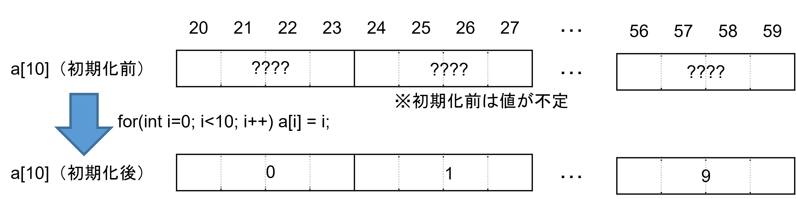

この問題では，C言語を使う上で避けては通れない<font color="red">ポインタ</font>と<font color="red">アドレス</font>を取り扱う．p2-3と同様，本問題には3つのステップがあり，それぞれのステップがお互いに独立している．

---
## 問題ａ（ステップ1/3）
---

ここでは，アドレスとポインタの概念について学び，ポインタの使い方を習得してもらう．

---
### メモリとアドレス

これまでは，「変数は値を入れる入れ物」のようなイメージでプログラミングできる，いわゆる高水準言語的な部分のみを用いてきた．一方，実際にはプログラムはハードウェア（プロセッサ，メモリなど）上で動いている．変数の値はメモリ上の特定の位置に格納され，その位置を示す<font color="red">アドレス</font>を参照することで読み書きを行う．C言語では"ハードウェアを意識した"低水準言語的なプログラミングもできる（場合によってはしなくてはいけない）．

メモリとは，"0"と"1"で表されたデータを物理的に記憶（格納）しておくハードウェアの総称を指す．プログラム内で使う変数の値と，プログラム自身（厳密にはプロセッサを動作させるための”命令”）を格納している．プログラムから見るとメモリは一次元の配列のようになっており，そのインデックスがアドレス（番地，位置）である．アドレスは1バイト（8ビット）ごとに割り当てられている．`int`，`char`，`double`などの型はそれぞれバイト数が異なり，`char`型は1バイト，`double`型は8バイト．`int`型は環境によってバイト数が異なるが，4バイト = 32ビットの場合が多い．複数バイトのサイズを持つ型は，先頭のアドレスを参照することでその値を取得できる．より詳細な説明は[メモリとアドレスに関する補足](#memory_alignment_and_endian)を参照．


C言語では，`sizeof`演算子（関数ではない）を使ってプログラム内でバイト数を確認することができる：

  ```
  printf("%d %d %d\n", sizeof(char), sizeof(double), sizeof(int));
  ```

また，アドレスは整数で表され，`&`演算子を用いて取得できる：

  ```
  int a;
  double b;
  char c;

  printf("%x, %x, %x\n", &a, &b, &c); // 16進数でアドレスを表示
  printf("%o, %o, %o\n", &a, &b, &c); // 8進数でアドレスを表示
  printf("%u, %u, %u\n", &a, &b, &c); // 10進数でアドレスを表示
  ```

配列はメモリ上の連続した領域に割り当てられる．



配列を`int a[10];`のように定義すると，`a`を参照することで配列の先頭要素のアドレスが取得でき，配列の`i`番目の要素`a[i]`へのアクセスは，内部ではアドレス`a+i*sizeof(配列の型)`を参照することで実現している．


### ポインタ

C言語では，アドレスを関数に渡して関数内で変数の値を変えるときや，後述する`malloc`関数からの返り値を受けるときなどに，<font color="red">アドレスを入れる変数であるポインタ</font>（Pointer）を用いる．変数を"point"すなわち"指す"もの，という意味でポインタと呼ぶ．変数のアドレスは不変である一方，ポインタの値は変えることができる（指している先を変える）．

変数のアドレスの取得，ポインタの使い方は以下のとおりである：

  ```
  int a, b, c;
  int *p, *p2;

  p = &a; // 変数aのアドレスを取得して，ポインタ変数に格納する
  p2 = &b; // 変数bのアドレスを取得して，ポインタ変数に格納する
  
  *p = 10; // アドレスが指す変数に値を代入する
  *p2 = 20;
  
  scanf("%d", p); // 格納されたアドレスをscanf関数に渡す

  c = *p+*p2; // ポインタを介して変数の値を参照

  p = p2; // p2に格納されたアドレスを，pに格納
  ```


ポインタ自体も変数なのでアドレスを持っており（サイズは，32ビットプロセッサの場合は4バイト，64ビットプロセッサの場合は8バイト），ポインタを`int *p;`と宣言した場合，`&p`のように参照する．さらにはポインタ変数のアドレスを格納するためのポインタ変数，”ポインタのポインタ”というものがある．（課題３で再登場するので，そこで改めて説明する．）

  ```
  int a;
  int *p = &a; // 宣言時に代入する場合の書き方
  int **pp = &p; // 宣言時に代入する場合の書き方

  p = &a; // 変数aのアドレスを取得して，ポインタ変数に格納する
  pp = &p; // ポインタ変数pのアドレスを取得して，ポインタのポインタに格納する
  
  *(*pp) = 10; // ppが指すポインタ（=p）が指すアドレスの変数（=a）に値を代入する
  **pp = 10; // ()を省略した書き方も可能
  ```
  


また，ポインタ変数に配列の先頭アドレスを代入すれば，ポインタを介して配列の操作が可能である：

  ```
  int a[10];
  int *p;

  p = a;

  for(int i=0; i<10; i++) p[i] = i;
  ```

ポインタの主な用途は，関数の引数にすることでアドレスを渡し，異なる変数に対して同じ処理をすることである．これまで頻繁に使ってきた`scanf`関数も引数はポインタとなっており，変数のアドレスを`&`を用いて渡すことで，`scanf`関数の中でその変数に値を代入している．詳細な使い方は，[値渡しとアドレス渡し](#pass_by_value_vs_address)，[配列とポインタ](#array_and_pointer)で述べる．


### NULLポインタ

`NULL`ポインタとは，ポインタの中身のアドレスが無効，すなわちポインタが何も指していないことを表すために用いる，特殊なポインタである（NULL文字`\0`とは異なる）．以下のように用いる：

  ```
  int *p = (int *)NULL;
  ```
  
`NULL`ポインタは`stddef.h`に定義されているが，`#include <stdio.h>`をすれば使える．また，`NULL`ポインタは"型がないことを示す`void`型"であるため，`int`型のポインタに変換（キャストと呼ぶ）するため，`(int *)`をしている．

`NULL`ポインタは，ポインタを初期化するときや，後述する`malloc`関数がメモリ確保に失敗したときの返り値として使われる．


### セグメンテーション違反

プログラム実行時のエラーの一種であるセグメンテーション違反（Segmentation Fault）は，そのプログラムに割り当てられていない（アクセスが禁止されている）メモリ領域にアクセスした際に起こる．多くの場合，後述する配列動的メモリ確保に失敗した後，あるいはすでにメモリ解放をした後の配列にアクセスしたことにより起こる．以下のコードでは，意図的にセグメンテーション違反を起こしている．

  ```
  #include <stdio.h>
  #include <stdlib.h>

  int main(){
    int *a = (int *)NULL;
  
    a[0] = 0;
  
    return 0;
  }
```


---
### 仕様
---

初期コードの`???`となっている箇所をコメント文に沿うように書き換えて，ポインタの使い方を確認せよ．以下の点に注意すること．

- コンパイル時に`printf`文の書式に関する警告文が出てくるが，無視してよい．
- 初期コードの`???`となっている箇所のみを書き換え，他は一切書き換えないこと．特に`printf`文の中身は書き換えない．
- アドレスの値は環境によって異なるため，この問題において自動採点システムでは，ポインタ変数に格納されたアドレスが変数`a`，`b`どちらのアドレスかを照合している．そのため，実行例と自分の実行結果でアドレスが異なっていても気にしないこと．


### 入力例
  ```
  1 2
  ```

### 実行例

  ```
  sizeof(char)=1, sizeof(int)=4, sizeof(double)=8

  Addresses: &a=157466968, &b=157466972

  Initial values:
  p1=0, p2=0
  a=1, b=2

  Substitution of addresses into pointers:
  p1=157466968, p2=157466972
  *p1=1, *p2=2
  a=1, b=2

  Manipulation through pointers:
  p1=157466968, p2=157466972
  *p1=10, *p2=20
  a=10, b=20

  Copy of a pointer value to another pointer:
  p1=157466972, p2=157466972
  *p1=30, *p2=30
  a=10, b=30

  Pointer-to-pointer:
  *pp=157466968
  *pp=157466972
  a=40, b=50
  ```


******************

---
## 問題b（ステップ2/3）
---

ここでは，C言語における値渡しとアドレス渡しの違いを理解し，実際の挙動を確認してもらう．

---
### 値渡しとアドレス渡し<a name="pass_by_value_vs_address"></a>

C言語では関数を呼び出す際，呼び出し側で渡した変数の中身（値）が，呼び出された関数側の変数にコピーされる：

  ```
...
  int a = 10;
  test(a);
...
void test(int b){
  printf("%d\n", b); // bには呼び出し元のaの値が入っている
  b = 300; // bとaはアドレスが異なる別々の変数なので，呼び出し元のaには値が代入されない（できない）
}
  ```

これを<font color="red">値渡し</font>と呼ぶ．

一方，関数の引数をポインタ変数にすると，呼び出し側では変数のアドレスを渡すことができ，呼び出された関数側のポインタ変数にコピーされるため，関数内でそのアドレスが指す変数の更新が可能になる：

  ```
...
  int a = 10;
  test(&a);
...
void test(int *b){
  printf("%d\n", *b); // bには呼び出し元のaの値が入っている
  *b = 300; // bにはaのアドレスが入っているため，呼び出し元のaには値が代入される
}
  ```

これを<font color="red">アドレス渡し</font>と呼ぶ．`scanf`関数で変数のアドレスを渡すのは，入力された値を，関数内で（そのアドレスが指す）変数に代入する必要があるからである．関数から複数の返り値を返したい場合，ポインタ変数を引数に渡し，返り値を代入することで返す（C言語では複数返り値はサポートされていない）．


---
### 仕様
---

以下のコードを実行し，値渡し（"pass by value"）とアドレス渡し（"pass by address"）の違いを確認せよ．

[](Pass_by_valueとpass_by_addressの応用問題。単一変数と配列。スケルトンファイルを完成させる。)


### 初期コード

  ```
#include <stdio.h>

void pass_by_value(int x){
  printf("In pass_by_value: %d\n", x);
  x = 10;
}
void pass_by_address(int *ptr_x){
  printf("In pass_by_address: %d\n", *ptr_x);
  *ptr_x = 10;
}

int main(){
  int a = 0;

  pass_by_value(a);
  printf("After pass_by_value: %d\n", a);

  pass_by_address(&a);
  printf("After pass_by_address: %d\n", a);

  return 0;
}
  ```
  
  
### 実行例


******************

---
## 問題c（ステップ3/3）
---

ここでは，文字配列の処理を行うためにポインタを引数に取る関数を作成し，それに配列の先頭アドレスを渡して処理を行うことで，関数に配列を渡す方法を習得してもらう．

---
### 配列とポインタ<a name="array_and_pointer"></a>
---
p2-1などでは，関数に配列を渡す際に`void test(int array[], int n)`のような書き方をしていた．これは実は配列`array[]`の要素全てを渡しているのではなく，配列の先頭のアドレスが入っているポインタ変数`array`を渡しており，`void test(int *array, int n)`とほぼ等価である．（配列の値渡しがない理由は[こちら](#array_pass_by_value)）

以下のコードを実行し，配列の先頭アドレスを関数に渡しても，通常の配列のように`a[i]`のようなアクセスが可能であることを確認せよ．

  ```
#include <stdio.h>

void print_array(int *array, int n);

int main(){
  int n = 10;
  int a[n];
  
  for(int i=0; i<n; i++) a[i] = i;
  print_array(a, n);
  
  return 0;
}

void print_array(int *array, int n){
  for(int i=0; i<n; i++) printf("%d ", array[i]);
  printf("\n");
}

  ```


---
### 仕様
---

文字列処理を行う４つの関数を実装し，それらを使って`main`関数で確保した可変長配列（VLA）を操作するプログラムを，初期コードの`???`となっている箇所を書き換えることで実装せよ．

1. 標準入力から決められた長さ`N`の文字列を読み込む関数`void read_string(char *str, int N)`を実装する．この関数では，入力文字列の余分な空白・改行は全て除外し，次の行の文字列を全て読み込んで引数として渡された文字配列`str`に格納する．エラー処理用の1文字と，末尾のヌル文字分を足して`N+2`の長さの文字配列を確保されていると仮定してよい．`N`文字読み込むことに失敗した場合はエラー出力をして強制的にプログラムを終了させる．
以下のコードは初期コードとしてエディタに出てくるので，???となっている箇所を埋めて完成させること．
1. 文字配列の要素N個全てをヌル文字で初期化する関数`void zeros(char *str, int N)`を実装すること．
1. 文字列`X`の`a`番目と文字列`Y`の`b`番目を比較し，同じであれば1，異なれば0を返す関数`int delta(char *X, int a, char *Y, int b)`を実装すること．ここで言う”番目”とは，配列の先頭を0番目とした場合の番号である．`a`および`b`はそれぞれの文字列の範囲内であると仮定してよい．
1. 入力された文字列を逆順に並べ替え，出力する関数`void reverse(char *str, int N)`を実装すること．`N`は1以上であると仮定してよい．
1. `main`関数では上記４つの関数の動作が正しいかテストする．初期コードの時点で完成しているので，変更を加えないこと．
  
  
### 初期コード

  ```
  #include <stdio.h>
  
  int main(){
    return 0;
  }

  void read_string(char *str, int N){
    char tmpchar; // 文字列前の空白・改行を除外するために使う

    // 文字列の前に空白か改行があれば全て除外する
    do {
      tmpchar = getc(stdin);
      if( tmpchar == EOF ){ // 途中で読み込みが終了したらエラー終了
        printf("read_string(): Invalid string\n");
        exit(1);
      }
    }while( tmpchar==' ' || tmpchar=='\n' || tmpchar=='\r');

    ungetc(tmpchar, stdin); // 文字列を一文字stdinに戻す

    // N+1文字を標準入力から読み込む
    fgets(str, ???, stdin); // p14のfgetsの使い方を参照
    ungetc(str[N], stdin); // 次の入力に影響しないよう，余計な空白・改行を１文字戻す

    // 文字列の長さがNよりも短い場合はエラー出力して強制終了
    for(int i=0; i<N; i++){
      if(str[i]=='\n' || str[i]==' ' || str[i]=='\0' || str[i]=='\r'){ // 文字列中に空白・改行・ヌル文字があれば長さが足りていない（※Windowsでは\r\nで改行を表す）
        fprintf(stderr, "read_string(): Invalid string\n");
        exit(1);
      }
    }
    
    // 文字列の長さがNよりも長い場合はエラー出力して強制終了
    if( !(str[N]=='\n' || str[N]==' ' || str[N]=='\0' || str[N]=='\r') ){ // 長さがNの場合、N+1文字目は空白 or 改行 or ヌル文字であるはず
      fprintf(stderr, "read_string(): Invalid string\n");
      exit(1);
    }

    // fgetsで改行かスペースも読み込んでいる場合があるので，ヌル文字で上書き
    str[N] = ???;
  }
  ```


### 実行例


******************


---
## 参考情報
---
### メモリとアドレスに関する補足<a name="memory_alignment_and_endian"></a>
---
多くのハードウェアでは，異なる型の変数をメモリに並べるとき，詰めて並べるのではなく，例えば4バイトと8バイトある型の変数のアドレスが4の倍数になるように調整して並べる．


これをメモリアライメントと言い，何も格納されていない場所はパディングと呼ぶ．アライメントをするのは，メモリアクセスをより高速に行うためである．パディングがあることで必要な容量が増え，一見効率が落ちるように思うかもしれないが，トータルで見ると高速になる．なぜそうなるのかを理解するには，メモリを物理的にどう実現しているか（DRAMとSRAMの違い），メモリの階層構造（レジスタ，n次キャッシュ，メインメモリ）などの説明が必要になるので，ここでは割愛する．

また，複数バイトを持つ型に関して，どういう並びで実際のデータを格納するかはプロセッサによって異なり，格納する方式のことをエンディアンと呼ぶ．例えば`int`型変数に`123456789`（16進数表記では`075bcd15`）を値として代入した場合，アドレスが小さい方に上位（桁）のバイトを格納する方式をビッグエンディアン，アドレスが小さい方に下位（桁）のバイトを格納する方式をリトルエンディアンと呼ぶ．


IntelやAMDのプロセッサはリトルエンディアン，スーパーコンピュータ京に採用されたSPARC64 VIIIfxはビッグエンディアンである．スーパーコンピュータ富岳やスマートフォンに使われているARMプロセッサでは，どちらのエンディアンにも設定可能なバイエンディアンとなっている．

---
### 配列の値渡しができない理由<a name="array_pass_by_value"></a>
---
"配列の値渡し"がC言語でサポートされていないのは，値渡しでは変数をコピーするため，サイズが大きい配列を値渡しできてしまうと，メモリを浪費し，なおかつコピーする時間がかかることが理由である．

C言語が登場した時代と比べ，現代はハードウェア性能が桁違いによくなっており，よほど大きい配列でなければコピーはさほどコストはかからないが，配列が大きい場合や繰り返しの多い処理の場合は注意しないといけない．
