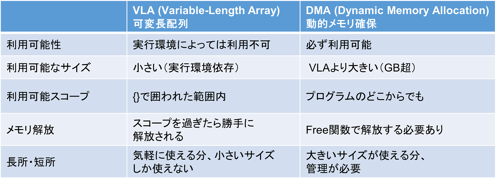

この問題では，これまで使っていた配列である<font color="red">可変長配列（Variable-Length Array; VLA）</font>に代わり，以降の問題で用いる<font color="red">動的メモリ確保（Dynamic Memory Allocation; DMA）</font>された配列を取り扱う．

また，複数の変数（ポインタ変数含む）を一つの変数としてまとめて取り扱うことができる，”構造体”
というC言語の機能も取り扱う．

---
## 動的メモリ確保／解放
---
これまで配列は，`int array[10];`のようにあらかじめ大きさを指定するか，

  ```
int n;
scanf("%d", &n);
int array[n];
  ```

のように書いて，入力に応じて配列の大きさを決めていた．後者は可変長配列（Variable-Length Array; VLA）と呼ばれ，便利な機能である．一方で，C言語の可変長配列は`n`が大きすぎると[メモリが確保できず](#memory_size)，また確保されなかったことも分からないため，プログラムが予期せぬ動作をする恐れがある．安全に配列を確保するためには，以下のように`malloc`関数を用いた動的メモリ確保と`free`関数を用いたメモリ解放を行う：

  ```
#include <stdio.h>
#include <stdlib.h> // malloc, free, exit関数を使うためにインクルード

int main(){
  int *array, n;
  
  scanf("%d", &n);
  
  // (1) メモリを動的確保
  array = (int*) malloc(sizeof(int)*n);
  
  // (2) 確保失敗時のエラー処理
  if( array == (int*)NULL ){ // アドレスとしてNULLが返ってきた場合，メモリ確保に失敗している
    fprintf(stderr, "Cannot allocate memory\n"); // エラー出力
    exit(1);  // プログラムを強制終了する
  }
  
  // (3) 配列を使用
  ...(省略)...
  
  // (4) メモリ解放
  free(array);
  
  return 0;
}
  ```

上記のコードは，動的メモリ確保に関連して４つの部分から成っている：
- (1)`malloc`関数を呼び出してメモリを動的確保する．引数には"総バイト数"を渡す必要があるため，１要素あたりのバイト数`sizeof(int)`と要素数`n`を掛けている．また，返り値は"型がないことを示す型"のポインタ`void *`であるため，`int`型のポインタに変換（キャストと呼ぶ）する`(int *)`を`malloc`の前に書いている．

- (2) `malloc`関数は，指定した総バイト数の確保に成功した場合は，その配列の先頭のアドレスを返す．失敗した場合は，無効なアドレスとして`NULL`ポインタを返す．後者の場合は通常の処理に進めないのでエラー処理が必要である．ここではエラー文を出力した後，`exit(1)`でプログラムを強制エラー終了する．

- (3) その配列を使う部分．途中で`return`文で関数を抜けてしまうと(4)が実行されないため，注意が必要である．

- (4) 使い終わった配列は`free`関数で解放する（引数は配列の先頭のアドレスで，配列サイズは不要）．`free`しないと，そのメモリ領域は再利用できずに残ってしまうため，メモリ容量を圧迫してしまう．

---
## 可変長配列 vs 動的メモリ確保
---
可変長配列と動的メモリ確保した配列の特徴を比較した表を以下に示す．



<span style="font-size: 85%;">※実行環境…コンパイラ・OS・シェル・物理メモリ量など．バージョンも含む．</span>

<span style="font-size: 85%;">※スコープ…変数の有効範囲（利用可能範囲）のこと．</span>

表の"利用可能スコープ"に関して，VLAを使うと関数の呼び出し側では配列が意図通りに動作しないことを確認せよ（`n`の値を4~40の間で変更すると，挙動が変わる）．

  ```
#include <stdio.h>
#include <stdlib.h>

int* array_allocation_by_VLA(int n);
int* array_allocation_by_DMA(int n);

int main(){
  int *a;
  int n = 40;
  
  a = array_allocation_by_DMA(n);
  for(int i=0; i<n; i++) printf("%d ", a[i]);
  printf("\n");
  for(int i=0; i<n; i++) a[i] = i;
  for(int i=0; i<n; i++) printf("%d ", a[i]);
  printf("\n");
  
  free(a);
  
  a = array_allocation_by_VLA(n);
  for(int i=0; i<n; i++) printf("%d ", a[i]);
  printf("\n");
  for(int i=0; i<n; i++) a[i] = i;
  for(int i=0; i<n; i++) printf("%d ", a[i]);
  printf("\n");
  
  return 0;
}

int* array_allocation_by_VLA(int n){
  int a[n];
  
  for(int i=0; i<n; i++) a[i] = 0;
  
  return a;
}

int* array_allocation_by_DMA(int n){
  int *a;
  
  a = (int*)malloc(sizeof(int)*n);
  
  for(int i=0; i<n; i++) a[i] = 0;
  
  return a;
}
  ```

---
## 問題
---
以下の仕様に従って，動的メモリ確保された配列を簡便に使うための構造体と関数群を実装し，入力された指示に従ってそれらの関数群を呼び出して配列を操作するプログラムを書け．

---
### 仕様
---

- **構造体の定義**：`int`型配列の先頭アドレスを保持するためのポインタ変数と，配列の長さを保持するための`int`型変数を持つ構造体として，`struct Vector`が以下のとおり定義されていると仮定する．

  ```
  struct Vector {
    int _len;
    int *_array;
  };
  ```
  
  構造体の定義および関数群の宣言は，`ppa_extra_h/Vector.h`でなされていると仮定する．（Vectorというのは日本語でいうとベクトル，つまり一次元の要素の列のことである．C++の標準テンプレートライブラリにはvectorクラスという，類似の機能がある．）


- **動的メモリ確保・解放**：引数として配列の長さを取り，動的メモリ確保して`struct Vector`変数を返す`Vector_alloc`関数，および`struct Vector`変数を引数として取って確保された配列を解放する`Vector_free`関数を実装すること．前者では，メモリ確保に失敗した場合は，以下のとおりのエラー文を出力してプログラムを強制終了すること．また，長さ0の配列は正常な配列として取り扱えるようにすること．

  ```
  struct Vector Vector_alloc(int n){
    ...
  
    if( ... ){
      fprintf(stderr, "Vector_alloc(): Cannot allocate memory\n");
      exit(1);
    }
  }

  void Vector_free(struct Vector v){
    ...
  }
  ```

- **配列要素の取得**：引数として`struct Vector`変数と，配列の位置（インデックス）を示す`int`型変数を取り，そのインデックスの要素を返す`Vector_get_at`関数を実装すること．インデックスが有効な範囲の外にある場合，以下のとおりのエラー文を出力してプログラムを強制終了すること．

  ```
  int Vector_get_at(struct Vector v, int i){
    ...
    if( ... ){
      fprintf(stderr, "Vector_get_at(): Index out of range\n");
      exit(1);
    }
   ...
  }
  ```

- **配列要素の代入**：引数として`struct Vector`変数，配列インデックスを示す`int`型変数，配列に代入したい要素を示す`int`型変数を取り，そのインデックスに要素を代入する`Vector_set_at`関数を実装すること．インデックスが有効な範囲の外にある場合，以下のとおりのエラー文を出力してプログラムを強制終了すること．  

  ```
  void Vector_set_at(struct Vector v, int i, int x){ // i：配列インデックス、x：配列に代入する要素
    ...
    if( ... ){
      fprintf(stderr, "Vector_set_at(): Index out of range\n");
      exit(1);
    }
   ...
  }
  ```

- **配列要素の出力**：引数として`struct Vector`変数を取り，配列要素を全て出力する`Vector_print`関数を実装すること．要素間には空白文字を一つ出力し，最後の要素の後には改行文字を出力すること．配列の長さが0の場合は，改行文字のみ出力すること．

  ```
  void Vector_print(struct Vector v){
    ...
  }
  ```
  
- **配列要素の挿入**：引数として`struct Vector`変数，配列インデックスを示す`int`型変数，配列に挿入したい要素を示す`int`型変数を取り，その要素を挿入する`Vector_insert_at`関数を実装すること．ここでいう挿入とは，与えられた位置に元からある要素，およびそれよりも後ろの全ての要素の位置を一つ後ろにずらして，その位置に新しい要素を代入する操作のことである．与えられた位置が最後尾の要素の１つ後ろの場合は，最後尾に要素を追加する．引数として渡された`struct Vector`とは別に，それよりも長さが1だけ長い`struct Vector`変数を新しく初期化すること．また，引数として渡された`struct Vector`は関数内で解放すること．インデックスが有効な範囲の外にある場合，以下のとおりのエラー文を出力してプログラムを強制終了すること．  

  ```
  struct Vector Vector_insert_at(struct Vector v, int i, int x){
    ...
    if( ... ){
      fprintf(stderr, "Vector_insert_at(): Index out of range\n");
      exit(1);
    }
   ...
  }
  ```

- **配列要素の削除**：引数として`struct Vector`変数，配列インデックスを示す`int`型変数を取り，その要素を削除する`Vector_delete_at`関数を実装すること．削除とは，与えられた位置よりも後ろの全ての要素の位置を一つ前にずらす操作のことである（その位置の要素は上書きされる）．引数として渡された`struct Vector`とは別に，それよりも長さが1だけ短い`struct Vector`変数を新しく初期化すること．また，引数として渡された`struct Vector`は関数内で解放すること．インデックスが有効な範囲の外にある場合，あるいは渡された配列の長さが0である場合，以下のとおりのエラー文を出力してプログラムを強制終了すること．  

  ```
  struct Vector Vector_delete_at(struct Vector v, int i){
    ...
    if( ... ){
      fprintf(stderr, "Vector_delete_at(): Index out of range\n");
      exit(1);
    }
   ...
  }
  ```

- **配列の浅いコピー（シャローコピー）と深いコピー（ディープコピー）**：配列を”コピー”したい場合，配列のアドレスだけを別のポインタ変数にコピーして要素を共有する方法と，新たにメモリを確保して要素をコピーし，同じ要素を持つ配列をもう一つ用意する方法が考えられる．前者を”浅いコピー（シャローコピー）”，後者を”深いコピー（ディープコピー）”と呼ぶ．例えば，あらかじめ用意された`struct Vector v1`に対して浅いコピーをするには，普通に代入演算`struct Vector v2 = v1;`をすればよい．構造体中のポインタ変数の値がコピーされるため，配列は浅くコピーされる．一方，深いコピーをするためには，`Vector_alloc`関数を呼び出してメモリ確保し，その上で配列の各要素に対して代入演算を行なう必要がある．ここでは，深いコピーを実行する`Vector_deep_copy`関数を実装せよ．関数内では必ず`Vector_alloc`関数，`Vector_get_at`関数，`Vector_set_at`関数を用いること．

  ```
  struct Vector Vector_deep_copy(struct Vector v){
    ...
  }
  ```

  深いコピー／浅いコピーは用途に応じて使い分ける．特に浅いコピーは，配列が非常に大きいが要素の変更をしない場合（read only）には重宝する．一方で，どの種類のコピーをされた配列なの  か，どこでメモリ解放をするのかなどを明確に取り決めておかないと，メモリリークの原因になってしまうので，使用には細心の注意が必要である．また，浅いコピーをした場合は，コピー元の配列の先頭アドレスを変更してはいけない（その意味では上記の`Vector_insert_at`や`Vector_delete_at`の実装は危険である！）．言語によってはそのようなメモリリークを防ぐための機構が用意されている（詳しくは[「動的メモリ確保に関する補足」](#dynamic_memory_allocation)を参照）．


- **`main`関数**：上記の関数群の動作テストを行うため，配列操作を指示する文を入力から一行ずつ読み込み，それに応じて実際に配列操作を行なう．この問題では関数群を正しく実装することを主眼にするため，`main`関数については以下のとおりあらかじめ用意されたテスト関数`test_Vector`を呼び出し（詳細は[テスト関数について](#test_vector)を参照），`main`関数の後ろで関数群の定義をすること．また，この問題では標準出力だけでなく，標準エラー出力も判定するので，エラー出力も仕様に従うこと．

  ```
  #include <stdio.h>
  #include <stdlib.h>
  #include "ppa_extra_h/Vector.h"

  // main関数
  int main(){
    test_Vector();
 
    return 0;
  }

  // 動的メモリ確保をする関数
  struct Vector Vector_alloc(...){
    ...
  }
  
  ...
  ```

---
## ステップ分割
---
- ステップ1/2では`Vector_alloc`，`Vector_free`，`Vector_get_at`，`Vector_set_at`，`Vector_print`関数を実装すること．また，`test_Vector`関数を使うにあたり，形だけでも`Vector_insert_at`，`Vector_delete_at`，`Vector_deep_copy`関数の定義が必要なので，中身は実装せずに，以下のように引数の`v`をそのまま返り値として返すこと．

  ```
  struct Vector Vector_insert_at(struct Vector v, int i, int x){
    return v;
  }
  ```

- ステップ2/2では`Vector_insert_at`，`Vector_delete_at`，`Vector_deep_copy`関数を実装すること．

---
### ステップ1/2の実行例
---
- 入力データ

  ```
  ALLOC 5
  SET_AT 0 1
  SET_AT 1 -1
  SET_AT 2 3
  SET_AT 3 5
  SET_AT 4 10
  PRINT
  GET_AT 5
  FREE
  ```
  
- 出力例

  ```
  1 -1 3 5 10
  ```
    
- エラー出力例

  ```
  Vector_get_at(): Index out of range
  ```
  
---
### ステップ2/2の実行例
---
- 入力データ

  ```
  ALLOC 5   
  SET_AT 0 0
  SET_AT 1 1
  SET_AT 2 2
  SET_AT 3 3
  SET_AT 4 4
  PRINT
  INSERT_AT 0 5
  PRINT
  INSERT_AT 7 6
  PRINT
  FREE
  ```
  
- 出力例

  ```
  0 1 2 3 4 
  5 0 1 2 3 4
  ```
    
- エラー出力例

  ```
  Vector_insert_at(): Index out of range
  ```

---
## 参考情報
---
### 可変長配列と動的メモリ確保の上限<a name="memory_size"></a>
---
可変長配列と動的メモリ確保で扱える配列の大きさの上限は実行環境依存であるので，特に可変長配列を使う際には必ず確認する必要があるが，"一般的"な環境では1kB程度であれば問題なく使えるはずである．

「プログラミング演習A」では，"サンドボックス"と呼ばれる，外部プログラムを安全にサーバ上で実行するための環境を用いている．そのため，プログラムを実行して可変長配列と動的メモリ確保の上限を確認することはできない．余裕があれば，自分のPCでC言語をコンパイル／実行できる環境を整えて確かめてみよう．

---
### 動的メモリ確保に関する補足<a name="dynamic_memory_allocation"></a>
---
可変長配列と動的メモリ確保の違いを理解するには，プログラムがハードウェア上でどのように動作するか，特に"ヒープ領域"，"スタック領域"について理解する必要があるが，この授業は「プログラミング演習」であるので，詳細には立ち入らない．

C言語は"ハードウェアを意識したプログラミング"ができる／しなくてはいけない言語で，メモリ容量制限がシビアな場合，リアルタイム処理が必要な場合などに適している．一方で，プログラムが大規模・多機能になると，"ハードウェアを意識しないプログラミング"の方がバグ／セキュリティホールを生じにくい，開発スピードが速いなどのメリットがある．そのようなプログラミングができる言語としては，C++，Java，Pythonがある．用途・実行環境に応じて適切な言語を選ぶ，あるいは複数言語を使い分けられるようになることが重要である．

`malloc/free`より安全なメモリ管理の方法として，C++ではコンストラクタ／デストラクタという機構が用意されている（p2-5の`struct Vector`の`Vector_init`，`Vector_free`を使用開始時／終了後に強制的に呼び出すようなイメージ）．さらに安全な方法として，JavaやPythonではガベージコレクションという機構が用意されている．

### テスト関数について<a name="test_vector"></a>

本問題で使用した`test_Vector`関数の中身は以下のとおりである：

```
void test_Vector(){
 struct Vector v1, v2;
  char op[10];
  int n, i, x;
  
  while( scanf("%s", op) != EOF ){
    if( strncmp(op, "ALLOC", 10) == 0 ){
      scanf("%d", &n);
      v1 = Vector_alloc(n);
    }
    else if( strncmp(op, "FREE", 10) == 0 ){
      Vector_free(v1);
    }
    else if( strncmp(op, "PRINT", 10) == 0 ){
      Vector_print(v1);
    }
    else if( strncmp(op, "GET_AT", 10) == 0 ){
      scanf("%d", &i);
      printf("%d\n", Vector_get_at(v1, i));
    }
    else if( strncmp(op, "SET_AT", 10) == 0 ){
      scanf("%d %d", &i, &x);
      Vector_set_at(v1, i, x);
    }
    else if( strncmp(op, "DELETE_AT", 10) == 0 ){
      scanf("%d", &i);
      v1 = Vector_delete_at(v1, i);
    }
    else if( strncmp(op, "INSERT_AT", 10) == 0 ){
      scanf("%d %d", &i, &x);
      v1 = Vector_insert_at(v1, i, x);
    }
    else if( strncmp(op, "SHALLOW_COPY_AND_DEEP_COPY", 10) == 0 ){
      printf("Shallow copy:\n");
      v2 = v1;
      printf("Before set:\n");
      printf("v1: "); Vector_print(v1);
      printf("v2: "); Vector_print(v2);
      Vector_set_at(v2, 4, 10);
      printf("After set:\n");
      printf("v1: "); Vector_print(v1);
      printf("v2: "); Vector_print(v2);

      printf("Deep copy:\n");
      v2 = Vector_deep_copy(v1);
      printf("Before set:\n");
      printf("v1: "); Vector_print(v1);
      printf("v2: "); Vector_print(v2);
      Vector_set_at(v2, 4, 20);
      printf("After set:\n");
      printf("v1: "); Vector_print(v1);
      printf("v2: "); Vector_print(v2);
    }
    else {
      fprintf(stderr, "%s: No such operation\n", op);
      exit(1);
    }
  }
}
```

この関数は，呼び出している関数群が定義されていない（中身がどうなっているのか分からない）にも関わらず，あらかじめコンパイルされている．関数の"宣言"（名前と引数・返り値の指定）をしておけば，それがどのように動作するのかを念頭に置いて，その関数を使うコードを書くことができる．複数人数でプログラミングする場合は，このように使う側／使われる側のコードを分担して書くのが常套手段である．
