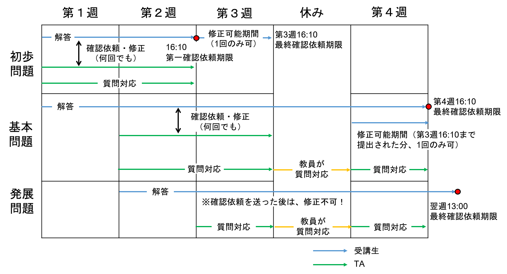
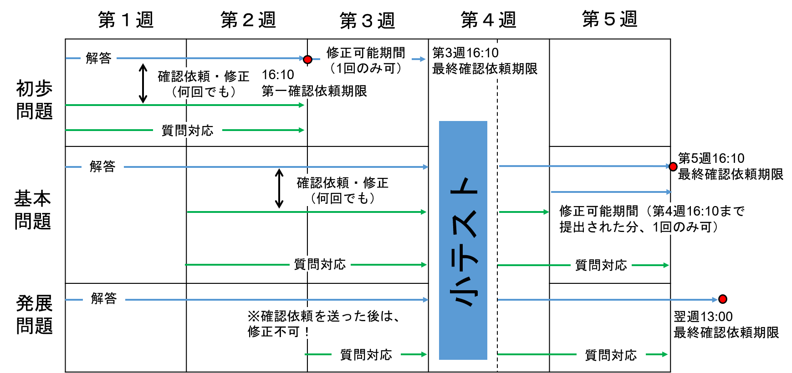
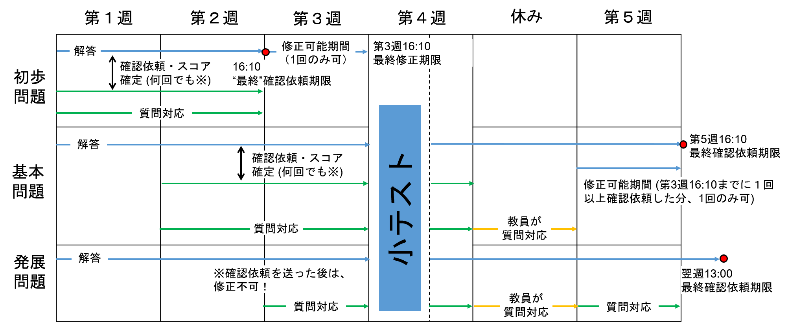

# 問題毎のポリシー
* 初歩問題：第２週までに確認依頼が必要．それまでは何回でも修正可能．その後は１回だけ修正が可能．
* 基本問題：第４週までに確認依頼すればよい．第３週までは何回でも修正可能．第３週までに確認依頼されていれば，その後１回だけ修正が可能．
* 発展問題：最終期限は演習終了１週間後．修正は不可．
* 問題毎に質問対応期間が決まっている．

# 課題１

# 課題２

# 課題３

