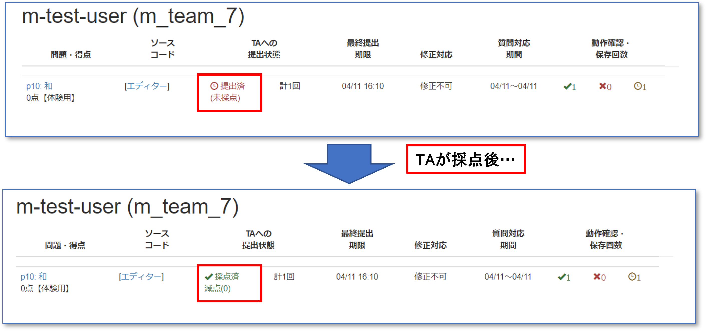

---
## はじめに
---

標準的には，以下の手順で課題を進めることになります．

1. 自動採点システムにログインする（このページをみている時点で既にログインしているはず）．
2. 取り組む問題のページを開く．
3. 同じ問題のエディターを開く．
4. エディターにプログラムを入力・編集する．
5. 適宜「保存」を行う．
   * ブラウザのページ更新やブラウザを閉じると保存していないプログラムは全て破棄されます．
6. プログラムをコンパイルする．
   * プログラムがプログラミング言語の仕様を満たして正しくかけているか検証．コンパイルエラーが出た場合は，原因を特定し．3に戻る．
7. プログラムを実行する．
   * 問題のページにあるサンプル入力などを使って正しく動いているか検証．うまく動かない場合は，プログラムをデバッグして原因を特定し．3に戻る． 
8. プログラムの動作確認をする．
   * いくつかのテストケース（入力列）に対して，プログラムが正しい出力をするか検証．
   * 動作確認に成功した場合，次に進める．失敗した場合は，プログラムをデバッグしてうまく動かない原因を特定し，3に戻る．
9. 自動採点システムでTAに提出し，採点をしてもらう．
   * TAに提出しないと点数が付かないので注意すること．

---
## 実施例
---

これらの手順を，以下の課題を解きながら進めてみましょう．

> 問題1-0: 2つの整数を標準入力から読み取り，その和を標準出力に書き出すプログラムを作成せよ


---
### 1. 自動採点システムにログインする
---
（このページをみている時点で既にログインしているはずなので省略）．

---
### 2. 取り組む問題のページを開く
---
（このページのことなので省略）．

---
### 3. 同じ問題のエディターを開く
---

本演習では，自動採点システムに付随する「ブラウザ上で動くエディタ」を使い，プログラミングを行います．

問題1-0のページを開く． 次に，1-0のエディタを開く．

{: align="center"}


<br>

<br>

すると，以下のようなページが現れます．

{: align="center"}
  

---
### 4. エディターにプログラムを入力・編集する．
---

エディターページの黒い部分がエディターなので，以下のプログラムを入力してください．

- 実際の問題ではプログラムを自分で設計・実装することになります．

```
#include <stdio.h>

int main()
{
  int a, b;
  scanf("%d %d", &a, &b);
  printf("%d\n", a+b);
  return 0;
}
```
---
### 5. 適宜「保存」を行う
---

入力したソースコードを保存するために「保存」ボタンを押します．

{: align="center"}


<br>

<br>

そうすると，保存履歴が追加されます．
履歴には最近のものから最大で100件表示されます．

{: align="center"}


また，履歴のリンクをクリックすることで，いつでも保存した状態に戻ることができます．


---
### 6. プログラムをコンパイルする．
---

プログラムが完成したと思ったら，作成したプログラムをコンパイルします．
C言語のソースコードがコンピュータが実行できる形式（機械語）に翻訳されます．

通常は，ターミナルなどで以下のコマンドを入れます．ここで，`sum.c`はソースコードのファイル名となります．
```
$ gcc -Wall sum.c
```
プログラムが正しく書かれていれば，実際には，，実行ファイル`a.out`が作成されます．
- なお，`-Wall`はコンパイルエラーにはならないものの，ソースコードに問題がありそうな場合に警告を表示するためのオプションです．予期せぬバグを防止するために，このオプションは必ず付けることを推奨しています．

この演習では，全てサーバ側で処理するため，「保存 / コンパイル」ボタンをクリックします．
すると，内部的にコンパイルが行われ，正しければメッセージなし，なにか問題があれば，エラーメッセージが表示されます．

{: align="center"}


---
### 7. プログラムを実行する．
---

コンパイルが正常に終了した場合，次に実際にプログラムを実行してみます．

本来は，`sum.c`から作成された`a.out`を実行するには，以下のコマンドを入力します．
```
$ ./a.out
```

この演習では，全てサーバ側で処理するため，「保存 / コンパイル / 実行」ボタンをクリックします．
すると，内部的にコンパイルとプログラムの実行が行われます．
このときに，「入力データ」に入れたものが，標準入力としてプログラムに渡されます．

{: align="center"}


<br>

<br>

具体的に，上記のプログラムでは`scanf`関数により，標準入力（キーボード）からの入力待ちの状態になりますので，２つの整数を入力します．

例：`4 5`

「コンパイル/実行」ボタンを押すと実行結果が表示されます．

{: align="center"}


実際に問題に取り組むときは，問題のページに書かれている実行例を入力し，期待通りの出力が得られることを確認してください．

上の例では，プログラムが正しく動作したので，デバッグは不要です．

---
### 8. プログラムの動作確認をする．
---

プログラムのコンパイル/実行が完了したら，動作確認に進みます．
エディターの下にある「動作確認」ボタンをクリックすると，内部で用意した入力と出力のセット（テストケース）に対して，プログラムの実行と出力の比較がされます．
全てのテストケースに正解した場合，動作確認成功となります．

{: align="center"}


<br>

<br>

なお，このシステムは複数の受講生が同時に利用していますので，ボタンを押した順番に動作確認が行われます．
このため，ボタンを押した直後は「テスト中」と表示されます．
よほど混雑していない限り，評価はすぐに完了します．
動作確認に成功すると，次のような画面が表示されます．

{: align="center"}


<br>

<br>

また黒いエディターの下には，実行結果が表示されています．

{: align="center"}


`STDIN`は「標準入力から与えられた内容」，`STDOUT`は「標準出力からプログラムが出力した内容」，ここには表示されていませんが`STDERR`は「標準エラー出力から出力した内容」を表示しています．
この例では，`3 4`の入力に対してプログラムが`7`を返し，その出力が正しかったことを示しています．
失敗したと表示された場合は，失敗したテストケースが赤色で表示されますので，それに対してコンパイル/実行を行なうなどして，プログラムをデバッグしてください．

---
### 9. TAに動作確認に成功したことを報告し，採点をしてもらう．
---

動作確認に成功したら，TAに提出して採点してもらいます．仕様を満たさない場合は減点されるので，仕様をよく読んで，適宜プログラムを修正してから提出しましょう．
**TAに提出しないと，その問題で得られる点数はゼロです．**

{: align="center"}


<br>

<br>

TAに提出中はその問題の動作確認・提出はできません．TAの採点が完了するまで，次の問題に取り組むなどしていて下さい．

{: align="center"}


<br>

<br>

自動採点システムのトップページを見ると，TAに提出した問題は「提出済（未採点）」という状態になっています．TAが採点した後は「採点済」という状態になります．

{: align="center"}



---
## 分からないことがあったら
---

書籍を見ながらのプログラミング，インターネットでの検索，教員・TAへの相談，周りの人との相談，など，**すべて問題ありません．推奨します．**
ただし言うまでもなく剽窃（コピペ）は厳に謹んでください．
ただし，インターネットで検索する場合，**とくに日本語での検索結果（Wikipedia 含む）には間違いが含まれている可能性がより高い** ことに留意してください．一般に書籍の方が正確性が高く，また，記事を検索する場合は日本語記事よりも英語記事の方が正確である場合が多いです．たとえば[英語版Wikipeda](https://en.wikipedia.org/)の計算機科学関連の記事や，[Stack Overflow](http://stackoverflow.com/)で票をたくさんもらっている回答はかなり正確だと思ってもらって結構です．

ChatGPTをはじめとする生成系AIの利用については，"東北大学 オンライン授業 ガイド"の[ChatGPT等の生成系AI利用に関する留意事項（学生向け）](https://olg.cds.tohoku.ac.jp/forstudents/ai-tools)に記載されているとおり， <font color="red"><b>AIの出力をレポート等の解答にそのまま利用することは自身の勉強になりません</b></font>．
プログラミング演習Aは皆さん自身のプログラミング能力を高めることが目的ですので，生成系AIを使ってコードを生成すること，コードのデバッグを行うことは控えてください．

また，各問題には「ヒント」の欄を設け，簡単なコメント・参考図書の該当章・参考URLなどを示しています．
「林」「倉」「高橋」などはそれぞれ参考図書を著者名で表します．
この欄に挙がっているキーワードを眺めるだけでも問題を解く際の大きなヒントとなるでしょう．

言語の仕様については以下のサイトや書籍も有益です．

- [JM Project (Japanese)](https://linuxjm.osdn.jp/index.html) （日本語，検索窓から関数名などで検索できる）
- [C reference - cppreference.com](http://en.cppreference.com/w/c) （英語）
- Samuel P. Harbison III and Guy L. Steele Jr.：『Cリファレンスマニュアル』，エスアイビーアクセス，2015．

