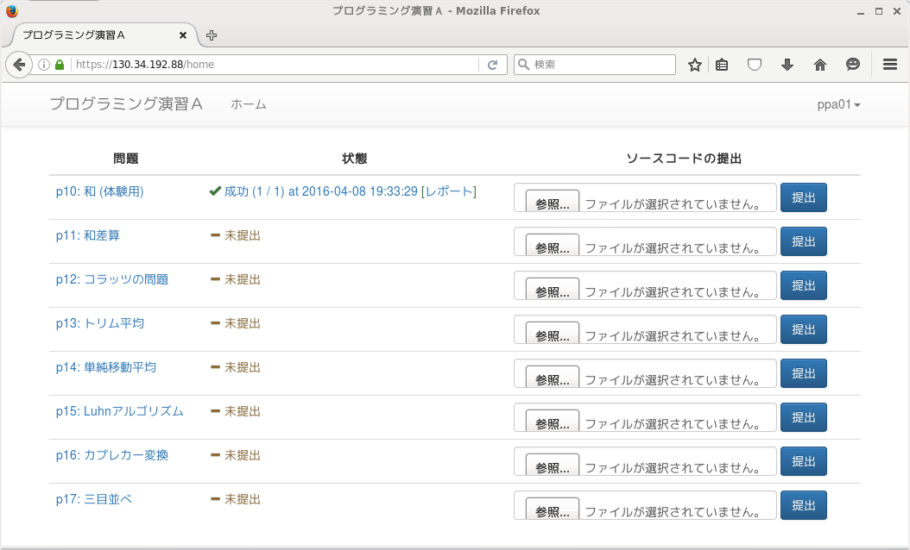

## はじめに

標準的には，以下の手順で課題を進めることになります．

1. プログラムを入力・編集する．
2. プログラムをコンパイルする．
3. プログラムを実行する．実行結果が正しければ手順6に進む．
4. プログラムをデバッグしてプログラムがうまく動かない原因を特定する．その後，手順1に戻る．
5. プログラムを[自動採点システム](https://www.cl.ecei.tohoku.ac.jp/ppa/)に提出する．テストに失敗した場合は，実行結果から失敗原因を探り，手順1もしくは手順3に戻る．
6. レポートを印刷する

これらの手順を，以下の課題を解きながら進めてみましょう．

> 2つの整数を標準入力から読み取り，その和を標準出力に書き出すプログラムを作成せよ

## ソースコードの入力

演習室の環境では，[Emacs](https://www.gnu.org/software/emacs/)，[Vim](http://www.vim.org/)，[gedit](https://wiki.gnome.org/Apps/Gedit)，[nano](http://www.nano-editor.org/)などのエディタを使い，ソースコードを入力します．
どのエディタを使っても構いませんが，後で説明するデバッグではEmacsを使うことを想定していますので，この演習では**Emacsを推奨**します．

まず，Emacsで`sum.c`というプログラムを作成するため，ターミナルから以下のコマンドを入力します．
ここではプログラムの名前を`sum.c`としましたが，どのような名前をつけても構いません．
末尾の`&`は，emacsをバックグラウンドで実行することで，emacsとターミナルの両方を同時に使えるようにするためのものです．

```
$ emacs sum.c &
```

以下のプログラムを入力します．
実際の課題ではプログラムを自分で設計・実装することになります．

```
#include <stdio.h>

int main()
{
  int a, b;
  scanf("%d %d", &a, &b);
  printf("%d\n", a+b);
  return 0;
}
```

入力したソースコードを保存するために，ツールバーのアイコンをクリックするか，`[Ctrl]+[x] [Ctrl]+[s]` キーを押します．
Emacsの操作方法は[Emacs クイックリファレンス](http://www.unixuser.org/~euske/doc/emacsref/)などを参照するとよいと思います．

## コンパイル

作成したプログラム（`sum.c`）をコンパイルします．
C言語のソースコードがコンピュータが実行できる形式（機械語）に翻訳され，実行ファイル`a.out`が作成されます．

```
$ gcc -Wall sum.c
```

なお，`-Wall`はコンパイルエラーにはならないものの，ソースコードに問題がありそうな場合に警告を表示するためのオプションです．
予期せぬバグを防止するため，**このオプションは必ず付けてください**（後述）．

## プログラムの実行

`sum.c`から作成された`a.out`を実行するには，以下のコマンドを入力します．

```
$ ./a.out
```

`scanf`関数により，標準入力（キーボード）からの入力待ちの状態になりますので，２つの整数を入力します．
実行例を以下に示します．

```
$ ./a.out
3                       <- 入力して[Enter]キーを押す
4                       <- 入力して[Enter]キーを押す
7                       <- 和が出力される
```

ちなみに，`scanf`関数の仕様により，空白文字で数字を区切って入力することも可能です．

```
$ ./a.out
3 5                     <- スペース区切りで整数を入力して[Enter]キーを押す
8                       <- 和が出力される
```

実際に課題に取り組むときは，問題のページに書かれている実行例を入力し，期待通りの出力が得られることを確認してください．
また，プログラムが無限ループに陥って暴走したり，入力待ちから抜けるために強制終了したいときがあります．
**強制終了するには，`[Ctrl]+[c]`を押してください**．

## プログラムのデバッグ

上の例では，プログラムが正しく動作したので，デバッグは不要です．
ここでは，以下のような間違ったプログラムを入力してしまった場合について説明します．
このプログラムでは，`scanf`関数の引数の変数に`&`を付けるのを忘れています（最初のうちはよく間違えるミスです）．

```
#include <stdio.h>

int main()
{
  int a, b;
  scanf("%d %d", a, b);
  printf("%d\n", a+b);
  return 0;
}
```

驚くことに，`-Wall`オプションを付けずにコンパイルすると，何のエラーも出ずにコンパイルが成功してしまいます．

```
$ gcc sum.c
```

実行すると，次のようにSegmentation Fault（セグメントエラー）が発生します．

```
$ ./a.out
2 3
セグメントエラー
```

プログラムのどこでセグメントエラーが発生したのか調べるには，デバッガを使います．
デバッガの使い方は，こちらの[資料](http://localweb.ecei.tohoku.ac.jp/~enshu25/emacs-gdb.pdf)や[動画](https://www.youtube.com/watch?v=p7XdkrlFXnU)にまとめられていますので，各自で確認してください．

なお，先ほどのプログラムは，`-Wall`付きでコンパイルすると警告が表示されます．

```
$ gcc -Wall sum.c
sum.c: In function ‘main’:
sum.c:6: 警告: format ‘%d’ expects type ‘int *’, but argument 2 has type ‘int’
sum.c:6: 警告: format ‘%d’ expects type ‘int *’, but argument 3 has type ‘int’
sum.c:6: 警告: ‘a’ is used uninitialized in this function
sum.c:6: 警告: ‘b’ is used uninitialized in this function
```

このエラーメッセージの意味が理解できなくても，`sum.c`の6行目に問題がありそうなことは分かると思います．
一般に，セグメントエラーのデバッグは少し手間がかかりますので，`-Wall`を付けておくだけでバグを発見しやすくなり，プログラムの開発効率がかなり向上します．

## 自動採点システムへの投稿

プログラムの動作確認・デバッグが完了したら，自動採点システム（[https://130.34.192.88/](https://130.34.192.88/)）に投稿します．
自動採点システムにアクセスすると，ユーザIDとパスワードを入力する画面になりますので，ログインして下さい．
初回ログイン時に，右上のメニューから仮パスワードを変更して下さい．

ログイン後，以下のようなホーム画面になります．
まだプログラムを提出していませんので，全ての問題が「未提出」と表示されます．


先ほど作成した`sum.c`を「p10: 和（体験用）」に対する解答として提出してみましょう．
問題に対応する部分の「参照」ボタンを押し，提出したいソースコードを選択します．
その後，「提出」ボタンを押すとソースコードが提出され，システム上で自動的に採点されます．
なお，このシステムは複数の受講生が同時に利用していますので，同時にソースコードが提出された場合は，提出順に採点が進みます．
このため，ソースコード提出直後は「テスト中」と表示されます．


よほど混雑していない限り，評価は一瞬で完了します．
少し間をおいてから「更新」ボタンを押して下さい．
テストに成功すると，次のような画面が表示されます．

STDINは標準入力から与えられた内容，STDOUTは標準出力からプログラムが出力した内容，ここには表示されていませんがSTDERRは標準エラー出力から出力した内容を表示しています．
この例では，`3 4`の入力に対してプログラムが`7`を返し，その出力が正しかったことを示しています．
この例ではテスト事例は1つですが，通常は複数のテスト事例が用意され，その全てに対して正しい結果を返した場合のみ，テストに成功します．
テストに失敗したと表示された場合は，失敗したテスト事例が表示されます．
失敗したテスト事例を使って端末上で動作させ，プログラムをデバッグしてください．


## レポートの印刷

テストに成功すると，ホーム画面に「レポート」へのリンクが表示されます．
このリンクをクリックすると，テスト結果の画面になりますので，この画面を印刷してレポートとします．
面接では，このレポートを見ながらプログラムの説明をすることになります．
面接点を確実に取れるように，**印刷したソースコードや出力結果にメモを書き込み，プログラムの説明の準備をしておくことをお勧めします**．



## 分からないことがあったら

書籍を見ながらのプログラミング，インターネットでの検索，教員・TAへの相談，周りの人との相談，など，**すべて問題ありません．推奨します．**
言うまでもなく剽窃（コピペ）は厳に謹んでください．
ただし，インターネットで検索する場合，**とくに日本語での検索結果（Wikipedia 含む）には間違いが含まれている可能性が高い** ことに留意してください．一般に書籍の方が正確性が高く，また，記事を検索する場合は日本語記事よりも英語記事の方が正確である場合が多いです．たとえば[英語版Wikipeda](https://en.wikipedia.org/)の計算機科学関連の記事や，[Stack Overflow](http://stackoverflow.com/)で票をたくさんもらっている回答はかなり正確だと思ってもらって結構です．

また，各問題には「ヒント」の欄を設け，簡単なコメント・参考図書の該当章・参考URLなどを示しています．
「林」「倉」「高橋」はそれぞれ参考図書を著者名で表します．
この欄に挙がっているキーワードを眺めるだけでも問題を解く際の大きなヒントとなるでしょう．

言語の仕様については以下のサイトや書籍も有益です．

- [JM Project (Japanese)](https://linuxjm.osdn.jp/index.html) （日本語，検索窓から関数名などで検索できる）
- [C reference - cppreference.com](http://en.cppreference.com/w/c) （英語）
- Samuel P. Harbison III and Guy L. Steele Jr.：『Cリファレンスマニュアル』，エスアイビーアクセス，2015．

## 演習室以外で課題を進めるには

セキュリティ上の問題から，自動採点システム（[https://130.34.192.88/](https://130.34.192.88/)）は学内からのアクセスのみ許可しています．
逆に言えば，学内でウェブブラウザが利用できる環境であれば，学内のどこからでも（例えば川内からでも）自動採点システムにプログラムを投稿できます．
例えば，川内のマルチメディア棟では，Linux端末からgccやemacsが利用できますので，１号館別館の演習室とほぼ同じように課題を進めることができます．
ただし，青葉山と川内の演習室のホームディレクトリは同期していません．
片方の演習室で進めた課題をもう片方の演習室で進めるには，電子メールなどの手段でファイルを転送しておく必要があります．

課題を自宅などで自分のパソコンで進めることもできます．
[Windows環境でプログラミングを行う手順](gcc_for_windows.html)や[Mac OS X環境でプログラミングを行う手順](gcc_for_osx.html)を参照して下さい．
ただし，自動採点システムに学外からアクセスすることは出来ませんので，完成させたソースコードを電子メールなどの方法で学内に転送し，学内から自動採点システムに投稿する必要があります．
この際，自分のパソコンで動くと思っていたプログラムにバグがあり，テストに失敗する可能性は十分にありますので，自動採点システムへの投稿は余裕をもって行って下さい．
