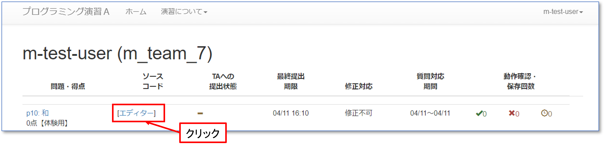
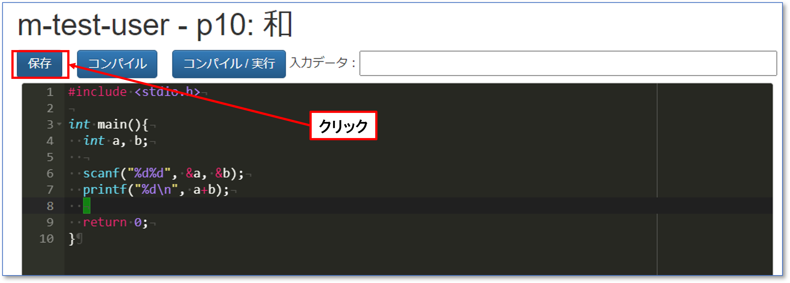
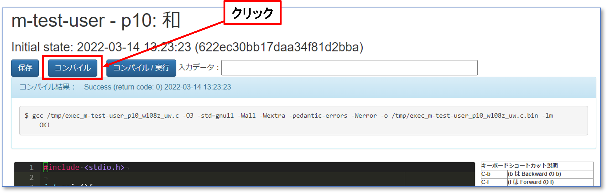
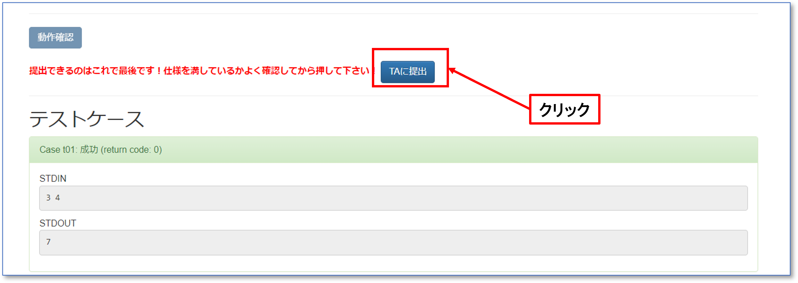
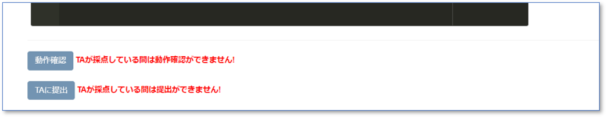

---
## はじめに
---

標準的には，以下の手順で課題を進めることになります．

1. 自動採点システムにログインする（このページをみている時点で既にログインしているはず）．
2. 取り組む課題のページを開く．
3. 同じ課題のエディターを開く．
4. エディターにプログラムを入力・編集する．
5. 適宜「保存」を行う．
   * ブラウザのページ更新やブラウザを閉じると保存していないプログラムは全て破棄されます．
6. プログラムをコンパイルする．
   * プログラムがプログラミング言語の仕様を満たして正しくかけているか検証．コンパイルエラーが出た場合は，原因を特定し．3に戻る．
7. プログラムを実行する．
   * 課題のページにあるサンプル入力などを使って正しく動いているか検証．うまく動かない場合は，プログラムをデバッグして原因を特定し．3に戻る． 
8. プログラムを提出する．
   * テストに失敗した場合は，プログラムをデバッグしてプログラムがうまく動かない原因を特定し，3に戻る．
9. 自動採点システムでTAに確認依頼をし，確認をしてもらう．
   * TAからの合格がなければ課題終了とならないので注意すること．

---
## 実施例
---

これらの手順を，以下の課題を解きながら進めてみましょう．

> 課題1-0: 2つの整数を標準入力から読み取り，その和を標準出力に書き出すプログラムを作成せよ


---
### 1. 自動採点システムにログインする
---
（このページをみている時点で既にログインしているはずなので省略）．

---
### 2. 取り組む課題のページを開く
---
（このページのことなので省略）．

---
### 3. 同じ課題のエディターを開く
---

本演習では，自動採点システムに付随する「ブラウザ上で動くエディタ」を使い，プログラミングを行います．

課題1-0の課題のページを開く． 次に，課題1-0のエディタを開く．



<br>

<br>

すると，以下のようなページが現れます．

  

---
### 4. エディターにプログラムを入力・編集する．
---

エディターページの黒い部分がエディターなので，以下のプログラムを入力してください．

- 実際の課題ではプログラムを自分で設計・実装することになります．

```
#include <stdio.h>

int main()
{
  int a, b;
  scanf("%d %d", &a, &b);
  printf("%d\n", a+b);
  return 0;
}
```
---
### 5. 適宜「保存」を行う
---

入力したソースコードを保存するために「保存」ボタンを押します．



<br>

<br>

そうすると，保存履歴が追加されます．
履歴には最近のものから最大で100件表示されます．


また，履歴のリンクをクリックすることで，いつでも保存した状態に戻ることができます．


---
### 6. プログラムをコンパイルする．
---

プログラムが完成したと思ったら，作成したプログラムをコンパイルします．
C言語のソースコードがコンピュータが実行できる形式（機械語）に翻訳されます．

通常は，ターミナルなどで以下のコマンドを入れます．ここで，`sum.c`はソースコードのファイル名となります．
```
$ gcc -Wall sum.c
```
プログラムが正しく書かれていれば，実際には，，実行ファイル`a.out`が作成されます．
- なお，`-Wall`はコンパイルエラーにはならないものの，ソースコードに問題がありそうな場合に警告を表示するためのオプションです．予期せぬバグを防止するために，このオプションは必ず付けることを推奨しています．

この演習では，全てサーバ側で処理するため，「保存 / コンパイル」ボタンをクリックします．
すると，内部的にコンパイルが行われ，正しければメッセージなし，なにか問題があれば，エラーメッセージが表示されます．




---
## 7. プログラムを実行する．
---

コンパイルが正常に終了した場合，次に実際にプログラムを実行してみます．

本来は，`sum.c`から作成された`a.out`を実行するには，以下のコマンドを入力します．
```
$ ./a.out
```

この演習では，全てサーバ側で処理するため，「保存 / コンパイル / 実行」ボタンをクリックします．
すると，内部的にコンパイルとプログラムの実行が行われます．
このときに，「入力データ」に入れたものが，標準入力としてプログラムに渡されます．


<br>

<br>

具体的に，上記のプログラムでは`scanf`関数により，標準入力（キーボード）からの入力待ちの状態になりますので，２つの整数を入力します．

例：`4 5`

「コンパイル/実行」ボタンを押すと実行結果が表示されます．


実際に課題に取り組むときは，問題のページに書かれている実行例を入力し，期待通りの出力が得られることを確認してください．

上の例では，プログラムが正しく動作したので，デバッグは不要です．

---
### 8. プログラムを提出する．
---

プログラムの動作確認・デバッグが完了したら課題を提出します．
エディターの下にある「提出」ボタンをクリックするとソースコードが提出され，システム上で自動的に採点されます．


<br>

<br>

なお，このシステムは複数の受講生が同時に利用していますので，同時にソースコードが提出された場合は，提出順に採点が進みます．
このため，ソースコード提出直後は「テスト中」と表示されます．
よほど混雑していない限り，評価は一瞬で完了します．
テストに成功すると，次のような画面が表示されます．


<br>

<br>

また黒いエディターの下には，実行結果が表示されています．


`STDIN`は「標準入力から与えられた内容」，`STDOUT`は「標準出力からプログラムが出力した内容」，ここには表示されていませんが`STDERR`は「標準エラー出力から出力した内容」を表示しています．
この例では，`3 4`の入力に対してプログラムが`7`を返し，その出力が正しかったことを示しています．
この例ではテスト事例は1つですが，通常は複数のテスト事例が用意され，その全てに対して正しい結果を返した場合のみ，テストに成功します．
テストに失敗したと表示された場合は，失敗したテスト事例が表示されます．
失敗したテスト事例を使って端末上で動作させ，プログラムをデバッグしてください．

---
### 9. TAに自動採点システムを通過したことを報告し，確認をしてもらう．
---

自動採点で合格になったら，その旨をTAにその都度確認依頼をし，プログラムの確認をしてもらいます．
**TAに合格をもらって，はじめてその問題を終了したことになります．**



<br>

<br>

確認依頼中はその問題の再提出・再確認依頼はできません．TAが確認するまで，次の問題に取り組むなどしていて下さい．



<br>

<br>

自動採点システムのトップページを見ると，確認依頼した問題は「依頼済（未確認）」という状態になっています．TAが確認した後は「確認済」という状態になります．


---
## 分からないことがあったら
---

書籍を見ながらのプログラミング，インターネットでの検索，教員・TAへの相談，周りの人との相談，など，**すべて問題ありません．推奨します．**
ただし言うまでもなく剽窃（コピペ）は厳に謹んでください．
ただし，インターネットで検索する場合，**とくに日本語での検索結果（Wikipedia 含む）には間違いが含まれている可能性が高い** ことに留意してください．一般に書籍の方が正確性が高く，また，記事を検索する場合は日本語記事よりも英語記事の方が正確である場合が多いです．たとえば[英語版Wikipeda](https://en.wikipedia.org/)の計算機科学関連の記事や，[Stack Overflow](http://stackoverflow.com/)で票をたくさんもらっている回答はかなり正確だと思ってもらって結構です．

また，各問題には「ヒント」の欄を設け，簡単なコメント・参考図書の該当章・参考URLなどを示しています．
「林」「倉」「高橋」などはそれぞれ参考図書を著者名で表します．
この欄に挙がっているキーワードを眺めるだけでも問題を解く際の大きなヒントとなるでしょう．

言語の仕様については以下のサイトや書籍も有益です．

- [JM Project (Japanese)](https://linuxjm.osdn.jp/index.html) （日本語，検索窓から関数名などで検索できる）
- [C reference - cppreference.com](http://en.cppreference.com/w/c) （英語）
- Samuel P. Harbison III and Guy L. Steele Jr.：『Cリファレンスマニュアル』，エスアイビーアクセス，2015．

