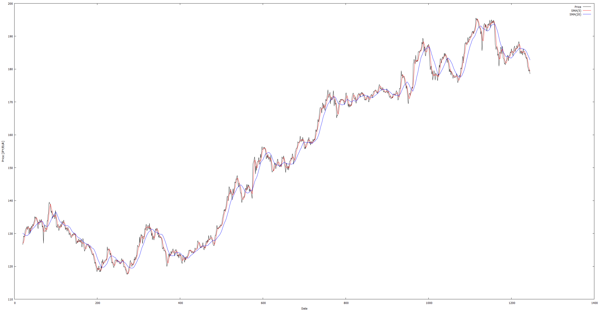

[単純移動平均 (SMA: Simple Moving Average)](https://ja.wikipedia.org/wiki/%E7%A7%BB%E5%8B%95%E5%B9%B3%E5%9D%87)を用いた金融データ（為替レート）の分析を体験しよう．

単純移動平均は，時系列データの傾向を調べる際しばしば用いられる指標であり，
形式的には，$T$日分の観測値からなる時系列データ$x_1, x_2, ..., x_T$に対して，日付$t$における，$N$日の単純移動平均は次式で定義される．
簡単に言えば，時系列データの各時点$t$における「（当日も含めた）直近$N$日の平均」のことである．


$$
{\rm SMA}^{(N)}_t = \frac{x_t + x_{t-1} + ... + x_{t-N+1}}{N}
$$

ここでは，5日単純移動平均と20日単純移動平均を求めるプログラムを作成しよう．

※ 投資では，短期移動平均線（例えば${\rm SMA}^{(5)}$）が長期移動平均線（例えば${\rm SMA}^{(20)}$）を下から上に突き抜けた時をゴールデンクロスと呼び，買い（上昇トレンド）のシグナルとして用いられる．逆に，短期移動平均線が長期移動平均線を上から下に突き抜けた時をデッドクロスと呼び，売り（下降トレンド）のシグナルとして用いられる．

## 問題

### プログラムの作成

標準入力から$1,245$個の観測値からなる時系列データ$x_1, x_2, ..., x_{1245}$を読み込み，
5日単純移動平均，20日単純移動平均を計算し，
各日付$t=20, 21, ..., 1245$に対して，標準出力に$t$, $x_t$, ${\rm SMA}^{(5)}_t$, ${\rm SMA}^{(20)}_t$を半角スペース区切りで書き出せ．

ただし，入力される実数値は1行1観測値の形式で，$t=1$から$1,245$までのちょうど$1,245$個の観測値が順に与えられると仮定してよい．
プログラムは以下の仕様を満たすこと．

1. $x_t$, ${\rm SMA}^{(5)}_t$, ${\rm SMA}^{(20)}_t$はそれぞれ`printf`関数のフォーマット指定子を用い，小数点以下2位までを出力すること
1. 各行の末尾には改行文字`\n`を付けること


### グラフの作成

さらに，作ったプログラムを[米ドルの為替レートのデータ](usdjpy.txt)に適用し，横軸を$t$，縦軸を観測値として，$x_t$, ${\rm SMA}^{(5)}_t$, ${\rm SMA}^{(20)}_t$をそれぞれ折れ線グラフとしてひとつの図の中にプロットし，レポートに含めよ．
グラフの作成には[gnuplot](http://www.gnuplot.info/)を使うとよい．

## 実行例

`#`は標準入力，`>`は標準出力を表す．

```
# 83.78
# 82.9
# 82.61
# 83.62
# 83.98
# 83.82
# 83.95
# 83.56
# 83.87
# 84.25
# 84.06
# 84.09
# 83.74
# 83.83
# 83.19
# 82.97
# 82.72
# 82.33
# 81.44
# 81.8
# 82.04
# 83.38
# 83.36
# 82.9
# 83.32
# 83.12
# 82.81
# 82.93
# 82.77
# 82.6
# 82.17
# 83.05
# 82.72
# 82.63
# 82.24
# 82
# 82.77
# (途中省略)
# 120.96
# 120.15
# 120.54
# 120.39
# 120.54

> 20 81.80 82.25 83.33
> 21 82.04 82.07 83.24
> 22 83.38 82.20 83.26
> 23 83.36 82.40 83.30
> 24 82.90 82.70 83.26
> 25 83.32 83.00 83.23
> 26 83.12 83.22 83.20
> 27 82.81 83.10 83.14
> 28 82.93 83.02 83.11
> 29 82.77 82.99 83.05
> 30 82.60 82.85 82.97
> 31 82.17 82.66 82.88
> 32 83.05 82.70 82.82
> 33 82.72 82.66 82.77
> 34 82.63 82.63 82.71
> 35 82.24 82.56 82.66
> 36 82.00 82.53 82.62
> 37 82.77 82.47 82.62
> 38 82.11 82.35 82.61
> 39 82.04 82.23 82.64
> 40 81.47 82.08 82.62
> 41 81.63 82.00 82.60
> 42 81.67 81.78 82.52
> 43 82.28 81.82 82.46
> 44 82.31 81.87 82.43
> 45 82.31 82.04 82.38
> 46 82.49 82.21 82.35
> 47 83.26 82.53 82.37
> 48 83.32 82.74 82.39
> 49 83.73 83.02 82.44
> 50 83.63 83.29 82.49
> 51 83.37 83.46 82.55
> 52 83.10 83.43 82.55
> 53 82.95 83.36 82.57
> 54 82.87 83.18 82.58
> 55 82.31 82.92 82.58
> 56 81.94 82.63 82.58
> (途中省略)
> 1241 120.96 121.70 122.27
> 1242 120.15 121.23 122.15
> 1243 120.54 120.84 122.04
> 1244 120.39 120.65 121.92
> 1245 120.54 120.52 121.79
```

## グラフのプロット例

[ユーロの為替レートのデータ](eurjpy.txt)に対して，$x_t$, ${\rm SMA}^{(5)}_t$, ${\rm SMA}^{(20)}_t$をプロットした例．

<a href="eurjpy.png"></a>

## ヒント

### リダイレクト

- ダウンロードした`usdjpy.txt`をプログラムに渡す（`scanf`関数から読み込ませるには）には，`$ ./a.out < usdjpy.txt`のように`<`を用いれば良い．
    - （より深く知りたい人へ）`a.out`などのプログラムは，**標準入力**，**標準出力**，**標準エラー出力**と呼ばれる3つの「データの出入り口」を持っている．何も指定しない場合，標準入力はキーボードに繋がっている（ので，キーボードから入力した文字列を`scanf`関数で読み込むことができる）が，`<`という記号を用いてこの出入り口を別のファイルに繋ぎかえることができる（**リダイレクト**）．標準出力は`>`で繋ぎかえることができる．
    - （より深く知りたい人へ）したがって，この問題以外についても，`kadai1-1input.txt`等のファイルに入力例を書いておいてリダイレクトすれば，プログラムをテストする際の作業効率が大変よくなる．
- 林：18.3 標準ストリーム

### gnuplotの使い方

- グラフ作成に使うgnuplotの使い方については，別資料「[gnuplotの使い方](../tips/gnuplot_howto.html)」を参照せよ

## 余談

移動平均の応用は，信号処理全般にわたって広がっている．画像処理では，画像のノイズを除去して滑らかにするために移動平均が用いられる．音声処理では，移動平均は有限インパルス応答（FIR）フィルタの特殊形であり，ローパスフィルタ（LPF）として用いることができる．

## 謝辞

この演習で使用するデータとして，みずほ銀行が提供している[外国為替公示相場ヒストリカルデータ](http://www.mizuhobank.co.jp/rate/market/historical.html)を用いた．
