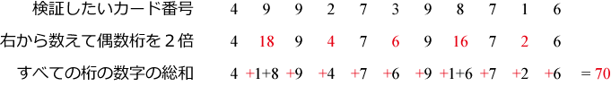

クレジットカード番号に誤りがないか確認するため，[Luhnアルゴリズム](https://ja.wikipedia.org/wiki/Luhn%E3%82%A2%E3%83%AB%E3%82%B4%E3%83%AA%E3%82%BA%E3%83%A0)が用いられている．このアルゴリズムは，入力された番号が「正しい」か「間違っている」かを，以下の手順で求める．

1. 右端から数えて偶数番目の数字をすべて2倍する
2. 1.の計算の後，すべての数字の総和を求める．ただし，1.の処理で数字が2桁になった場合は，1桁目と2桁目の数字を足す．
3. 求めた総和の1の位が0であれば「正しい」，そうでなければ「間違っている」と判定する

例えば，49927398716という番号が入力されたとき，



これより$70$が求まり，1の位が0であるため，このカード番号は「正しい」と判定される．

---
## 問題
---
標準入力より60桁までのカード番号を読み取り，
Luhnアルゴリズムで正当性を検証し，正しければ`true`，間違っていれば`false`と標準出力に書き出すプログラムを作成せよ．

ただし，プログラムは以下の仕様を満たすこと．

1. 入力される整数$x$が$1$文字以上$60$文字以下を受理し，それ以外の入力の場合は，`Error`と表示して終了する．
1. 入力される整数$x$が$0$より小さい値の場合や，$0$から$9$までの10文字以外の文字が代入された場合は，`Error`と表示して終了する．
1. 各表示は標準出力に出力し，それぞれ末尾には改行文字`\n`を付けること．
1. `#include` していいのは `<stdio.h>`のみとする．
1. 入力を保持するメモリ領域は，必要かつ最小の文字数分を確保すること．
1. scanfを使わないこと（理由は手順例1.に書いてある） ．

---
## 実行例
---
`#`は標準入力，`>`は標準出力を表す．

```
# 49927398716
> true
```

```
# 49927398714
> false
```

```
# 1982049058395830128494
> true
```

---
### 手順例
---

問題を分解して考える．

1. 標準入力から整数$x$を読み込む
1. 入力された数字を各桁ごとに処理
1. 各桁の値の総和を計算する，ただし，右から数えて偶数の桁は値を2倍する
1. $x_{i+1}$ を出力

---
#### 0. 準備

- これまでの課題と同様に，まず，確実に必要と思われるC言語のメインの構造を作ってみる．

---
#### 1. 標準入力から整数$x$を読み込む

- これまでの課題と同じように考えれば，以下の様に値を読み込むことをまず考えるだろう．

```
int main()
{
  int xxx;
  scanf("%d", &xxx);
...
}
```

- しかし，この課題1-5では，この読み込み方で課題を完璧に解くことができない．その理由は「標準入力より60桁までのカード番号を読み取り，．．．」の部分に関わっている．
    - 計算機は，もちろん無限の数値を記憶できるわけではなく，物理的な記憶メモリに記述できる大きさの数字しか表現できない．通常一つの数値を表すために用意されている記憶領域は，64bitマシンでひとつのレジスタをまるまるひとつのunsigned整数に用いても$2^{64} - 1$（=$18,446,744,073,709,551,615$）までの数しか表現できない．これは10進法でわずか20桁である．そのため，`int` では，最大60桁の値を読み込むことができない．
- では，どのようにして値を読み込めば良いか？　一つの方法として，カード番号を（数字を表す）文字の配列，すなわち文字列として読み込むと取り扱いが楽になる．

##### 文字列（文字の配列）の扱い

- C言語には文字列を格納するための型が **無い**．代わりに文字（`char`型）の **配列** として文字列を表現する．
    - 倉：1巻 4-3 文字列--基礎編，4-4 文字列--応用編
    - 高橋：7.6 文字列と配列
- これまでどおり`scanf`を使うとすると，文字列型の変数（文字の配列を指す変数）に値を読み込むコードは以下のようになる：
```
char str[100];
scanf("%s", str); // %sは文字列入力用の変換指定子．strはポインタなので，&strとしてはいけない．
...
```
  - （より深く知りたい人へ）`int x[10]`のように配列変数`x`を宣言し，`x`を関数に渡すと，関数には配列`x`の最初の要素へのポインタ，すなわち`&x[0]`が渡される（`int*`型の値が渡る）．つまり，上で`str`という名前で`scanf`に渡っているものはポインタ（`char*`型）である．

- しかし，この`scanf`の使い方は，読み込む文字列長が配列のサイズを超える場合は，エラーの原因になる（いわゆる”バッファオーバーフロー”と呼ばれるセキュリティホールである）．
- 想定されるより十分大きいサイズの配列（100万など）を確保する応急措置も考えられるが，本質的な解決ではない．本問題の仕様で「入力を保持するメモリ領域は，必要かつ最小の文字数分を確保する」としているため，その方法では仕様を満たすことはできない．そこで，`fgets`関数を用いる：
```
fgets(str, N, stdin);
...
```
- `fgets`は，一行から`N`個未満の文字を読み込み，配列strに格納する関数である（`stdin`は標準入力から読むときに指定）．一行に`N`個以上の文字がある場合、先頭から`N-1`個の文字が読み込まれる．一行に`N`個未満しか文字がない場合は，それらの文字全てが格納される．
- `scanf`と異なり，改行を表す文字コード`\n`も文字として読み込まれることに注意．例えば`abc\n`が入力されると，`str`には`abc\n\0`が格納される（`\0`については2.を参照）．


---
#### 2. 入力された数字を各桁ごとに処理

- 1.の処理で数字を一つずつ分解して読み込んでいるなら，各桁ごとに繰り返し処理をすればよい．
- ここでは，入力が何桁だったのかを取得して処理をしたい．
- 桁数（ここでは文字数）がいくつかを取得する方法を考える．
    - まず，文字列の末尾には，特殊な文字コードである`\0`（ヌル文字）が挿入されている．例えば，`abc`を読み込んだ場合に，実際のメモリ上には`abc\0`の4文字分(`\0`で一文字という計算)が記録されている．よって，`\0`の場所がわかれば桁数（文字列長）がわかる．
- ヒント

```
for(i=0;i<N;++i){
  if(str[i] == '\0'){
    break;
  }
}
```

---
#### 3. 各桁の値の総和を計算する，ただし，右から数えて偶数の桁は値を2倍する

- 右から数えるので，`for` 文の回し方を考える必要がある．というのも，例えば配列の先頭`str[0]`から値をみた場合は，「右から」ではなく「左から」になるため，判定の仕方を考える必要がある．

- 現在，値は文字列として読み込んでいるとすると，文字として読み込んだ`'3'`と数字の`3`は計算機の中では別のものとして扱われているこに注意．（`(int)'3'`と型キャストしても`3`にはならない！）
- **ASCII** （アスキーと読む）の範囲の文字（英数字やキーボードに打刻されている記号類など，たとえば`'a'`，`'3'`，`']'`など）は，計算機の内部では，その文字を表す整数で格納されている．たとえば`'a'`は計算機の内部では`97`である．対応表は **ASCIIコード**，**文字コード** などの用語で調べることができる．
    - 林：表表紙見返し 文字コード表
    - （より深く知りたい人へ）整数`97`を`printf`で文字型（`"%c"`）として出力すれば`'a'`が表示されることが分かるだろう．`char`型は`int`型の仲間である．
    - （より深く知りたい人へ）日本語ではASCIIの範囲外の文字（ひらがな，漢字など）を多く用いるため，日本語文を計算機に取り扱わせる際はASCIIよりも表現力の高い文字コードが必要となる．たとえば Shift JIS や UTF-8 はそうした表現力の高い文字コード（「文字」と「それを計算機の内部でどう表現するか」の対応表）である．
- 文字の`'3'`を数字の`3`にするためには`'3' - '0'`のように**`'0'`を引けば良い**．
    - （より深く知りたい人へ）理由をASCIIコード表を見ながら考えてみよう．`char`型は計算機の内部では`int`としてで扱われることと，ASCIIコード表では`'0'`から`'9'`までが順番に並んでいることがミソである．
- ヒント

```
  v = str[i] - '0';
```

---
### ヒント
---
- 60桁より桁数が多い場合をどう判別すればよいか？fgetsでちょうど60桁読むだけでは判別ができない．
- もし，$0$から$9$までの数字以外の文字が入力される場合はどの様に判定すれば良いか？
