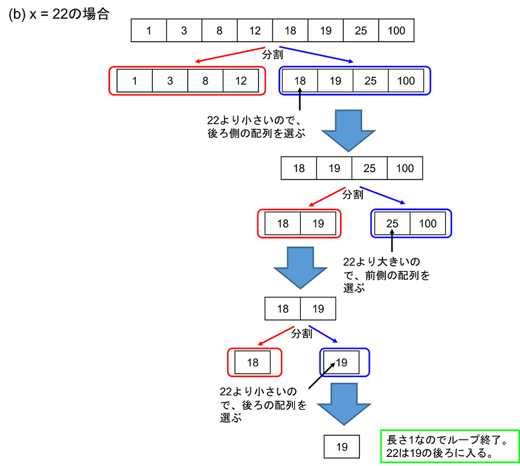

ここでは，2-3で実装したマージソートを用いた応用として，配列の中から条件に合う要素を見つけ出す”探索”を考える．

---
## 問題
---
与えられた整数配列データを読み込んで，ある整数$x$よりも小さい要素の数をカウントするプログラムを作成せよ．

---
### 仕様
---
- 配列の大きさ$n$は$1\le n \le 1,000$，配列の要素は全て整数であり，かつ全て異なると仮定してよい．

- 整数$x$は複数個（$m$個，$m\ge1$）与えられ，配列の中には$x$は入っていないと仮定してよい．

- 入力は，以下の順で与えられるとする：

  ```
  n
  A1 A2 ... An
  m
  x1 x2 ... xm
  ```

- 以下の二通りのアルゴリズムを実装する関数を作成した上で，それらを順に適用していき，$x$より小さい要素の数と，比較演算を実行した回数を出力すること：
1. 配列をソートせずに，配列の先頭から順に$x$より小さいか判定していく．関数名および引数は以下のとおりにすること：

  ```
  struct Count count_less_unsorted(int array[], int N, int x);
  ```
  
返り値のstruct Countは"構造体"と呼ばれるC言語の機能で，変数を複数まとめて一つの変数として扱える．定義の仕方や使い方については、["構造体"](#structure)を読むこと．  
2. 配列をソートした後，下記に説明する["二分探索法"](#binary_search)を用いて`array[i] < x < array[i+1]`となる`i`を探すことで，全ての要素と`x`を比較することなく，`x`よりも小さい要素を計算することができる．関数名および引数は以下のとおりにすること：

  ```
  struct Count count_less_sorted(int array[], int N, int x);
  ```

- 配列要素と`x`の比較演算としては`<`あるいは`>`のみを用いること．`if`文の条件式として書く場合は，一度に一回の比較のみ行うこと（例えば`if( array[0]<x && x<array[1] )`は，比較演算の回数は場合によって1回にも2回にもなるため，そのことに熟知していないかぎり推奨しない）．

- それぞれのアルゴリズムについて，厳密な比較演算の回数は実装の仕方によって異なる．ここでは，それぞれのアルゴリズムについて以下のとおりに縛りを入れることで，比較演算回数を一意的に定めることとする：
1. 各要素に対して一度だけ`x`と比較すること．
2. 配列がソートされている場合，もし`x < array[0]`であればその他の要素に対しても成り立ち，カウントはゼロとなる．そのため，まずは`x < array[0]`の判定を行うこと．それが成り立たない場合，二分探索を行うこと．二分探索の比較回数については，["二分探索法"](#binary_search)に記載の仕様に従うこと．

- まずはアルゴリズム1を用いて，`m`個の`x`に対する要素数・比較演算回数を出力する．次に配列をソートし，アルゴリズム2を用いて同様の出力をする．

- 各アルゴリズムの出力の前に，`count_less_unsorted:`，`count_less_sorted:`と出力する．

- 要素数と比較演算回数の出力は，その間に空白文字一つを入れ，末尾に改行文字を入れること．

- 配列のソートには，2-3で登場したマージソートを用いる．ここでは，以下のとおり`ppa_extra_h/mrg_sort.h`ヘッダーをインクルードし，その中で宣言されている`mrg_sort_`関数を用いること．関数の引数は，2-3と同じ仕様になっており，第一引数の配列の長さは`2N`でなければいけないことに注意すること．

    ```
    #include "ppa_extra_h/mrg_sort.h"
    ...
    i = mrg_sort_(array, N, 0, N-1);
    ```

---
### 構造体<a name="structure"></a>
---
- 構造体とは，C言語の機能の一つで，変数を複数まとめて一つの変数として扱えるものである．

- 構造体の中の変数には，ピリオド"."を付けて書くことでアクセス可能．通常の変数と同様に演算ができる．

- 具体的には以下のように使用する：

  ```
  // 構造体を定義
  struct 構造体名 {
    int 変数1;
    int 変数2;
  };
  ...
  //
  struct 構造体名 a;
  ...
  // 構造体中の変数は、通常の変数のように代入・演算ができる
  a.変数1 = 1;
  b.変数2 = 2;
  int tmp = a.変数1+b.変数2;
  printf("%d %d\n", 構造体名.変数1, 構造体名.変数2);
  ...
  // 構造体変数自体も代入ができる
  struct 構造体名 a, b;
  ...
  a = function(...); // 構造体を返り値とする関数を呼び出し、a中の各変数に代入
  b = a; // a中の各変数の値を、b中の各変数に代入
  ```

- 構造体の中には`int`型に限らず，ほかの型の変数も入れることができる（構造体変数も含む）．様々な用途があるが，ここでは詳細には立ち入らない．

- この問題で必要な構造体`struct Count`は以下のように定義すること：

  ```
  #include <stdio.h>

  struct Count {
    int comparison_count; // 比較回数のカウントをする変数
    int element_count; // 範囲内の要素数を保持する変数
  };

  ...
  // 使用例
  struct Count c1, c2;

  c1.comparison_count = 0;
  c1.element_count = 0;
  c2 = c1;
  ...
  ```

---
### 二分探索法<a name=""></a>
---
- ここでは，ソートされた`N`要素の配列`array`に対して，ある数`x`がどこに”入る”かを探す，言い換えると`array[i]< x < array[i+1]`となる`i`を探す．そのために，ソートされていることを活かした<font color="red">二分探索法</font>を用いる．

- `array[0] < x`であること，どの要素も`x`とは一致しないことを仮定する．

- 二分探索法は，2-4のマージソートと似た感じで配列を分割していき，二つの配列のうちどちらに`x`が入るのかを判定して，範囲を絞っていくというイメージ．

- 二分探索法では，以下の手順で行う：
1. 配列の長さが1の場合，その要素の後ろに`x`が入るので，終了．
2. 配列の長さが1より大きい場合、入力配列を同じ長さの2つの配列に分割する．長さが奇数の場合は，必ず前側の配列の長さを1つ長くすること．
3. 後ろ側の配列の先頭の要素と`x`を比較し，`x`の方が小さければ`x`は前側の配列（あるいはその末尾）に入る．`x`の方が大きければ`x`は後ろ側の配列（あるいはその末尾）に入る．
4. `x`が入る方の配列について，また手順1.から繰り返す．

- 以下に，具体的な入力例における二分探索法の様子を図示する．

<br>
<br>
<br>
<br>
 
<br>
<br>
<br>
<br>
<br>
<br>
 


---
## 実行例
---
- 入力データ

```
5
1 3 5 7 9
2
2 8
```

- 出力例

```
count_less_unsorted:
1 5
4 5
count_less_sorted:
1 4
4 3
```

---
## 補足
---
- この問題では「配列の中には$x$は入っていない」「配列要素は全て異なる整数」と仮定したが，より現実的には同じ要素が１つ以上入っていることもある．余力があれば，そのケースに対応するためにはどのように自分の書いたコードを拡張すればよいか，考えてみよう．

- 一度ソートとしておいて探索を高速化する手法は，データベースなどで重用されている．$m$回探索を行うとすると，ソートせずに全探索するアルゴリズムでは比較演算回数は$m\times n$に比例する一方，ソートしてから二分探索法するアルゴリズムでは$m\times log_2 n$に比例する．そのため，$n$が十分大きい場合には，後者の方が圧倒的に高速な手法である．
