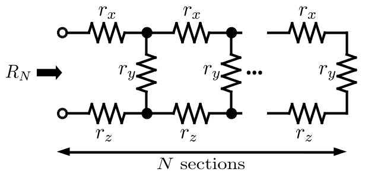
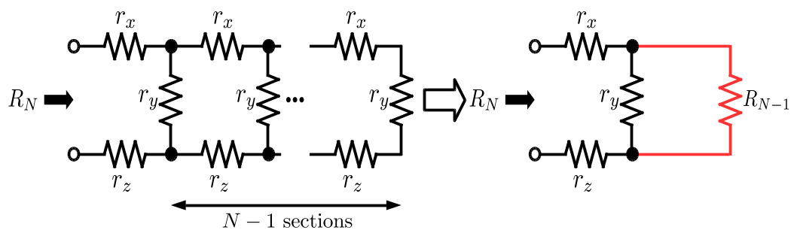

下図に示すように，3 種類の抵抗 $r_x$[Ω]，$r_y$[Ω]，$r_z$[Ω] をそれぞれ $N$ 個ずつ用いて構成された $N$ 段梯子形回路を考える．この回路において，端子 $AB$ 間の抵抗 $R_N$[Ω] を求めるプログラムを作成せよ．ただし，以下の仕様を満たすこと．

- 段数 $N$，抵抗 $r_x$，抵抗 $r_y$，抵抗 $r_z$の値をそれぞれ標準入力から読み込む．
  - $N$，$r_x$，$r_y$, $r_z$ の順番で一つずつ読み込む（実行例を参照）．
  - $N$，$r_x$，$r_y$, $r_z$ の値はすべて 1 以上 20 以下の整数が入力されるとしてよい．
- $R_N$ を計算する`resistance`関数を作成する．
  - グローバル変数および静的変数を使用してはいけない．
  - $R_N$ の計算において，<font color="red">再帰呼び出し</font>を用いること．
  - 可能な限り，`resistance` 関数を呼び出す回数を減らすこと．
- `resistance` 関数によって得られた $R_N$ の値を標準出力し，プログラムを終了する．なお，$R_N$ の値を小数点第 3 位まで表示させること．



## 実行例

```
# 1
# 1
# 2
# 3
> 6.000
```

```
# 5
# 1
# 3
# 5
> 8.196
```

## $R_N$ の計算法
- $R_N$ の値はN段梯子形回路が抵抗 $r_y$ とN-1段梯子形回路の抵抗 $R_{N-1}$を並列に繋いだ回路とみなすことで再帰的に計算することができる．

