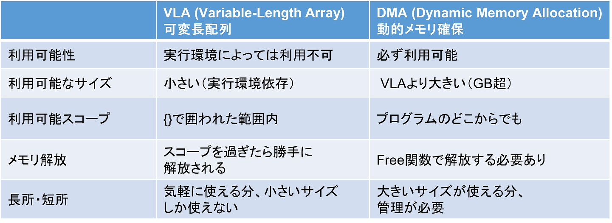

この問題では，これまで使っていた配列である<font color="red">可変長配列（Variable-Length Array; VLA）</font>に代わり，課題３以降で用いる<font color="red">動的メモリ確保（Dynamic Memory Allocation; DMA）</font>された配列を取り扱う．
また，動的メモリ確保に関連して，C言語を使う上で避けては通れない<font color="red">ポインタ</font>と<font color="red">アドレス</font>について解説する．途中途中でサンプルコードを載せるので，各自，実行して動作を理解すること．本番の問題文は後半にあるが，前半を読み飛ばさないように．

---
## メモリ、アドレス、ポインタ
---
これまでは，「変数は値を入れる入れ物」のようなイメージでプログラミングできる，いわゆる高水準言語的な部分のみを用いてきた．一方，実際にはプログラムはハードウェア（プロセッサ，メモリなど）上で動いておる．変数の値はメモリ上の特定の位置に格納され，その位置を示す"アドレス"を参照することで読み書きを行う．C言語では"ハードウェアを意識した"低水準言語的なプログラミングもできる（場合によってはしなくてはいけない）ので，ここでは簡単なモデルでメモリにアクセスする方法を学ぶ．

メモリ、アドレスについて説明と図。。。

`int`，`char`，`double`などの型はそれぞれバイト数が異なる．`char`型は1バイト = 8ビット，`double`型は8バイト = 64ビットである．`int`型はOS・コンパイラによってバイト数が異なるが，4バイト = 32ビットの場合が多い．C言語では，`sizeof`演算子（関数ではない）を使ってプログラム内でバイト数を`int`確認することができる：

  ```
printf("%d %d %d\n", sizeof(char), sizeof(double), sizeof(int));
  ```

変数の位置を示す"アドレス"は整数で表され，`&`演算子を用いて取得できる：

  ```
int a;

printf("%x\n", &a); // 16進数で表示
printf("%o\n", &a); // 8進数で表示
printf("%u\n", &a); // 10進数で表示
  ```

C言語では，アドレスを関数に渡して関数内で変数の値を変えるとき（[値渡しとアドレス渡し](#pass_by_value_vs_address)を参照），後述する`malloc`関数からの返り値を受けるときなどに，アドレスを入れる変数であるポインタ（Pointer）を用いる．変数を"point"すなわち"指す"もの，という意味でポインタと呼ぶ．

変数のアドレスの取得，ポインタの使い方は以下のとおりである：

  ```
int a;
int *p;

p = &a; // 変数aのアドレスを取得して，ポインタ変数に格納する

*p = 10 // アドレスが指す変数に値を代入する

scanf("%d", p); // 格納されたアドレスをscanf関数に渡す
  ```

配列はメモリ上の連続した領域に割り当てられる．

メモリ上の配列の図。。。

配列を`int a[10];`のように定義すると，`a`を参照することで配列の先頭のアドレスが取得でき，配列の`i`番目の要素`a[i]`へのアクセスは，内部ではアドレス`*a+i*sizeof(配列の型)`を参照することで実現している．ポインタ変数に配列の先頭アドレスを代入すれば，ポインタを介して配列の操作が可能である：

  ```
int a[10];
int *p;

p = a;

for(int i=0; i<10; i++) p[i] = i;
  ```

---
## NULLポインタ
---
`NULL`ポインタとは，ポインタの中身のアドレスが無効であることを表すために用いる，特殊なポインタである（NULL文字`\0`とは異なる）．以下のように用いる：

  ```
int *p = (int *)NULL;
  ```
  
`NULL`ポインタは`stddef.h`に定義されているが，`#include <stdio.h>`をすれば使える．また，`NULL`ポインタは"型がないことを示す`void`型"であるため，`int`型のポインタに変換（キャストと呼ぶ）するため，`(int *)`をしている．

`NULL`ポインタは，ポインタを初期化するときや，後述する`malloc`関数がメモリ確保に失敗したときの返り値として使われる．

---
## セグメンテーション違反
---
セグメンテーション違反（Segmentation Fault）

---
## 値渡しとアドレス渡し<a name="pass_by_value_vs_address"></a>
---

C言語では関数を呼び出す際，呼び出し側で渡した変数の中身（値）が，呼び出された関数側の変数にコピーされる：

  ```
...
  int a = 10;
  test(a);
...
void test(int b){
  printf("%d\n", b); // bには呼び出し元のaの値が入っている
  b = 300; // bとaはアドレスが異なる別々の変数なので，呼び出し元のaには値が代入されない（できない）
}
  ```

これを<font color="red">値渡し</font>と呼ぶ．

一方，関数の引数をポインタ変数にすると，呼び出し側では変数のアドレスを渡すことができ，呼び出された関数側のポインタ変数にコピーされるため，関数内でそのアドレスが指す変数の更新が可能になる：

  ```
...
  int a = 10;
  test(&a);
...
void test(int *b){
  printf("%d\n", *b); // bには呼び出し元のaの値が入っている
  *b = 300; // bとaはアドレスが異なる別々の変数なので，呼び出し元のaには値が代入されない（できない）
}
  ```

これを<font color="red">アドレス渡し</font>と呼ぶ．`scanf`関数で変数のアドレスを渡すのは，入力された値を，関数内で（そのアドレスが指す）変数に代入する必要があるからである．関数から複数の返り値を返したい場合，ポインタ変数を引数に渡し，返り値を代入することで返す（C言語では複数返り値はサポートされていない）．

以下のコードを実行し，値渡し（"pass by value"）とアドレス渡し（"pass by address"）の違いを確認せよ．

  ```
#include <stdio.h>

void pass_by_value(int x){
  printf("In pass_by_value: %d\n", x);
  x = 10;
}
void pass_by_address(int *ptr_x){
  printf("In pass_by_address: %d\n", *ptr_x);
  *ptr_x = 10;
}

int main(){
  int a = 0;

  pass_by_value(a);
  printf("After pass_by_value: %d\n", a);

  pass_by_address(&a);
  printf("After pass_by_address: %d\n", a);

  return 0;
}
  ```

---
## 配列とポインタ
---
p2-4などでは，関数に配列を渡す際に`void test(int array[], int n)`のような書き方をしていた．これは実は配列`array[]`の要素全てを渡しているのではなく，配列の先頭のアドレスが入っているポインタ変数`array`を渡しており，`void test(int *array, int n)`と等価である．（配列の値渡しがない理由は[こちら](#array_pass_by_value)）

以下のコードを実行し，配列の先頭アドレスを関数に渡しても，通常の配列のように`a[i]`のようなアクセスが可能であることを確認せよ．

  ```
#include <stdio.h>

void print_array(int *array, int n);

int main(){
  int n = 10;
  int a[n];
  
  for(int i=0; i<n; i++) a[i] = i;
  print_array(a, n);
  
  return 0;
}

void print_array(int *array, int n){
  for(int i=0; i<n; i++) printf("%d ", array[i]);
  printf("\n");
}

  ```

---
## 動的メモリ確保／解放
---
これまで配列は，`int array[10];`のようにあらかじめ大きさを指定するか，

  ```
int n;
scanf("%d", &n);
int array[n];
  ```

のように書いて，入力に応じて配列の大きさを決めていた．後者は可変長配列（Variable-Length Array; VLA）と呼ばれ，便利な機能である．一方で，C言語の可変長配列は`n`が大きすぎると[メモリが確保できず](#memory_size)，また確保されなかったことも分からないため，プログラムが予期せぬ動作をする恐れがある．安全に配列を確保するためには，以下のように`malloc`関数を用いた動的メモリ確保と`free`関数を用いたメモリ解放を行う：

  ```
#include <stdio.h>
#include <stdlib.h> // malloc, free, exit関数を使うためにインクルード

int main(){
  int *array, n;
  
  scanf("%d", &n);
  
  // (1) メモリを動的確保
  array = (int*) malloc(sizeof(int)*n);
  
  // (2) 確保失敗時のエラー処理
  if( array == (int*)NULL ){ // アドレスとしてNULLが返ってきた場合，メモリ確保に失敗している
    fprintf(stderr, "Cannot allocate memory\n"); // エラー出力
    exit(1);  // プログラムを強制終了する
  }
  
  // (3) 配列を使用
  ...(省略)...
  
  // (4) メモリ解放
  free(array);
  
  return 0;
}
  ```

上記のコードは，動的メモリ確保に関連して４つの部分から成っている：
- (1)`malloc`関数を呼び出してメモリを動的確保する．引数には"総バイト数"を渡す必要があるため，１要素あたりのバイト数`sizeof(int)`と要素数`n`を掛けている．また，返り値は"型がないことを示す型"のポインタ`void *`であるため，`int`型のポインタに変換（キャストと呼ぶ）する`(int *)`を`malloc`の前に書いている．

- (2) `malloc`関数は，指定した総バイト数の確保に成功した場合は，その配列の先頭のアドレスを返す．失敗した場合は，無効なアドレスとして`NULL`ポインタを返す．後者の場合は通常の処理に進めないのでエラー処理が必要である．ここではエラー文を出力した後，`exit(1)`でプログラムを強制エラー終了する．

- (3) その配列を使う部分．途中で`return`文で関数を抜けてしまうと(4)が実行されないため，注意が必要である．

- (4) 使い終わった配列は`free`関数で解放する（引数は配列の先頭のアドレスで，配列サイズは不要）．`free`しないと，そのメモリ領域は再利用できずに残ってしまうため，メモリ容量を圧迫してしまう．

---
## 可変長配列 vs 動的メモリ確保
---
可変長配列と動的メモリ確保した配列の特徴を比較した表を以下に示す．



<span style="font-size: 85%;">※実行環境…コンパイラ・OS・シェル・物理メモリ量など．バージョンも含む．</span>

<span style="font-size: 85%;">※スコープ…変数の有効範囲（利用可能範囲）のこと．</span>

表の"利用可能スコープ"に関して，VLAを使うと関数の呼び出し側では配列が意図通りに動作しないことを確認せよ（`n`の値を4~40の間で変更すると，挙動が変わる）．

  ```
#include <stdio.h>
#include <stdlib.h>

int* array_allocation_by_VLA(int n);
int* array_allocation_by_DMA(int n);

int main(){
  int *a;
  int n = 40;
  
  a = array_allocation_by_DMA(n);
  for(int i=0; i<n; i++) printf("%d ", a[i]);
  printf("\n");
  for(int i=0; i<n; i++) a[i] = i;
  for(int i=0; i<n; i++) printf("%d ", a[i]);
  printf("\n");
  
  free(a);
  
  a = array_allocation_by_VLA(n);
  for(int i=0; i<n; i++) printf("%d ", a[i]);
  printf("\n");
  for(int i=0; i<n; i++) a[i] = i;
  for(int i=0; i<n; i++) printf("%d ", a[i]);
  printf("\n");
  
  return 0;
}

int* array_allocation_by_VLA(int n){
  int a[n];
  
  for(int i=0; i<n; i++) a[i] = 0;
  
  return a;
}

int* array_allocation_by_DMA(int n){
  int *a;
  
  a = (int*)malloc(sizeof(int)*n);
  
  for(int i=0; i<n; i++) a[i] = 0;
  
  return a;
}
  ```

---
## 問題
---
以下の仕様に従って，動的メモリ確保された配列を簡便に使うための構造体と関数群を実装し，入力された指示に従ってそれらの関数群を呼び出して配列を操作するプログラムを書け．

---
### 仕様
---

- **構造体の定義**：`int`型配列の先頭アドレスを保持するためのポインタ変数と，配列の長さを保持するための`int`型変数を持つ構造体として，`struct Vector`を実装すること．

  ```
  struct Vector {
    ...
  };
  ```

- **動的メモリ確保・解放**：引数として配列の長さを取り，動的メモリ確保して`struct Vector`変数を返す`Vector_alloc`関数，および`struct Vector`変数を引数として取って確保された配列を解放する`Vector_free`関数を実装すること．前者では，メモリ確保に失敗した場合はエラー文を出力してプログラムを強制終了すること．また，長さ0の配列は正常な配列として取り扱えるようにすること．

  ```
  struct Vector Vector_alloc(int n){
    ...
  
    if( ... ){
      fprintf(stderr, "Vector_alloc(): Cannot allocate memory\n");
      exit(1);
    }
  }

  void Vector_free(struct Vector v){
    ...
  }
  ```

- **配列要素の取得**：引数として`struct Vector`変数と，配列の位置（インデックス）を示す`int`型変数を取り，そのインデックスの要素を返す`Vector_get_at`関数を実装すること．インデックスが有効な範囲の外にある場合，エラー文を出力してプログラムを強制終了すること．

  ```
  int Vector_get_at(struct Vector v, int i){
    ...
    if( ... ){
      fprintf(stderr, "Vector_get_at(): Index out of range\n");
      exit(1);
    }
   ...
  }
  ```

- **配列要素の代入**：引数として`struct Vector`変数，配列インデックスを示す`int`型変数，配列に代入したい要素を示す`int`型変数を取り，そのインデックスに要素を代入する`Vector_set_at`関数を実装すること．インデックスが有効な範囲の外にある場合，エラー文を出力してプログラムを強制終了すること．  

  ```
  void Vector_set_at(struct Vector v, int i, int x){
    ...
    if( ... ){
      fprintf(stderr, "Vector_set_at(): Index out of range\n");
      exit(1);
    }
   ...
  }
  ```

- **配列要素の出力**：引数として`struct Vector`変数を取り，配列要素を全て出力する`Vector_print`関数を実装すること．要素間には空白文字を一つ出力し，最後の要素の後には改行文字を出力すること．

  ```
  void Vector_print(struct Vector v){
    ...
  }
  ```
  
- **配列要素の挿入**：引数として`struct Vector`変数，配列インデックスを示す`int`型変数，配列に挿入したい要素を示す`int`型変数を取り，その要素を挿入する`Vector_insert_at`関数を実装すること．ここでいう挿入とは，与えられた位置に元からある要素，およびそれよりも後ろの全ての要素の位置を一つ後ろにずらして，その位置に新しい要素を代入する操作のことである．引数として渡された`struct Vector`とは別に，それよりも長さが1だけ長い`struct Vector`変数を新しく初期化すること．また，引数として渡された`struct Vector`は関数内で解放すること．インデックスが有効な範囲の外にある場合，エラー文を出力してプログラムを強制終了すること．  

  ```
  struct Vector Vector_insert_at(struct Vector v, int i, int x){
    ...
    if( ... ){
      fprintf(stderr, "Vector_insert_at(): Index out of range\n");
      exit(1);
    }
   ...
  }
  ```

- **配列要素の削除**：引数として`struct Vector`変数，配列インデックスを示す`int`型変数を取り，その要素を削除する`Vector_delete_at`関数を実装すること．削除とは，与えられた位置よりも後ろの全ての要素の位置を一つ前にずらす操作のことである（その位置の要素は上書きされる）．引数として渡された`struct Vector`とは別に，それよりも長さが1だけ短い`struct Vector`変数を新しく初期化すること．また，引数として渡された`struct Vector`は関数内で解放すること．インデックスが有効な範囲の外にある場合，あるいは渡された配列の長さが0である場合，エラー文を出力してプログラムを強制終了すること．  

  ```
  struct Vector Vector_delete_at(struct Vector v, int i){
    ...
    if( ... ){
      fprintf(stderr, "Vector_delete_at(): Index out of range\n");
      exit(1);
    }
   ...
  }
  ```

- **配列の浅いコピー（シャローコピー）と深いコピー（ディープコピー）**：配列を”コピー”したい場合，配列のアドレスだけを別のポインタ変数にコピーして要素を共有する方法と，新たにメモリを確保して要素をコピーし，同じ要素を持つ配列をもう一つ用意する方法が考えられる．前者を”浅いコピー（シャローコピー）”，後者を”深いコピー（ディープコピー）”と呼ぶ．例えば，あらかじめ用意された`struct Vector v1`に対して浅いコピーをするには，普通に代入演算`struct Vector v2 = v1;`をすればよい．構造体中のポインタ変数の値がコピーされるため，配列は浅くコピーされる．一方，深いコピーをするためには，`Vector_alloc`関数を呼び出してメモリ確保し，その上で配列の各要素に対して代入演算を行なう必要がある．ここでは，深いコピーを実行する`Vector_deep_copy`関数を実装せよ．関数内では必ず`Vector_alloc`関数，`Vector_get_at`関数，`Vector_set_at`関数を用いること．

  ```
  struct Vector Vector_deep_copy(struct Vector v){
    ...
  }
  ```

  深いコピー／浅いコピーは用途に応じて使い分ける．特に浅いコピーは，配列が非常に大きいが要素の変更をしない場合（read only）には重宝する．一方で，どの種類のコピーをされた配列なの  か，どこでメモリ解放をするのかなどを明確に取り決めておかないと，メモリリークの原因になってしまうので，使用には細心の注意が必要である．また，浅いコピーをした場合は，コピー元の配列の先頭アドレスを変更してはいけない（その意味では上記の`Vector_insert_at`や`Vector_delete_at`の実装は危険である！）．言語によってはそのようなメモリリークを防ぐための機構が用意されている（詳しくは[「動的メモリ確保に関する補足」](#dynamic_memory_allocation)を参照）．


- **`main`関数**：上記の関数群の動作テストを行うため，配列操作を指示する文を入力から一行ずつ読み込み，それに応じて実際に配列操作を行なうコードを書く．この問題では関数群を正しく実装することを主眼にするため，`main`関数については以下のとおりに書いてよい．余力があれば自分なりに作ってもよいが，その場合は必ずコメントを書き，なおかつ`main`関数内では構造体内の変数を直接参照しないこと．

  ```
  #include <stdio.h>
  #include <stdlib.h>

  // struct Vector構造体の定義
  ...

  // 関数群の宣言
  struct Vector Vector_alloc(...);
  ...

  // main関数
  int main(){
  
    /*
     * strncmpとif文を使って配列操作を判別する
     */
  
    return 0;
  }

  // 関数群の定義
  struct Vector Vector_alloc(...){
    ...
  }
  ...
  ```

---
## ステップ分割
---
ステップ1/2では`Vector_alloc`，`Vector_free`，`Vector_get_at`，`Vector_set_at`，`Vector_print`を実装し，ステップ2/2では`Vector_insert_at`，`Vector_delete_at`，`Vector_deep_copy`を実装すること．

---
### 実行例
---
- 入力データ
```
```
- 出力例
```

```

---
## 参考情報
---
### 配列の値渡しができない理由<a name="array_pass_by_value"></a>
---
"配列の値渡し"がC言語でサポートされていないのは，値渡しでは変数をコピーするため，サイズが大きい配列を値渡しできてしまうと，メモリを浪費し，なおかつコピーする時間がかかることが理由である．

C言語が登場した時代と比べ，現代はハードウェア性能が桁違いによくなっており，よほど大きい配列でなければコピーはさほどコストはかからないが，配列が大きい場合や繰り返しの多い処理の場合は注意しないといけない．

---
### 可変長配列と動的メモリ確保の上限<a name="memory_size"></a>
---
可変長配列と動的メモリ確保で扱える配列の大きさの上限は実行環境依存であるので，特に可変長配列を使う際には必ず確認する必要があるが，"一般的"な環境では1kB程度であれば問題なく使えるはずである．

「プログラミング演習A」では，"サンドボックス"と呼ばれる，外部プログラムを安全にサーバ上で実行するための環境を用いている．そのため，プログラムを実行して可変長配列と動的メモリ確保の上限を確認することはできない．余裕があれば，自分のPCでC言語をコンパイル／実行できる環境を整えて確かめてみよう．

---
### 動的メモリ確保に関する補足<a name="dynamic_memory_allocation"></a>
---
可変長配列と動的メモリ確保の違いを理解するには，プログラムがハードウェア上でどのように動作するか，特に"ヒープ領域"，"スタック領域"について理解する必要があるが，この授業は「プログラミング演習」であるので，詳細には立ち入らない．

C言語は"ハードウェアを意識したプログラミング"ができる／しなくてはいけない言語で，メモリ容量制限がシビアな場合，リアルタイム処理が必要な場合などに適している．一方で，プログラムが大規模・多機能になると，"ハードウェアを意識しないプログラミング"の方がバグ／セキュリティホールを生じにくい，開発スピードが速いなどのメリットがある．そのようなプログラミングができる言語としては，C++，Java，Pythonがある．用途・実行環境に応じて適切な言語を選ぶ，あるいは複数言語を使い分けられるようになることが重要である．

`malloc/free`より安全なメモリ管理の方法として，C++ではコンストラクタ／デストラクタという機構が用意されている（p2-5の`struct Vector`の`Vector_init`，`Vector_free`を使用開始時／終了後に強制的に呼び出すようなイメージ）．さらに安全な方法として，JavaやPythonではガベージコレクションという機構が用意されている．
