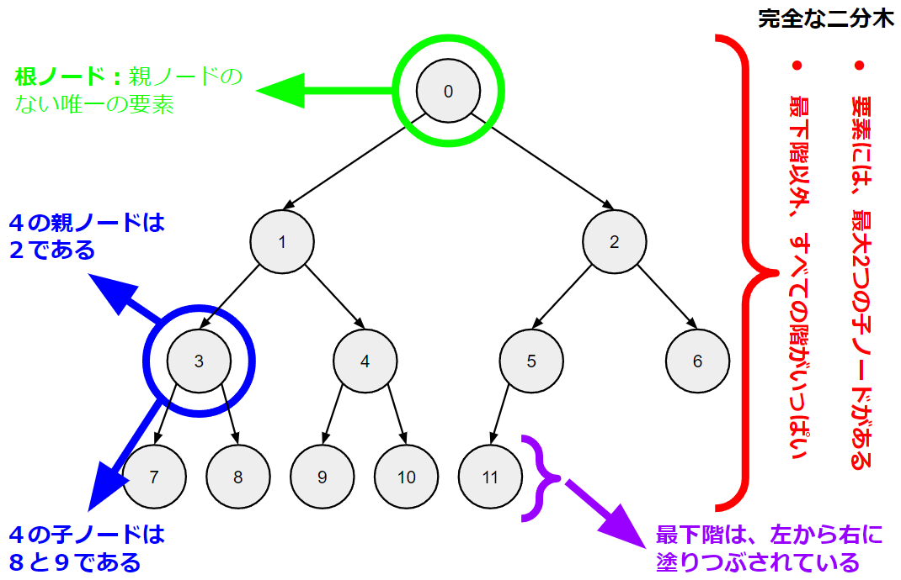
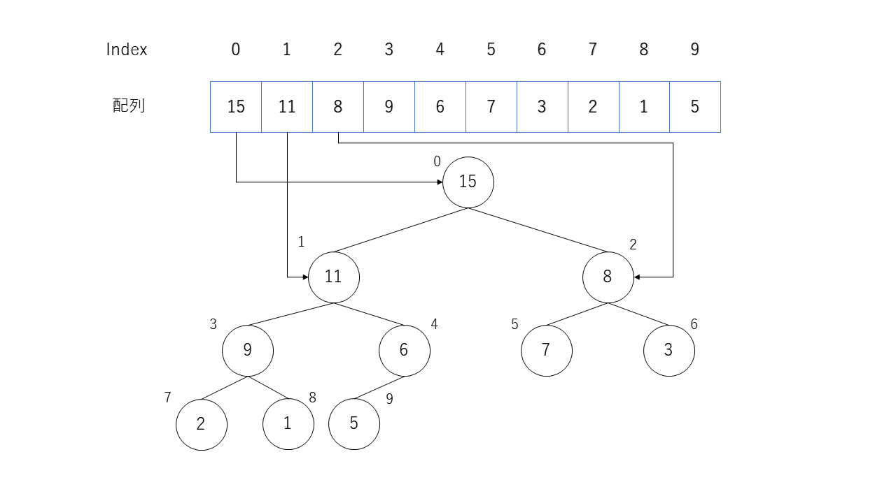
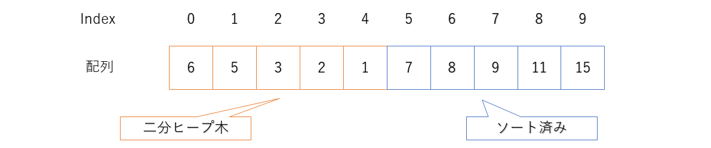

この課題では、ヒープソートを実装する。 ヒープソートとは、挿入アルゴリズムの一種である。 ヒープソートは、最初にヒープを構築し、次にそのヒープに基づいてソートすることに基づいている。

この課題では、3つの主要なステップがある。
- 木構造を配列で表す方法を理解。
- 配列を最大ヒープに変換。
- ヒープに基づいて配列を並べ替える。

`#include` していいのは `<stdio.h>`と`"ppa_extra_h/print_heap.h"`のみとする。
ただし、`p22`の関数`swap`と関数`print_array`、および`p23`の関数`comp`を使用していい。
コメントでコードを説明すること。
`main`関数の前で関数宣言、後ろで関数定義をすること。
グローバル変数や静的変数を使用してはいけない

---
## ステップ1/3 木構造と配列
---
木構造は、各要素に1つの親ノードと複数の子ノードがあるデータ構造である。根ノードは、親ノードのない唯一の要素である。

 

木構造 の1つのタイプは、完全な二分木である。完全な二分木の各ノードには、最大2つの子ノードがある。二分木では、最下層以外すべての階に最大数のノードがある。
完全な二分木は配列で表すことができる。この表現では、配列の0番目の要素が根である。次に、 $ i $ 番目の要素ごとに、その子ノードは $ （2 * i + 1） $ 番目と $ （2 * i + 2） $ 番目の要素で表される。ただし、子ノードが存在しない、または一方の子ノードしか存在しない場合がある（例えば、ノード番号6と7）。

 

ステップ1/3では、入力配列とその配列内のインデックス $ i $ を受け取り、次の数値を出力するプログラムを作成すること。
- $ i $ の子ノードが存在する場合はそのインデックス。 
- $ i $ とその子ノードの中で最大の要素のインデックス。

#### 入力の形式
入力配列のサイズを表す整数 $ N $ 、配列要素を表す $ N $ 個の整数、要素インデックス $ i（0 <= i < N） $ 。
- 例：

```
5 6 4 2 3 9 2
```

  - 配列の長さは $ 5 $ 
  - 配列要素は `6 4 2 3 9`
  - インデックスは$ 2 $

#### 出力
$ i $ 番目の要素の子ノードが存在する場合はそのインデックス、および $ i $ とその子ノードの中で最大の要素のインデックス。

#### 仕様
- 関数`maxChild`を作成すること。
  - この関数の引数は、入力配列（ $ X $ ）、入力配列の長さ（ $ N $ ）、および要素インデックス（ $ i $ ）である。
  - この関数は、要素 $ i $ と $ i $ の子ノードの中で最大の要素のインデックスを返す。
  - この関数内で、上記で要求された出力を標準出力すること。出力形式は、実行例を参照すること。
  
    ```
    int maxChild（int X[]、int N、int i） ...
    ```
    
- 関数`main`について：
  - この関数内で、標準入力からの入力を読み取る。入力は上記の形式に従う。
  - 配列に入力からの要素を保存。
  - 関数`maxChild`を呼び出す。
  
#### 実行例

- 実行例(1)
  - 入力データ
  
  ```
  5 1 2 3 4 5 1
  ```
  
  - 出力例
  
  ```
  MXCH(1) left=3 right=4 max=4
  ```
  
- 実行例(2)
  - 入力データ
  
  ```
  5 1 2 3 5 4 1
  ```
  
  - 出力例
  
  ```
  MXCH(1) left=3 right=4 max=3
  ```
  
- 実行例(3)
  - 入力データ
  
  ```
  5 1 2 3 4 5 0
  ```
  
  - 出力例
  
  ```
  MXCH(0) left=1 right=2 max=2
  ```
  
- 実行例(4)
  - 入力データ
  
  ```
  5 1 2 3 4 5 2
  ```
  
  - 出力例
  
  ```
  MXCH(2) max=2
  ```
  
- 実行例(5)
  - 入力データ
  
  ```
  6 1 2 3 4 5 6 2
  ```
  
  - 出力例
  
  ```
  出力：MXCH(2) left=5 max=5
  ```

---
## ステップ2/3  最大ヒープの構築
---
最大ヒープは、特定のタイプの完全な二分木である。最大ヒープでは、親ノードの要素の値はその子ノードの要素の値以上である。
完全な二分木を表す長さ $ N $ の配列 $ X $ について考えてみる。 $ X $ を最大ヒープに変換するには、次のアルゴリズムを使用する。
- ステップ0: $ （N-1） $ 番目の要素から $ 0 $ 番目の要素まで、すべての要素に対して以下のステップを繰り返す。
- ステップ1: $ i $ 番目の要素について、その値を子ノードの値と比較（存在する場合）。 $ i $ がその子ノードの両方よりも大きい場合、 $ i $ は正しい場所にある。ステップ0の次の要素に進む。それ以外の場合は、ステップ2に進む。
- ステップ2: $ i $ の値を $ i $ の最大の子ノードの値と交換。ステップ1を繰り返すが、代わりに交換された子ノードのインデックスを検討する。

ステップ2/3では、入力配列を受け取り、最大ヒープを作成するプログラムを作成する。

#### 入力の形式
入力配列のサイズを表す整数 $ N $ と、配列要素を表す $ N $ 個の整数。
- 例：

```
6 1 8 2 9 3 6
```

  - 配列の長さは $ 6 $ 
  - 配列要素は `1 8 2 9 3 6`

#### 出力
ステップ0の反復ごとに、現在の要素のインデックスと考慮される配列の長さを出力し、配列の結果の状態を含む各要素の交換の行を出力し、配列の木構造表現を出力する。最後に、配列の最終状態を出力する。

#### 仕様
- 関数`downheap`を作成する
  - この関数は、入力配列（ $ X $ ）、入力配列の長さ（ $ N $ ）、および要素インデックス（ $ i $ ）を受け取る。
  - この関数内では、インデックス $ i $ から始めて、必要に応じてステップ1とステップ2を実行する必要。
  - 各関数呼び出しの開始時に $ i $ と $ N $ の値を標準出力。
  - 配列で行われたすべての交換を標準出力し、その後に配列の結果の状態を出力する
  - 上記を実行した後、関数`print_heap_`を使用して、配列の木構造表現を出力する。
    - `print_heap_`は、入力配列（`array`）と配列の長さ（`size`）を受け取る
	- `"ppa_extra_h/print_heap.h"`を`include`したら、`print_heap`を使える。
    
    ```
	void print_heap_(int array[], int size)
	```
	
  - 2.6.1で作成された関数`maxChild`を使用（`maxChild`関数内の標準出力の部分は不要になったため、削除すること）
  
    ```
    void downheap（int X[]、int N、int i） ...
    ```
    
- 関数`main`について
  - この関数内で、標準入力からの入力を読み取る。入力は上記で指定された形式に従う。
  - 配列に入力からの要素を保存する。
  - 入力配列の初期状態を標準出力する。
  - 上記のステップ0の指定に従って、入力配列内のすべての要素に対して関数`downheap`を呼び出す。
  - 配列の最終状態を標準出力する。
  
#### 実行例

- 入力データ

  ```
  6 1 8 2 9 3 6
  ```
  
- 出力例

  ```
  INIT::::::::::   1,    8,    2,    9,    3,    6
  DOWN( 5, 6)
  
            1
            |
       ============
       8         2
       |         |
    =======   =======
    9    3    6
  
  DOWN( 4, 6)
  
            1
            |
       ============
       8         2
       |         |
    =======   =======
    9    3    6
  
  DOWN( 3, 6)
  
            1
            |
       ============
       8         2
       |         |
    =======   =======
    9    3    6
  
  DOWN( 2, 6)
  SWAP( 2, 5) :    1,    8,    6,    9,    3,    2
  
            1
            |
       ============
       8         6
       |         |
    =======   =======
    9    3    2
  
  DOWN( 1, 6)
  SWAP( 1, 3) :    1,    9,    6,    8,    3,    2
  
            1
            |
       ============
       9         6
       |         |
    =======   =======
    8    3    2
  
  DOWN( 0, 6)
  SWAP( 0, 1) :    9,    1,    6,    8,    3,    2
  SWAP( 1, 3) :    9,    8,    6,    1,    3,    2
  
            9
            |
       ============
       8         6
       |         |
    =======   =======
    1    3    2
  
  DONE::::::::::   9,    8,    6,    1,    3,    2
  ```

---
## ステップ3/3 ヒープソート
---
ヒープソートは、以下のアルゴリズムに従う。
- ステップ0: 長さ $ N $ の初期配列を準備。
- ステップ1: 長さ $ N $ の配列を最大ヒープに変換。
- ステップ2: $ 0 $ 番目の要素の位置を $ （N-1） $ 番目の要素と交換 （このステップでは、最大の要素を配列の最後に移動）
- ステップ3: $ N $ の値を $ 1 $ 減らす。それでも $ N $ が $ 0 $ より大きい場合は、ステップ1に戻る。

ヒント：ステップ1を初めて実行するときは、配列内の要素ごとに`downheap`を呼び出す必要がある。ステップ1が2回目実行されたときから、配列内の1つの要素だけに対して`downheap`を呼び出す必要がある。

ヒント：ステップ3では、 $ N $ を1つ減らす。 $ N $ は最大ヒープのサイズを示す。 $ N $ の後の配列の要素（つまり、最大ヒープの外側の配列の要素）はすでにソートされている。

 

ステップ3/3では、入力配列を受け取り、ヒープソートを使用してソートするプログラムを作成せよ。

#### 入力の形式
入力配列のサイズを表す整数 $ N $ と、配列要素を表す $ N $ 個の整数。
- 例：

```
6 1 8 2 9 3 6
```

  - 配列の長さは $ 6 $ 
  - 配列要素は `(1 8 2 9 3 6)`

#### 出力
配列の初期状態を出力し、`downheap`を呼び出す度に出力されるその都度呼び出し回の行を出力し、各要素交換の行を出力し、配列の最終状態を出力。

#### 仕様
- 関数`heap_sort`について
  - この関数は、入力配列（ $ X $ ）と入力配列の長さ（ $ N $ ）を受け取る。
  - 上記のアルゴリズムに従って、ヒープソートを実装。
  - 2.6.2からの関数`downheap`を使用　（標準出力するダウンヒープ内の部分は不要になったため、削除することを忘れないで）
  - ただし、`downheap`への都度呼び出しの開始時に、 $ i $ と $ N $ の値を標準出力。
  
    ```
    void heap_sort（int X[]、int N） ...
    ```
    
- 関数`main`について
  - この関数内で、`STDIN`からの入力を読み取る。 入力は上記で指定された形式に従う。
  - 配列にの入力からの要素を保存。
  - 入力配列の初期状態を`STDOUT`に出力。
  - 関数`heap_sort`を呼び出す。
  - 配列の最終状態を`STDOUT`に出力。
  
#### 実行例

- 入力データ

  ```
  6 1 8 2 9 3 6
  ```
  
- 出力例

  ```
  INIT::::::::::   1,    8,    2,    9,    3,    6
  DOWN( 5, 6)
  DOWN( 4, 6)
  DOWN( 3, 6)
  DOWN( 2, 6)
  SWAP( 2, 5) :    1,    8,    6,    9,    3,    2
  DOWN( 1, 6)
  SWAP( 1, 3) :    1,    9,    6,    8,    3,    2
  DOWN( 0, 6)
  SWAP( 0, 1) :    9,    1,    6,    8,    3,    2
  SWAP( 1, 3) :    9,    8,    6,    1,    3,    2
  SWAP( 0, 5) :    2,    8,    6,    1,    3,    9
  DOWN( 0, 5)
  SWAP( 0, 1) :    8,    2,    6,    1,    3
  SWAP( 1, 4) :    8,    3,    6,    1,    2
  SWAP( 0, 4) :    2,    3,    6,    1,    8,    9
  DOWN( 0, 4)
  SWAP( 0, 2) :    6,    3,    2,    1
  SWAP( 0, 3) :    1,    3,    2,    6,    8,    9
  DOWN( 0, 3)
  SWAP( 0, 1) :    3,    1,    2
  SWAP( 0, 2) :    2,    1,    3,    6,    8,    9
  DOWN( 0, 2)
  SWAP( 0, 1) :    1,    2,    3,    6,    8,    9
  DOWN( 0, 1)
  DONE::::::::::   1,    2,    3,    6,    8,    9
  ```
