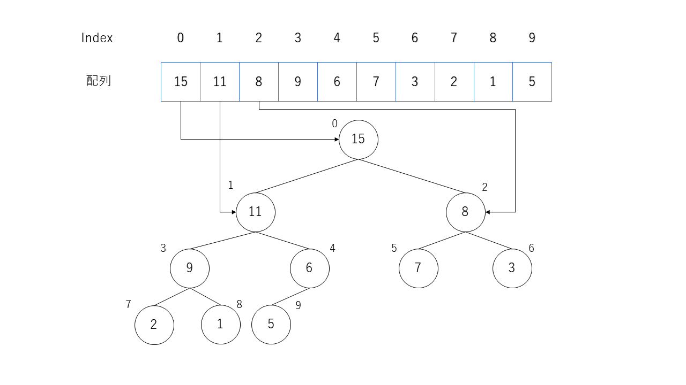

ここでは，<font color="red">選択に基づくソート</font>の一種である<font color="red">ヒープソート (heap sort)</font>を実装してみよう．

ヒープソートとは，二分ヒープ木を活用してソートをおこなうアルゴリズムである．
ヒープソートが選択に基づくソートの一種と呼ばれるのは，選択ソートと同様に，ソートされていない要素から，一つ最大値（あるいは最小値）を取得して，それを順番に並べる処理を基本操作とするためである．
ただし，ヒープソートでは，二分ヒープ木と呼ばれる特別な構造をソートされていない範囲で実現することで，最大値（あるいは最小値）の取得を容易にする工夫がなされている．
要素数が少ない場合は単純な選択ソートでよいが，要素数が大きくなった場合に，ヒープを作成しておく分だけ効率的になる．

---
## 問題
---
与えられた配列データを<font color="red">ヒープソート</font>により<font color="red">昇順</font>に並べ替えるプログラムを作成せよ．


---
### ヒープソート
---
#### 1.二分ヒープ木

降順の二分ヒープ木とは，各節点の値はその子の節点の値以上となるようにした二分木のことである．二分ヒープ木は配列を使って表すことができ，以下の画像のように配列のindexと節点を対応付ける．

- 節点$k$について考えると各節点のindexは次の計算で得られる．
  - 親の節点のindex : $ \lfloor (k - 1) / 2 \rfloor$
  - 左の子の節点のindex : $ 2 \times k + 1 $
  - 右の粉の節点のindex : $ 2 \times k + 2 $

<br>

 

<br>

#### 2.二分ヒープ木の作成
本課題では降順の二分ヒープ木を与えられた配列を次の`downheap`関数を使って並び替えることによって作成する．
`downheap`関数は，ある節点$k$の子が根となる降順の二分ヒープ木となってる場合に，節点$k$と子の二分ヒープ木をマージして，節点$k$を根とした降順の二分ヒープ木を作成するアルゴリズムである．具体的な処理は，次のようになる．
- 1.節点$k$の値と子の節点の値を比較する．
   - 子の値の方が大きい場合は大きい方の子の値と節点$k$の値を交換する．
   - 節点$k$の値の方が大きい，または等しい場合はすでに降順の二分ヒープ木が作成されているので終了する．(子が存在しない場合も終了する)
   
- 2.交換した子のindexを$k$とし1に戻る．

この関数を配列に対して逆順に適用させていくことで降順の二分ヒープ木を作成することができる．

<br>

#### 3.ヒープソート
二分ヒープ木を作成できたら，根の値を取り出すことで最大値を容易に取得することができる．その値と二分ヒープ木の末尾の値を交換し，二分ヒープ木から取り除く．その後，二分ヒープ木を再構築するということを繰り返すことで，配列の末尾から降順にソートすることができる．

<br>

 

<br>

木構造についての各名称については[木構造（データ構造）](https://ja.wikipedia.org/wiki/%E6%9C%A8%E6%A7%8B%E9%80%A0_(%E3%83%87%E3%83%BC%E3%82%BF%E6%A7%8B%E9%80%A0))などを参考にせよ．

---
### 仕様
---
- 課題2-0に記載されている仕様を全て満たすこと．

<br>

- 配列操作に利用可能な関数
  - 配列内の二つの要素を入れ替える手続きとして`func_swap_`関数を用いること．
  - 配列内の二つの要素を比較する手続きとして`comp_`関数を用いること．
  - 配列内の要素を表示する手続きとして`print_array_`関数を用いること．

<br>

- 配列をヒープソートによって並び替える `hp_sort` 関数を作成すること．また，以下の仕様を満すこと．
  - この関数内で呼ばれる別の関数を作成してもよい．その際は必ず前方宣言すること．
  - `hp_sort`の引数は，入力データ用に動的に確保した配列と入力データの個数の二つを引数とすること．
    ```
    void hp_sort(int *array, int N) ...
    ```
  - 要素の値が同じ場合など，入れ替える必要がない場合は入れ替えてはいけない．

<br>

- 配列を先頭を根とする<font color="red">降順の</font>二分ヒープ木に並び替えること．
  - このために，配列が既に二分ヒープ木として構築されている際に，配列のある要素が書き換わったと仮定し，その要素（節点）から葉に向かって二分ヒープ木を再構築する downheap 関数を作成すること．ただし，`downheap` 関数は以下の仕様を満すこと．
    - `downheap`の引数は，(1)動的に確保したデータ配列のポインタ，(2)配列データの個数 $N$，(3)ヒープ木再構築する節点の位置$i$，(4)二分ヒープ木の大きさ$M$の
       4種とする．
      ```
      void downheap(int* array, int N, int i, const int M) ...
      ```

<br>

- `hp_sort`関数で最初に配列を二分ヒープ木に並び替える際に以下の仕様を満たすこと．
  - `downheap`を配列に対して逆順に適用することで二分ヒープ木に並べ替えること．
    - この時の二分ヒープ木の大きさ$M$は便宜的に配列の大きさ$N$とする．

<br>

- 表示
  - `func_swap_`により値を入れ替えるたびに，入れ替えた要素の場所と配列全体の要素を以下の書式で表示すること
    - 交換した2つの要素番号$i,j(i < j)$を用いて SWAP$(i, j)$ と表示し，空白後に交換後の配列の全要素を表示する．ただし，交換が実行されなかった場合は何も表示してはいけない．
    - 例：要素番号 0,12の要素を交換した場合
    ```
    SWAP(⊔0,12)⊔⊔6⊔⊔2⊔⊔8⊔⊔4⊔11⊔⊔9⊔12⊔⊔5⊔⊔3⊔13⊔⊔1⊔⊔7⊔10↩︎
    ```
    - また，`downheap`関数内で要素を入れ替えた場合は，その`downheap`関数を呼び出した際の引数(先頭の節点$k$と二分ヒープ木の大きさ$M$)の情報を，DH$(k,M)$と先頭に表示する．
      - 例：`downheap`の引数が$k=1,M=6$，および，要素番号 $0,12$の要素を交換した場合
　　　　　```
	DH(⊔1,⊔6)⊔SWAP(⊔0,12)⊔⊔6⊔⊔2⊔⊔8⊔⊔4⊔11⊔⊔9⊔12⊔⊔5⊔⊔3⊔13⊔⊔1⊔⊔7⊔10↩︎
	```

<br>

- 題2-0に提示してある関数と題2-1に提示してある`func_copy_val_`と`print_array_range_`を`ppa_extra_h/p2_header.h`というファイルにおいてある．`#include "ppa_extra_h/p2_header.h"`という宣言を通して含めたら，こちらの関数を書かなくても呼べる：`func_swap_`，`comp_`，`print_array_`，`func_mallocation_`，`func_copy_val_`，`print_array_range_`

<br>

- 入力として与えられる配列の値は全て異なる．

<br>

- 以下のプログラムを必ず用いてプログラムを完成せること．

```
#include <stdio.h>
#include <stdlib.h>
#include “ppa_extra_h/p2_header.h”

void downheap(int *, int , int , int ) ;
void hp_sort(int *, int ) ;

int main() {

  ...(省略)...

  return 0;
}

void downheap(int *array, int N, int i, int M) {

  ...(省略)...

}

void hp_sort(int *array, int N) {

  ...(省略)...

}
```


---
## 実行例
---
---
### 実行例(1)
---
- 入力データ
```
7 2 1 3 7 4 6 5
```
- 出力例
```
INIT:::::::  2  1  3  7  4  6  5
DH( 2, 7) SWAP( 2, 5)  2  1  6  7  4  3  5
DH( 1, 7) SWAP( 1, 3)  2  7  6  1  4  3  5
DH( 0, 7) SWAP( 0, 1)  7  2  6  1  4  3  5
DH( 0, 7) SWAP( 1, 4)  7  4  6  1  2  3  5
SWAP( 0, 6)  5  4  6  1  2  3  7
DH( 0, 6) SWAP( 0, 2)  6  4  5  1  2  3  7
SWAP( 0, 5)  3  4  5  1  2  6  7
DH( 0, 5) SWAP( 0, 2)  5  4  3  1  2  6  7
SWAP( 0, 4)  2  4  3  1  5  6  7
DH( 0, 4) SWAP( 0, 1)  4  2  3  1  5  6  7
SWAP( 0, 3)  1  2  3  4  5  6  7
DH( 0, 3) SWAP( 0, 2)  3  2  1  4  5  6  7
SWAP( 0, 2)  1  2  3  4  5  6  7
DH( 0, 2) SWAP( 0, 1)  2  1  3  4  5  6  7
SWAP( 0, 1)  1  2  3  4  5  6  7
DONE:::::::  1  2  3  4  5  6  7
```


---
### 実行例(2)
---
- 入力データ
```
13 10 15 8 4 12 9 11 5 3 13 1 2 6
```
- 出力例
```
INIT::::::: 10 15  8  4 12  9 11  5  3 13  1  2  6
DH( 4,13) SWAP( 4, 9) 10 15  8  4 13  9 11  5  3 12  1  2  6
DH( 3,13) SWAP( 3, 7) 10 15  8  5 13  9 11  4  3 12  1  2  6
DH( 2,13) SWAP( 2, 6) 10 15 11  5 13  9  8  4  3 12  1  2  6
DH( 0,13) SWAP( 0, 1) 15 10 11  5 13  9  8  4  3 12  1  2  6
DH( 0,13) SWAP( 1, 4) 15 13 11  5 10  9  8  4  3 12  1  2  6
DH( 0,13) SWAP( 4, 9) 15 13 11  5 12  9  8  4  3 10  1  2  6
SWAP( 0,12)  6 13 11  5 12  9  8  4  3 10  1  2 15
DH( 0,12) SWAP( 0, 1) 13  6 11  5 12  9  8  4  3 10  1  2 15
DH( 0,12) SWAP( 1, 4) 13 12 11  5  6  9  8  4  3 10  1  2 15
DH( 0,12) SWAP( 4, 9) 13 12 11  5 10  9  8  4  3  6  1  2 15
SWAP( 0,11)  2 12 11  5 10  9  8  4  3  6  1 13 15
DH( 0,11) SWAP( 0, 1) 12  2 11  5 10  9  8  4  3  6  1 13 15
DH( 0,11) SWAP( 1, 4) 12 10 11  5  2  9  8  4  3  6  1 13 15
DH( 0,11) SWAP( 4, 9) 12 10 11  5  6  9  8  4  3  2  1 13 15
SWAP( 0,10)  1 10 11  5  6  9  8  4  3  2 12 13 15
DH( 0,10) SWAP( 0, 2) 11 10  1  5  6  9  8  4  3  2 12 13 15
DH( 0,10) SWAP( 2, 5) 11 10  9  5  6  1  8  4  3  2 12 13 15
SWAP( 0, 9)  2 10  9  5  6  1  8  4  3 11 12 13 15
DH( 0, 9) SWAP( 0, 1) 10  2  9  5  6  1  8  4  3 11 12 13 15
DH( 0, 9) SWAP( 1, 4) 10  6  9  5  2  1  8  4  3 11 12 13 15
SWAP( 0, 8)  3  6  9  5  2  1  8  4 10 11 12 13 15
DH( 0, 8) SWAP( 0, 2)  9  6  3  5  2  1  8  4 10 11 12 13 15
DH( 0, 8) SWAP( 2, 6)  9  6  8  5  2  1  3  4 10 11 12 13 15
SWAP( 0, 7)  4  6  8  5  2  1  3  9 10 11 12 13 15
DH( 0, 7) SWAP( 0, 2)  8  6  4  5  2  1  3  9 10 11 12 13 15
SWAP( 0, 6)  3  6  4  5  2  1  8  9 10 11 12 13 15
DH( 0, 6) SWAP( 0, 1)  6  3  4  5  2  1  8  9 10 11 12 13 15
DH( 0, 6) SWAP( 1, 3)  6  5  4  3  2  1  8  9 10 11 12 13 15
SWAP( 0, 5)  1  5  4  3  2  6  8  9 10 11 12 13 15
DH( 0, 5) SWAP( 0, 1)  5  1  4  3  2  6  8  9 10 11 12 13 15
DH( 0, 5) SWAP( 1, 3)  5  3  4  1  2  6  8  9 10 11 12 13 15
SWAP( 0, 4)  2  3  4  1  5  6  8  9 10 11 12 13 15
DH( 0, 4) SWAP( 0, 2)  4  3  2  1  5  6  8  9 10 11 12 13 15
SWAP( 0, 3)  1  3  2  4  5  6  8  9 10 11 12 13 15
DH( 0, 3) SWAP( 0, 1)  3  1  2  4  5  6  8  9 10 11 12 13 15
SWAP( 0, 2)  2  1  3  4  5  6  8  9 10 11 12 13 15
SWAP( 0, 1)  1  2  3  4  5  6  8  9 10 11 12 13 15
DONE:::::::  1  2  3  4  5  6  8  9 10 11 12 13 15
```


---
### 実行例(3)
---
- 入力データ
```
7 7 6 5 4 3 2 1
```
- 出力例
```
INIT:::::::  7  6  5  4  3  2  1
SWAP( 0, 6)  1  6  5  4  3  2  7
DH( 0, 6) SWAP( 0, 1)  6  1  5  4  3  2  7
DH( 0, 6) SWAP( 1, 3)  6  4  5  1  3  2  7
SWAP( 0, 5)  2  4  5  1  3  6  7
DH( 0, 5) SWAP( 0, 2)  5  4  2  1  3  6  7
SWAP( 0, 4)  3  4  2  1  5  6  7
DH( 0, 4) SWAP( 0, 1)  4  3  2  1  5  6  7
SWAP( 0, 3)  1  3  2  4  5  6  7
DH( 0, 3) SWAP( 0, 1)  3  1  2  4  5  6  7
SWAP( 0, 2)  2  1  3  4  5  6  7
SWAP( 0, 1)  1  2  3  4  5  6  7
DONE:::::::  1  2  3  4  5  6  7
```

---
## ヒント
---

ヒープソートの基本的な流れは以下のようになる．
- 1.配列を先頭を根とする降順の二分ヒープ木に並べ替える．

- 2.二分ヒープ木の根の値（最大値）を取り出し，二分ヒープ木の末尾と交換する．

- 3.二分ヒープ木の大きさを1減らす．

- 4.二分ヒープ木の根を節点としてdownheapを呼び出すことで二分ヒープ木を再構築する．

- 5.2〜4をソートが完了するまで繰り返す．


