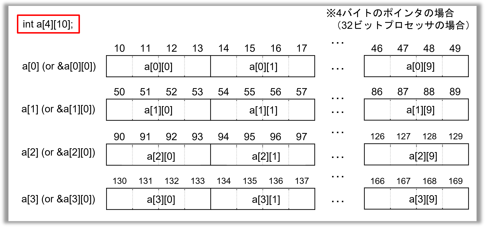
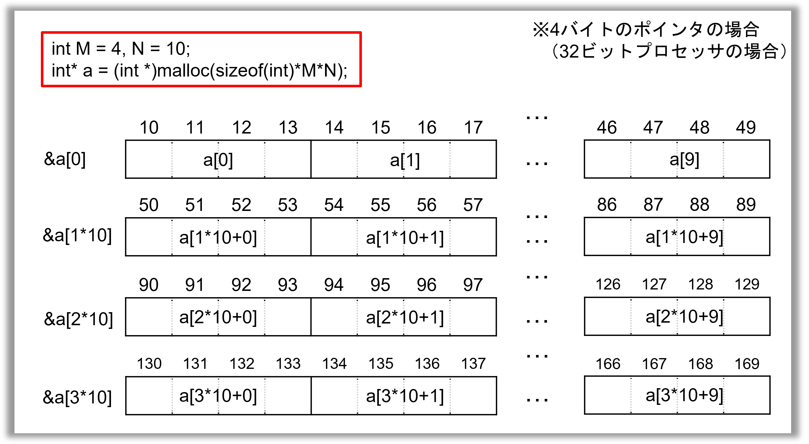

この問題では，以降の問題で使用する文字配列，整数の二次元配列，整数の最大／最小に関する関数群の一部を実装してもらう．


---
## 問題
---
以下に説明する関数群を実装し，それらの動作確認を行なうプログラムを書け．

---
### 整数引数の大小を判定する関数群とその仕様
---

+ 2つの値のうち大きい／小さい値を取得する関数`vmax_`／`vmin_`を，"三項演算子"を用いて実装すること：

  ```
  int vmax_(int a, int b){
    return a>b ? a:b;
  }

  int vmin_(int a, int b){
    ???;
  }
  ```

  `vmax_(2, 3)` なら戻り値は`3`，`vmin_(1, 3)` なら戻り値は`1`．三項演算子については，[こちら](#ternary_operator)を参照のこと．
+ 3つの値のうち最も大きい／小さい値を取得する関数`vmax3_`／`vmin3_`を，`vmax_`／`vmin_`のみを用いて実装すること：
  
  ``` 
  int vmax3_(int a, int b, int c){
    return vmax_(vmax_(a, b), c);
  }
  
  int vmin3_(int a, int b, int c){
    ???;
  }
  ```
    
  `vmax3_(3, 2 ,1)` なら戻り値は`3`，`vmin3_(2, 1, 3)` なら戻り値は`1`．

---
### 文字配列処理の関数群とその仕様
---
+ 文字配列専用でメモリ確保する関数`malloc_string_`を以下のコードを参考にして実装すること：

  ```
  char* malloc_string_(int N){
    char* str  = (???)malloc(???);  // 配列に動的メモリを割り当てる（正規の文字数N、エラー処理用の1文字、ヌル文字用の1文字）
  
    if (str == NULL) {       // メモリ確保に失敗した際のエラー処理
      fprintf(stderr, “malloc_string_(): Cannot allocate memory.\n”);
      exit(1);  // メモリ確保に失敗したら、プログラムを強制終了
    }
    
    zeros_(str, ???);   // 配列strを関数zeros_で初期化
    return ???;
  }
  ```

  + 引数は文字列の長さNで，エラー処理用の1文字と，末尾のヌル文字分を足してN+2の長さの文字配列を確保すること．
  + 関数`zeros_`によって確保した文字配列の全ての要素を初期化すること（関数`zeros_`の仕様は後述のとおり）．
  + 戻り値は，配列の先頭を指すポインタとすること．
  ※動的に確保したメモリ領域は，処理が完了した後に`free`関数で解放すること．
+ 標準入力から決められた長さの文字列を読み込む関数 `read_string_`を，以下のコードを参考にして実装すること：

  ```
  void read_string_(char *str, int N){
    int tmpchar; // 文字列前の空白・改行を除外するために使う

    // 文字列の前に空白か改行があれば全て除外する
    do {
      tmpchar = getc(stdin);
      if( tmpchar == EOF ){ // 途中で読み込みが終了したらエラー終了
        printf("read_string_(): Invalid string\n");
        exit(1);
      }
    }while( tmpchar==' ' || tmpchar=='\n' );

    ungetc(tmpchar, stdin); // 文字列を一文字stdinに戻す

    // N+1文字を標準入力から読み込む
    fgets(str, N+2, stdin); // p14のfgetsの使い方を参照
    ungetc(str[N], stdin); // 次の入力に影響しないよう，余計な空白・改行を１文字戻す

    // 文字列の長さがNよりも短い場合はエラー出力して強制終了
    for(int i=0; i<N; i++){
      if(str[i]=='\n' || str[i]==' ' || str[i]=='\0'){ // 文字列中に空白・改行・ヌル文字があれば長さが足りていない
        fprintf(stderr, "read_string_(): Invalid string\n");
        exit(1);
      }
    }
    
    // 文字列の長さがNよりも長い場合はエラー出力して強制終了
    if( !(str[N]=='\n' || str[N]==' ' || str[N]=='\0') ){ // 長さがNの場合、N+1文字目は空白 or 改行 or ヌル文字であるはず
      fprintf(stderr, "read_string_(): Invalid string\n");
      exit(1);
    }

    // fgetsで改行かスペースも読み込んでいる場合があるので，ヌル文字で上書き
    str[N] = ???;
  }
  ```
  
  + 引数は文字列の長さ`N`と，あらかじめ動的メモリ確保された文字配列のポインタ`str`で，エラー処理用の1文字と，末尾のヌル文字分を足して`N+2`の長さの文字配列を確保されていると仮定してよい．
  + 戻り値は，読み込んだ文字配列の先頭を指すポインタとすること．
  + `fgets`関数を用いて文字列の読み込みをすること．
  + 文字列の長さが引数Nよりも短い／長い場合はエラー出力して強制終了すること．
+ 文字配列の要素N個をヌル文字で初期化する関数`zeros_`を，以下のコードを参考に実装すること：

  ```
  void zeros_(char* str,  int N){
    for (int i = 0; i < ???; ++i){
      ???;  // 配列のi番目の要素をヌル文字で初期化
    }
  }
  ```

---
### 二次元配列を動的メモリ確保／解放する関数群とその仕様
---
+ 二次元配列とは，インデックスが二つある配列のことを指し，`a[i][j]`のようにアクセスする配列である．ここでは，数学でいう$M$行$N$列の行列のことを指す．
+ C言語においては，固定長の二次元配列は`int a[3][4]`のように書けるが，２番目のサイズを関数に明示的に指定しなければいけないため，非常に使い勝手が悪い（詳しくは「[固定長二次元配列を関数に渡す際の注意](#2D_array_to_func)」を参照）．
+ 動的メモリ確保によって二次元配列を実現する方法はいくつかあるが，ここではよく使われている方法で実装する（他の実現方法については，「[二次元配列を実現するその他の方法](#2D_array_others)]」を参照）．
+ C言語では二次元配列の動的メモリ確保は直接的にサポートされていないため，$1$行$N$列の一次元配列を$M$行，動的メモリ確保し，さらにそれぞれの先頭アドレスを格納するためのポインタ型の一次元配列（ポインタ配列）を動的メモリ確保する（下の図を参照）．


+ このようにすると，`a[i][j]`と書いたとき，`a[i]`は`i`行目の配列の先頭アドレスとして解釈され，`a[i][j]`は`i`行目の配列の`j`列目の要素になる．
+ `int`型の二次元配列を動的メモリ確保する関数`malloc_2d_`は，以下のとおり実装することができる：

  ```
  int** malloc_2d_(int len_x, int len_y){
    int** array_2d = (int **)malloc(sizeof(int *) * len_x); // ポインタ配列を確保
    
    if(array_2d == NULL){ // 確保失敗時のエラー処理
      fprintf(stderr, "malloc_2d_(): Cannot allocate memory.\n");
      exit(1);
    }
    
    for(int i = 0; i < len_x; ++i){ // int型配列len_x個を確保
      array_2d[i] = (int*)malloc(sizeof(int) * ???);
      if(array_2d[i] == NULL){ // 確保失敗時のエラー処理
        fprintf(stderr, "malloc_2d_(): Cannot allocate memory.\n");
        exit(1);
      }
    }
    
    return ??;
  }
  ```
  
+ この二次元配列を解放する関数`free_2d_`は，以下のとおりである：

  ```
  void free_2d_(int **array_2d, int len_x){
    for(int i = 0; i < len_x; ++i) free(???); // 先にint型配列len_x個を解放
    free(array_2d); // その後でポインタ配列を解放
  }
  ```

+ 先にポインタ配列を解放してしまうと`int`型の配列$M$行が解放できなくなってしまうため，解放の順番には注意が必要である．


---
### プログラム全体の仕様
---
+ `include`するファイルは`<stdio.h>`および`<stdlib.h>`のみとする．
+ プログラム全体の構成を以下に従うようにする．
  + `main`関数の正常終了時の戻り値を0にする．
  + 関数は前方宣言を用い，関数本体は`main`関数の下に記述する（後方定義）．
+ 以下のプログラムを必ず用いて完成させること．
  + 関数群の中身は，上記の仕様に書いてあるコードを参考にしてよい．`???`となっている箇所は自分で考えて書くこと．
  + すでに書いてあるコメント文も含め，コメント文を書く必要はない．
  + `???`となっている箇所以外は書き換えないこと．行間・インデント・スペースは変更してもよい．

```
#include <stdio.h>
#include <stdlib.h>


// 関数群の前方宣言

int vmax_(int x, int y);
int vmax3_(int a, int b, int c);
int vmin_(int x, int y);
int vmin3_(int a, int b, int c);

void zeros_(char* str, int N);
char* malloc_string_(int N);
void read_string_(char *str, int N);

int** malloc_2d_(int len_x, int len_y);
void free_2d_(int **array_2d, int len_x);


// 関数群をテストするmain関数

int main(){
  
  // 最大／最小を判定する関数群のテスト
  
  int x, y, z;
  scanf("%d%d%d", &x, &y, &z);

  printf("vmax_(%d, %d) = %d\n", x, y, vmax_(x, y));
  printf("vmax_(%d, %d) = %d\n", y, z, vmax_(y, z));
  printf("vmax_(%d, %d) = %d\n", z, x, vmax_(z, x));
  printf("vmin_(%d, %d) = %d\n", x, y, vmin_(x, y));
  printf("vmin_(%d, %d) = %d\n", y, z, vmin_(y, z));
  printf("vmin_(%d, %d) = %d\n", z, x, vmin_(z, x));

  printf("vmax3_(%d, %d, %d) = %d\n", x, y, z, vmax3_(x, y, z));
  printf("vmin3_(%d, %d, %d) = %d\n", x, y, z, vmin3_(x, y, z));


  // 文字配列処理の関数群のテスト
  
  int len;
  scanf(“%d”, &len); 
  char* str = malloc_string_(len);
  read_string_(str, len);
  printf("str = \"%s\"\n", str);
  ???;  // 動的に確保された配列strの解放


  // 二次元配列の確保／解放の関数群のテスト
  int **a;
  int len_x, len_y;
  
  scanf("%d %d", &len_x, &len_y);

  a = malloc_2d_(len_x, len_y); // 'len_x'行×'len_y'列の二次元配列の動的メモリ確保
  
  for(int i=0; i<len_x; i++){
    for(int j=0; j<len_y; j++){
      scanf("%d", &a[i][j]);
    }
  }
  for(int i=0; i<len_x; i++){
    for(int j=0; j<len_y; j++){
      if( j > 0 ) printf(" "); // 数値間にだけ空白を出力 
      printf("%d", a[i][j]);
    }
    printf("\n");
  }

  free_2d_(a, len_x); // 動的確保された二次元配列aの解放
  return 0;
} 


// 関数群の定義
...

```


---
## 実行例
---

---
### 例（1）
---

+ 入力
```
1 2 3
4 wxyz
3 3
1 2 3
4 5 6
7 8 9
```

+ 出力
```
vmax_(1, 2) = 2
vmax_(2, 3) = 3
vmax_(3, 1) = 3
vmin_(1, 2) = 1
vmin_(2, 3) = 2
vmin_(3, 1) = 1
vmax3_(1, 2, 3) = 3
vmin3_(1, 2, 3) = 1
str = "wxyz"
1 2 3
4 5 6
7 8 9
```

---
### 例（2）
---

+ 入力
```
2 1 3
1 a
1 1
1
```

+ 出力
```
vmax_(2, 1) = 2
vmax_(1, 3) = 3
vmax_(3, 2) = 3
vmin_(2, 1) = 1
vmin_(1, 3) = 1
vmin_(3, 2) = 2
vmax3_(2, 1, 3) = 3
vmin3_(2, 1, 3) = 1
str = "a"
1
```


---
## 参考情報
---
---
### 三項演算子<a name="ternary_operator"></a>
---
- 関数`vmax_`等で用いられている`(条件式) ? (真式) : (偽式)`という記法は，三項演算子と呼ばれ，(条件式)が真であれば(真式)を，偽であれば(偽式)を評価して値を返す．例えば`vmax_`は以下と等価である：

  ```
  int vmax_(int x, int y){
   if( x > y ){
     return x;
   }
    else {
      return y;
    }
  }
  ```
 
- 簡単な式であればよいが，カッコ書きや三項演算子を入れ子にするような複雑な式の場合は，if文を使用した方が見やすい：

  ```
  d = (a>b) ? ((b>c) ? c : b) : ((a>c) ? c : a );
  
  if( a > b ){
    if( b > c ) d = c;
    else d = b;
  }
  else {
    if( a > c ) d = c;
    else d = a;
  }
  ```
  
- 「真偽判定の結果に応じて異なる値を代入する」という処理はわりと登場頻度が高いので，C言語では演算子としてサポートされている．（もともと導入された経緯としては，Intelプロセッサなどで提供している"conditional move"などの条件付き命令を積極的に用いるためというのも一つある．）

---
### 二次元配列を関数に渡す際の注意<a name="2D_array_to_func"></a>
---
一次元配列を引数に取る関数を書くとき，`void test(int a[]){ ... }`のように書くことができる．その延長線上で，二次元配列を引数に取る関数も`void test(int a[][]){ ... }`と書きたくなってしまうが，この書き方ではコンパイルエラーが出てしまう．正しい書き方は，`void test(int a[][10]){ ... }`のように列のサイズを明示的に渡さないといけない．可変長二次元配列の場合は，`void test(int N, int a[][N]){ ... }`のようになる（必ず`int N`が先に渡される必要がある）．

なぜこのような書き方しか許されないのか？それは，メモリのアドレスが一次元で並んでいることに起因している．C言語の場合，固定長の二次元配列はメモリ上では一次元に以下の図のように並んでおり，$M$行$N$列の場合，`a[i][j]`は先頭から`i*N+j`番目にある．列のサイズ`N`が分からないと`a[i][j]`がどこにあるのか分からないため，`void test(int a[][]){ ... }`のような書き方ではコンパイルエラーが出る，というわけである．




---
### 二次元配列を実現するその他の方法<a name="2D_array_others"></a>
---

上述の二次元配列の実装方法は，「行間で不連続なメモリが割り当てられてしまう可能性がある」「直接的にアドレス取得できない」といった効率上の欠点があり，特に大規模数値計算には向かない．また，メモリ確保と解放をループ処理しないといけないため，煩雑になってしまう．ここでは，より実践的な方法について補足説明する．

1. 一次元配列を二次元的にアクセスする
- $M\times N$の一次元配列を`a = (int *)malloc(sizeof(int)*M*N);`と確保し，`a[i*N+j]`のようにアクセスすれば，メモリ上で連続した"二次元"配列が実現できる（下図参照）．この方法では直接的に変数にアクセスするため，より高速である．また，メモリ確保／解放は一度だけ行えばよい．

  ```
  int *a = (int *)malloc(sizeof(int)*M*N);

  for(int i=0; i<M; i++){
    for(int j=0; j<N; j++){
      a[i*N+j] = ...;
    }
  }

  free(a);
  ```

- ただし，`a[i][j]`という簡便な書き方はできない．



1. 一次元配列の各行の先頭アドレスを格納するポインタ配列を用意する
- 一番目の方法では`a[i][j]`というアクセスの仕方ができないが，各行の先頭に対応するアドレスを格納するポインタ配列を用意することで可能になる：

  ```
  int *a = (int *)malloc(sizeof(int)*M*N);
  int **p = (int **)malloc(sizeof(int*)*M);
  
  for(int i=0; i<M; i++) p[i] = &a[i*N];
  
  for(int i=0; i<M; i++){
    for(int j=0; j<N; j++){
      p[i][j] = ...;
    }
  }

  free(p);
  free(a);
  ```

  - この方法では間接なアドレス取得によるアクセスにはなってしまうが，「行間で連続なメモリが割り当てられる」ため，簡便性と高速性を両立させた書き方と言える．


---
### 固定長二次元配列と動的メモリ確保された二次元配列
---
C言語においては，固定長の二次元配列と，（上記のいずれの方法での実装でも）動的メモリ確保された二次元配列は明確に異なるデータ構造であると考えた方がよい．配列要素へのアクセスの書き方（`a[i][j]`）は同じであるものの，実際のアクセスの方法は異なり，関数への渡し方も異なる．
