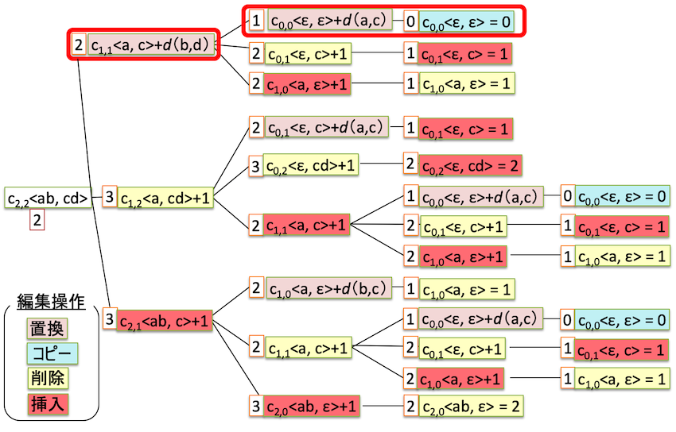

---
### 編集距離
---

2つの文字列の類似性が測定できると役に立つ場合がある．
例えば，`GATCGGCAT`と`CAATGTGAATC`の2つのDNA塩基配列に対して，次のような対応付けを行うことで，これらの塩基配列の類似度合いを調べることができる．

```
G ATCG GCAT
CAAT GTGAATC
RI==D=I=R==I
```

なお，`=`は文字が一致している箇所，`R`は文字が異なっている場所，`D`は上側に文字を挿入した箇所，`I`は下側に文字を挿入した箇所である．
また，修正前と修正後のソースコードの類似部分を見つけることで，ソースコードに加えられた変更点（diff）を調べることができる（以下の例では`=`を`==`に修正）．

```
before: if (flag = 1) { printf("found\n"); }
after:  if (flag == 1) { printf("found\n"); }
```

本課題では，2つの文字列$X = \langle x_1, x_2, ..., x_m \rangle$と$Y = \langle y_1, y_2, ..., y_n \rangle$の類似性を測定する方法として，**編集距離（edit distance）**に取り組む．


---
### 編集距離の定義
---

編集距離について理解するため，文字列$X$の先頭から任意回の**編集操作**を逐次適用していき，文字列$Y$に等しい文字列$Z = \langle z_1, z_2, ..., z_n \rangle$を得る手続きを考える．**編集操作**とは，「$X$ の 2 文字目を $Z$ の 3 番目の変数にコピーする」などの「$X$ の $i$ 番目の文字 $x_i$ の情報を使って，$Z$ の $j$ 番目の変数 $z_j$ を変更する操作」をいう．

以上を形式的に表現してみよう．まず，$Z$の初期状態を空文字列とする．$X,Z$ の編集操作の対象となる添字を変数 $i,j$ で表現し，初期状態を $i=j=1$ とする．すると，前述の手続きは，「$Y$ と等しい $Z$ を得るまで (1) 編集操作の適用，(2) 操作対象の添字 $i,j$ の更新，を繰り返す」という手続きで表現できる．ここで，可能な編集操作は，次のものとする．

+ **copy**: $X$の1文字を$Z$にコピーする．つまり，代入$z_j \gets x_i$を行い，$i$と$j$にそれぞれ$1$を加える．
+ **replace**: $X$の1文字を別の文字$\alpha$に置換する．つまり，代入$z_j \gets \alpha$を行い，$i$と$j$にそれぞれ$1$を加える．
+ **delete**: $X$の1文字を削除する．つまり，$j$を変更せずに$i$に$1$を加える．
+ **insert**: 文字$\alpha$を$Z$に挿入する．つまり，代入$z_j \gets \alpha$を行ったうえで，$j$だけに$1$を加える．

例えば，$X = \langle a,l,g,o,r,i,t,h,m \rangle$に編集操作を適用し，$Z=\langle  a,l,t,r,u,i,s,t,i,c \rangle$を得る過程の例を示す．
ここで，$X$の太字と$Z$のアスタリスク（*）は，操作対象の添字 $i,j$ を表す．$Z$ の アンダーバー (_) は，空文字を表す．

| 現在の $X$            | 適用する操作     | 操作適用後の $Z$      | 操作適用後の $i$ | 操作適用後の $j$ |
|:----------------------|:-----------------|:----------------------|:-----------------|:-----------------|
| **a** l g o r i t h m | 初期化           | * _ _ _ _ _ _ _ _ _   | 1                | 1                |
| **a** l g o r i t h m | copy             | a * _ _ _ _ _ _ _ _   | 2                | 2                |
| a **l** g o r i t h m | copy             | a l * _ _ _ _ _ _ _   | 3                | 3                |
| a l **g** o r i t h m | replace with 't' | a l t * _ _ _ _ _ _   | 4                | 4                |
| a l g **o** r i t h m | delete           | a l t * _ _ _ _ _ _   | 5                | 4                |
| a l g o **r** i t h m | copy             | a l t r * _ _ _ _ _   | 6                | 5                |
| a l g o r **i** t h m | insert 'u'       | a l t r u * _ _ _ _   | 6                | 6                |
| a l g o r **i** t h m | insert 'i'       | a l t r u i * _ _ _   | 6                | 7                |
| a l g o r **i** t h m | insert 's'       | a l t r u i s * _ _   | 6                | 8                |
| a l g o r **i** t h m | insert 't'       | a l t r u i s t * _   | 6                | 9                |
| a l g o r **i** t h m | copy             | a l t r u i s t i *   | 7                | 10               |
| a l g o r i **t** h m | replace with 'c' | a l t r u i s t i c * | 8                | 11               |
| a l g o r i t **h** m | delete           | a l t r u i s t i c * | 9                | 11               |
| a l g o r i t h **m** | delete           | a l t r u i s t i c * | 10               | 11               |
{: .table .table-striped}

一般的に，ある文字列を別の文字列に変換する編集過程は複数存在することに注意せよ．

さて，各編集操作$a$にコスト${\rm cost}(a)$が定義されているとすれば，上記の編集過程で要するコストは，次のように計算できる．

$$
4 \times {\rm cost}(\mbox{copy}) + 2 \times {\rm cost}(\mbox{replace}) + 3 \times {\rm cost}(\mbox{delete}) + 4 \times {\rm cost}(\mbox{insert})
$$

本課題では，${\rm cost}(\mbox{copy}) = 0$，${\rm cost}(\mbox{replace}) = {\rm cost}(\mbox{delete}) = {\rm cost}(\mbox{insert}) = 1$とする．したがって，編集過程のコストの総和は$9$である．

一般的に，2つの文字列$X = \langle x_1, x_2, ..., x_m \rangle$と$Y = \langle y_1, y_2, ..., y_n \rangle$，および編集操作コストが与えられたとき，**$X$から$Y$への編集距離とは，$X$を$Y$に変換する編集操作列のコストの最小値である．**

---
### 編集距離の求め方
---

編集距離を効率良く求める問題を考える．まず，**接頭辞 (prefix)** という概念を導入する．

+ ある文字列$X = \langle x_1, x_2, ..., x_m \rangle$の長さ$p \in \lbrace0, 1, ..., m\rbrace$の**接頭辞**を$X_p = \langle x_1, x_2, ..., x_p \rangle$と定義する．例えば，$X = \langle A, T, C, G \rangle$に対し，$X_2 = \langle A, T \rangle$である．$X_0$は空文字列である．

$X$の接頭辞$X_i$（$i \in \lbrace0, 1, ..., m\rbrace$），$Y$の接頭辞$Y_j$（$j \in \lbrace0, 1, ..., n\rbrace$）の編集距離を$c_{i,j}$と書くと，以下の漸化式が成り立つ．

$$
c_{i,j} = \begin{cases}
\max (i, j) & i = 0 \mbox{ または } j = 0 \mbox{ のとき} \\
\min \begin{cases}
c_{i-1, j-1} + d_{x_i \neq y_j},\\
c_{i-1, j} + 1,\\
c_{i, j-1} + 1,\\
\end{cases} & それ以外
\end{cases}
$$

ただし，$d_{x_i \neq y_j}$は，$x_i = y_j$ならば$0$，$x_i \neq y_j$ならば$1$である（注意: クロネッカーのデルタとは異なる）．
$c_{i,j}$の漸化式のうち，最小値を求める部分は次の編集操作に対応する．

+ （$x_i = y_j$の場合のみ）$c_{i-1,j-1}$: $Y_{j-1}$に$x_i$をコピー（copy）する
+ （$x_i \neq y_j$の場合のみ）$c_{i-1,j-1} + 1$: $x_i$を$\alpha$に置換（replace）して，$Y_{j-1}$に追加する
+ $c_{i-1,j} + 1$: $x_i$を削除（delete）し，$Y_j$を得る
+ $c_{i,j-1} + 1$: 新しい文字$\alpha$を挿入（insert）し，$Y_j$を得る

以上のことから，**編集距離$c_{m,n}$を求める問題は，部分問題，すなわち編集距離$c_{m-1,n-1}$, $c_{m-1,n}$, $c_{m,n-1}$を求める問題に分解できる．**


例えば，$X = \langle a, b \rangle$と$Y = \langle c, d\rangle$に対して，$c_{i,j}$は次のように求まる．$X$と$Y$の編集距離は$2$である．
<div align="center">

</div>
<div style="text-align: center;">（課題説明スライド 16ページを参照）</div>


---
## 問題
---
与えられた文字列$X$を$Y$に変換する編集距離を再帰関数により求めるプログラムを実装せよ．

---
### 仕様
---
+ 課題3-1に記載の課題全体の仕様

+ 文字列$X$，文字列$X$の先頭から$m$文字目の場所を表すインデックス$m$，文字列$Y$，文字列$Y$の先頭から$n$文字目の場所を表すインデックス$n$の4つを引数にとり，編集距離を返す再帰関数`ld`を作成すること
  + 例：
  ```
  int ld(char *X, int m, char *Y, int n);
  ```
  + 再帰を止めるタイミングは，文字列長が0になって関数を呼び出した後とする．例えば，X=a，Y=cの場合，
  ```
  c1,1
  c1,0
  c0,1
  c0,0
  ```
  の4回呼び出すものとする．

+ 文字列$X$の位置$a$の文字と文字列$Y$の位置$b$の文字が等しい場合に0，違う場合に1を返す関数`delta`を作成し，それを再帰関数`ld`の中で用いること
  + 例：
  ```
  int delta(char *X, int a, char *Y, int b);
  ```

+ 標準出力に以下の出力をする．
  + 1行目に入力文字列$X$とその長さを表示する．
  + 2行目に入力文字列$Y$とその長さを表示する．
  + 3行目に編集距離を表示する．
    + 余計な空白などは入れないこと．


+ 問題3-1に提示してある関数を`ppa_extra_h/p3_header.h`というファイルにおいてある．`#include "ppa_extra_h/p3_header.h"`という宣言を通して含め、以下の関数を必要に応じて用いること．
  + `vmax_`
  + `vmax3_`
  + `vmin_`
  + `vmin3_`
  + `zeros_`
  + `func_mallocation_char_`
  + `read_string_`


+ 以下のプログラムを必ず用いてプログラムを完成させること．
  + `???` の部分は適宜補完すること
  
```
#include <stdio.h>
#include <stdlib.h>

#include "ppa_extra_h/p3_header.h"

int delta(char *X, int a, char *Y, int b);  // ???
int ld(char *X, int m, char *Y, int n);     // ???


int main() {
  int len_x, len_y ;                   // ???
  scanf(“%d”, &len_x);                 // ???
  scanf(“%d”, &len_y);                 // ???
  char* data_x = read_string_(len_x);  // ???
  char* data_y = read_string_(len_y);  // ???

  ...(省略)...

  free(data_x);  // ???
  free(data_y);  // ???
  return 0;      // ???
}


int delta( ??? ) {

  ...(省略)...

};


int ld( ??? ) {

  ...(省略)...

}
```

+ 文字列$X$の要素$x_i$は，C言語では`x[i-1]`として表現されることに注意せよ（配列のインデックスが$0$から始まるため）．


---
## ステップに分けてプログラミング
---
この問題では，「ld関数を実装する」「ld関数を用いて編集距離を計算する」の2ステップに分けてプログラミングしてもらう．ステップごとに”動作確認”に成功しなければ，”TAに提出”が出来ないようになっている．以下では，各ステップをさらに細分化して説明する．

---
## ステップ1/2　「ld関数を実装する」
---
ここでは，ld関数を実装する．

- 重要：このステップでは，ld関数の再帰を正しく実装出来たかをチェックするために，ld関数の呼び出し回数を計算する．このため，**ステップ1/2では「ld関数の返り値は『ld関数の呼び出し回数』」とする．**

- 文字列$X$と$Y$の長さを$len_x$と$len_y$としたとき，

#### 1-1. 準備
- 「以下のプログラムを必ず用いてプログラムを完成させること．」に書かれたプログラムを書き写す．

#### 1-2. delta関数の実装
- 関数の引数を記入し，関数の中身を実装する．


---
## 実行例
---

---
### 例（1）
---

+ 入力
```
3 3 eat ate
```

+ 出力
```
eat 3
ate 3
2
```

---
### 例（2）
---

+ 入力
```
8 7 abababab abababc
```

+ 出力
```
abababab 8
abababc 7
2
```


---
## 参考文献
---

+ T. コルメン, R. リベスト, C. シュタイン, C. ライザーソン．アルゴリズムイントロダクション 第3版 総合版．近代科学社，2013年．
