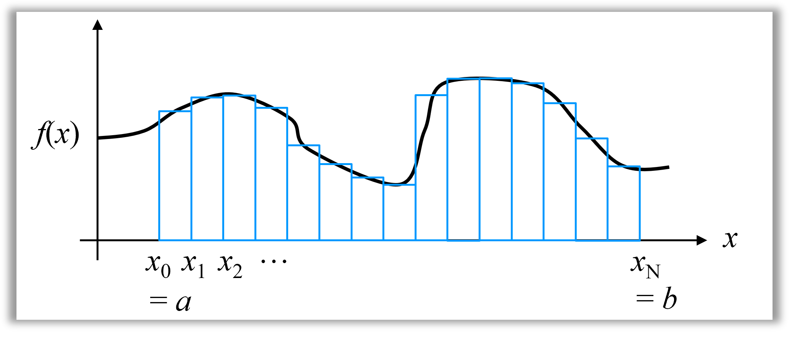
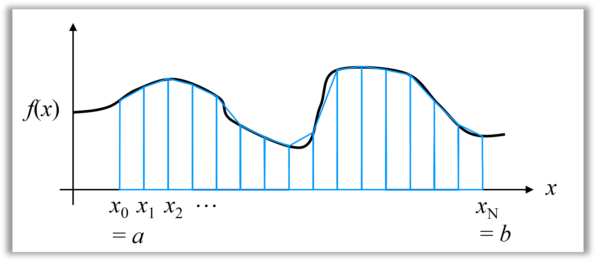

コンピュータはもともと，数式として解が得られない（解析解がない）物理方程式に対して，近似解を求めるために実現されたという経緯がある．その手法は<font color=red>数値解析</font>と呼ばれ，今日でも盛んに研究が行われている分野である．この問題では，代表的な数値解析手法である<font color=red>数値積分</font>について学ぶ．

数値解析を考える上で常に念頭に置かなくてはいけないのは，コンピュータ上では実数を表現するための精度（ざっくり言うと小数点以下の桁数）が有限であるということである．関連して，数学で言う無限大，無限小といった極限操作ができないため，いかに有限の操作で精度良く計算するかがカギとなる．

もともとの積分の定義である「リーマン和の極限」

$$
S = \lim_{N=\infty}\sum_{i=1}^{N}f(\xi_{i})\Delta x_{i} = \int_{a}^{b}f(x)dx \\
x_{i} = (b-a)i/N+a (i=0, 2, ..., N) \\
\Delta x_{i} = x_{i}-x_{i-1} (i=1, 2, ..., N)\\
x_{i-1}\le\xi_{i}\le x_{i} (i=1, 2, ..., N)
$$

から一歩立ち戻り，有限和で近似するのが数値積分法である．ただし，図？？のようにリーマン和は長方形の面積で関数の積分を近似するため，精度が悪い．ここでは，同じ$N$でもっと精度高く数値積分ができる方法をいくつか実装してもらう．



---
### 1. 台形則
---
  積分区間$[a, b]$を$N$個の区間$[x_{0}, x_{1}], [x_{1}, x_{2}], \cdots [x_{N-1}, x_{N}]\quad (x_{0} = a, x_{N}=b)$に等分すると，各区分における積分は，図2に示すように台形の面積として近似できる．
  
  
  
  式で表すと以下のようになる：

$$
\int_{x_{i-1}}^{x_{i}}f(x)dx \simeq h\left(\frac{1}{2}f_{i-1}+\frac{1}{2}f_{i}\right)\qquad(f_{i} = f(x_{i}), h = x_{i}-x_{i-1}, i = 1, 2, \cdots, N)
$$

これを全区間に適用すると，積分区間$[a, b]$における積分は以下の式で近似できる：

$$
\int_{a}^{b}f(x)dx \simeq h\left(\frac{1}{2}f_{0}+f_{1}+f_{2}+\cdots+f_{N-1}+\frac{1}{2}f_{N}\right)
$$

この式は「台形則に基づく」数値積分である．図1，図2を比較すると，台形則に基づく数値積分の方が視覚的に精度が高いことが見て取れる．

---
### 2. Simpson則
---
 台形則は，言い方を替えると，区間ごとに関数を直線で近似してから数式上で積分を行っているとも言える．区間$[x_{i-1}, x_{i}]$の端２点における関数の値から直線の式$A_{i}+B_{i}x$における$A_{i}$, $B_{i}$が求まる．この考え方を拡張すると，$x_{i-1}, x_{i}, x_{i+1}$の３点における値から関数を二次関数$A_{i}+B_{i}x+C_{i}x^2$
で近似し，数式上で積分を行うことで，より精度の高い数値積分が可能である．この方法では，区間$[x_{i-1}, x_{i+1}]$における積分は

$$
\int_{x_{i-1}}^{x_{i+1}}f(x)dx \simeq h\left(\frac{1}{3}f_{i-1}+\frac{4}{3}f_{i}+\frac{1}{3}f_{i+1}\right)\qquad(f_{i} = f(x_{i}), h = x_{i}-x_{i-1}, i = 1, 2, \cdots, N-1)
$$

と近似され，考案者の名前を取ってSimpson則と呼ばれる．全区間における積分は

$$
\int_{a}^{b}f(x)dx \simeq h\left(\frac{1}{3}f_{0}+\frac{4}{3}f_{1}+\frac{2}{3}f_{2}+\frac{4}{3}f_{3}+\cdots+\frac{2}{3}f_{N-2}+\frac{4}{3}f_{N-1}+\frac{1}{3}f_{N}\right)
$$

となる．この方法では，区間数$N$は偶数である必要がある．

---
## 問題
---

台形則，Simpson則に基づく数値積分を行なう関数を作成し，それらを使って数学関数を積分するプログラムを作成せよ．

---
## 仕様
---

プログラムは以下の仕様を満たすこと．

- 入力は，数学関数の番号（後述）である整数$n$ ($n = 1, 2, 3, 4)と，積分を行なう範囲$[a, b]$を指定する実数$a$，$b$とする：

  ```
  n a b
  ```
- 数学関数を定義するにあたり，`math.h`ヘッダをインクルードすること．
- 数学関数は以下の４つ，$f_{1}(x), ..., f_{4}(x)$である．対応するプログラム上の関数`double f1(double x), ..., double f4(double x)`を定義すること．
  - $f_{1}(x) = ...$ → `double f1(double x){ return ???; }`
  - $f_{2}(x) = ...$ → `double f2(double x){ return ???; }`
  - $f_{3}(x) = ...$ → `double f3(double x){ return ???; }`
  - $f_{4}(x) = ...$ → `double f4(double x){ return ???; }`
- 台形則，Simpson則，Simpson3/8則に基づく数値積分を行なうための関数をそれぞれ１つずつだけ作成すること．各関数は，第一引数を関数ポインタ（），第二引数を`double`型の積分開始点$a$，第二引数を`double`型の積分終了点$b$とし，積分結果を`double`型で返すこと：

  ```
  double integral_trapezoid(double (*f)(double x), double a, double b);
  double integral_Simpson(double (*f)(double x), double a, double b);
  double integral_Simpson_3_8(double (*f)(double x), double a, double b);
  ```
- 出力は，台形則，Simpson則，Simpson3/8則に基づいた数値積分の値を，空白で区切って出力すること（末尾には空白は付けない）．
- 各行の末尾には改行文字`\n`を出力すること．

---
### ステップに分けてプログラミング
---
この問題では，「関数ポインタの動作確認」「台形則に基づく数値積分の実装」「Simpson則，Simpson3/8則に基づいた数値積分の実装」の3ステップに分けてプログラミングしてもらう．ステップごとに"動作確認"に成功しなければ，"TAに提出"が出来ないようになっている．以下では，各ステップをさらに細分化して説明する．

---
### ステップ1/3　「関数ポインタの動作確認」
---

---
### ステップ2/3　「台形則に基づく数値積分の実装」
---
---
### ステップ3/3　「Simpson則，Simpson3/8則に基づいた数値積分の実装」
---


---
## 実行例
---

+ 入力
```

```

+ 出力
```

```
```

```


---
### 参考情報
---

---
#### C言語における数学関数ライブラリ
---

---
#### 関数ポインタ
---
- 
- 
