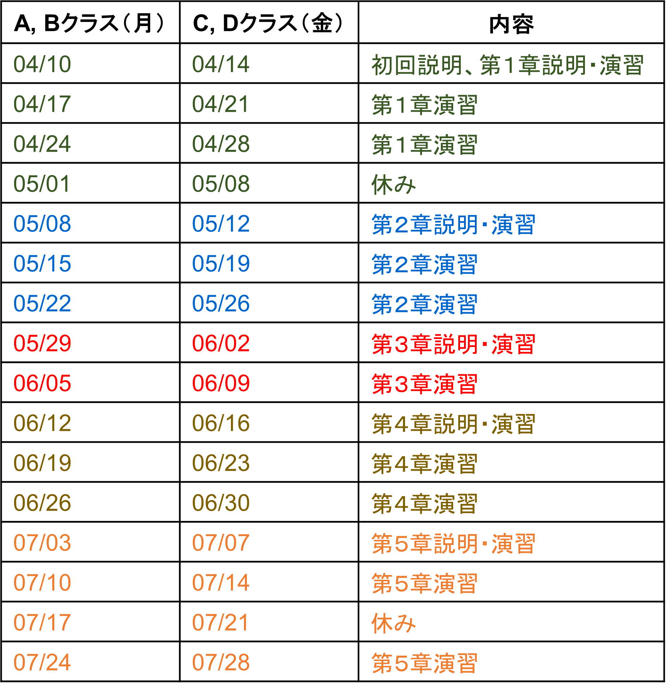

## 講義日程

## 場所

+ 各自割り当てられた教室で演習を行ないます．割り当ては個別に連絡します．以下の教室になります：
+ 月曜：[電子情報システム・応物系 南講義棟](https://www.eng.tohoku.ac.jp/map/?menu=campus&area=d&build=18)　南講義棟201/203/205室
+ 金曜：[電子情報システム・応物系 復興記念教育研究未来館](https://www.eng.tohoku.ac.jp/map/?menu=campus&area=d&build=14)　復興記念ホール

※講義・演習時間外の演習室への立ち入りに関しては，教務係に問い合わせて下さい．
