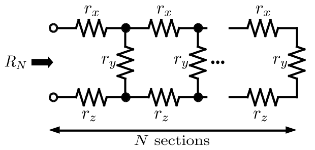
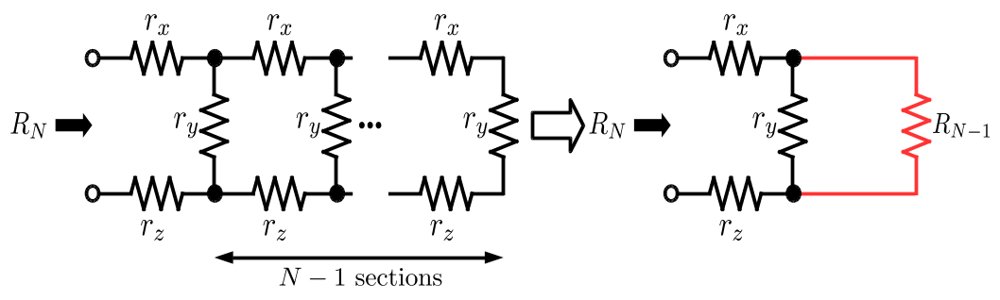

ここでは**再帰呼び出し**をする関数（**再帰関数**）を実装しよう．
再帰関数とは，自分自身を呼び出す関数のことである．

たとえば，正整数 $n$ の階乗 $f(n)=n!$ は，(1)のように定義することも，(2)のように再帰的に（自分自身を定義に含める形で）定義することもできる．

階乗の定義(1)

$$
f(n) = 1\times 2\times\dots \times n
$$

階乗の定義(2)

$$
f(n) = \begin{cases}
    1 & (n = 1) \\
    f(n-1)\times n & (\text{otherwise})
    \end{cases}
$$

ここでは，(2)のように再帰的に定義された関数を実装しよう．
再帰呼び出しを使いこなせるようになると，プログラミングの幅が大きく広がる．

## 問題

下図に示す $N$ 段梯子形回路の合成抵抗 $R_N$[Ω] を求めるプログラムを作成せよ．
回路は，3種類の抵抗 $r_x$[Ω]，$r_y$[Ω]，$r_z$[Ω] をそれぞれ $N$ 個ずつ用いて構成されている．

プログラムは以下の仕様を満たすこと(以下の仕様を満たしたプログラムに5点を加点する)．

- グローバル変数および静的変数を使用してはいけない．
- 入力
  - 入力として，段数 $N$，抵抗 $r_x$，抵抗 $r_y$，抵抗 $r_z$それぞれの値が改行で区切られて与えられる．
  - $N$，$r_x$，$r_y$, $r_z$ の値はすべて 1 以上 20 以下の整数である．
- 任意の段数 $N$ に対して合成抵抗 $R_N$ を計算する`resistance`関数を作成せよ．ただし，`resistance`関数は以下の仕様を満すこと．
  - $N$と抵抗 $r_x$， $r_y$，$r_z$ を引数とすること．
  - 合成抵抗 $R_N$ を戻り値とすること．
  - 再帰呼び出しを用いること．
    - つまり， $N$ 段梯子型回路の抵抗値を計算する際に， $N-1$ 段梯子型回路の抵抗値を利用せよ．
    - 可能な限り，`resistance` 関数を呼び出す回数を減らすこと．
- 出力
  - $R_N$ の値を標準出力へ書き出すこと．
  - $R_N$ の値は，`printf`関数のフォーマット指定を用いて小数点第3位までを表示すること．
  - 表示の末尾には改行文字`\n`を付けること．



## 実行例

`#`は標準入力，`>`は標準出力を表す．

```
# 1
# 1
# 2
# 3
> 6.000
```

```
# 5
# 1
# 3
# 5
> 8.196
```

## ヒント：$R_N$ の計算法
- $R_N$ の値はN段梯子形回路が抵抗 $r_y$ とN-1段梯子形回路の抵抗 $R_{N-1}$を並列に繋いだ回路とみなすことで再帰的に計算することができる．


