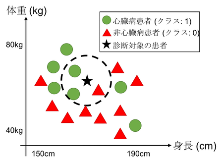

<style type="text/css">
  .center {
    text-align: center;
  }
</style>

## 問題

年齢・身長・体重などの患者の情報を与えたとき，過去の診断結果のデータベースに照らし合わせて，その患者が心臓病にかかっているかを自動判定するプログラムを作成せよ．自動判定のアルゴリズムとしてk近傍法を利用せよ．


## k近傍法による健康診断

k近傍法は，与えられたデータをある決められたカテゴリ（**クラス**）に分類するアルゴリズムの一種である．入力データが与えられたとき，最も近い過去の分類の事例 $k$ 個を探し出し，多数決により入力データのクラスを決定する．一般に，データは $d$ 次元の空間（**特徴空間**）における点として表現される．

本課題では，データを患者，クラスを診断結果（`0`: 心臓病でない か `1`: 心臓病である）に対応させてk近傍法を適用する．簡単のため，(身長, 体重) という二次元の特徴空間を考えた場合の例を図1に示す．●と▲はそれぞれ過去の分類事例，すなわち過去に受信した患者に対する診断結果を示しており，★がこれから診断を行う対象の患者を示す．ここでは身長170cm, 体重65kg の患者を想定する．

{: .center}

<br />図1. k近傍法による心臓病診断

k近傍法に基づく健康診断の具体的な計算手順を説明する．まずはじめに，過去の診断結果のうち，診断対象の患者に最も近い $k$ 名の患者を探し出す．ここでは $k=3$ の場合を考えよう．「近い」とは，どのような距離尺度を基準としてもよいが，本課題ではユークリッド距離を用いる．図1では，下記のような近傍 3 患者が見つかっている（点線内を参照せよ）．

- 心臓病と診断された患者: 2名
- 心臓病と診断されなかった患者: 1名

最後に多数決を取り，診断対象の患者の診断を下す．ここでは「心臓病である」と診断することになる．

なお，実際の場面ではデータをより正確に表現するため，より高次元の特徴空間が用いられる．例えば，本課題のテストケースの一部となっている[米医療機関 Cleveland Clinic Foundation 提供の心臓病診断に関するデータセット (カリフォルニア大学公開)](http://archive.ics.uci.edu/ml/datasets/Heart+Disease)では，13 次元の特徴空間において患者を表現している．それぞれの次元は，年齢・性別・胸の痛みの種類（4種類）・血圧・コレステロール値などに対応している（詳細は前述のリンク参照）．


## 入力データ

下記の形式により標準入力から与えられるものとする．


### 過去の診断データ

初めの二行で，過去の診断データの個数 $n$ と，特徴空間の次元数 $d$（患者の特徴を示す数値データの個数）が与えられる．

```
200
13
```

続いて，$n$ 個の過去の診断データが与えられる．1行につき心臓病診断の結果1件が与えられ，合計 $n$ 行のデータが与えられる．

診断結果1件は，患者の特徴を示す $d$ 個の数値データ（性別，身長，体重など）と，診断結果（`0` = 心臓病と診断されなかった or `1` = 心臓病と診断された）の組合わせからなる．スペース区切りで，次のような書式で与えられる（`⊔`は半角スペースを表す）．

```
63.0⊔1.0⊔1.0⊔145.0⊔233.0⊔1.0⊔2.0⊔150.0⊔0.0⊔2.3⊔3.0⊔0.0⊔6.0⊔0
53.0⊔1.0⊔4.0⊔140.0⊔203.0⊔1.0⊔2.0⊔155.0⊔1.0⊔3.1⊔3.0⊔0.0⊔7.0⊔1
57.0⊔1.0⊔4.0⊔140.0⊔192.0⊔0.0⊔0.0⊔148.0⊔0.0⊔0.4⊔2.0⊔0.0⊔6.0⊔0
... (以下197行続く) ...
```


### 自動診断の対象となる患者データ

過去の診断データに引き続いて，本課題が自動診断の対象とする患者のデータが与えられる．過去の診断データと同様に，$d$ 個の数値データからなる（ただし，ここでは「診断結果」が与えられていないことに注意せよ）．

```
50.0⊔0.0⊔3.0⊔120.0⊔219.0⊔0.0⊔0.0⊔158.0⊔0.0⊔1.6⊔2.0⊔0.0⊔3.0
```


## 要求仕様

以上を入力として受け取り，k近傍法を利用して自動健康診断を行う人工知能を実現せよ．本課題では，下記の3つの仕様を満たすこと（以下の仕様を満たしたプログラムに5点を加点する）．

- (1) 標準入力より過去の診断結果のデータを読み込み，$n$ 次元の `int` 配列，$n \times a$ 次元の `double` 型の配列を動的に確保し，過去の診断結果を保存せよ．プログラムの終了前に，確保した配列を解放せよ．
- (2) k近傍法により心臓病か否かの診断結果（`0`: 心臓病でない or `1`: 心臓病である）を返す関数 `knn_diag` を作成せよ．このとき，
    - (2a) 診断対象の患者を表す $n$ 次元の `double` 型の配列と，多数決に用いる近傍事例の数を引数として取れ．
    - (2b) k近傍法における「距離」としてユークリッド距離を用いよ．
    - (2c) クラスの決定に用いた近傍事例を `距離（実数値）⊔診断結果のクラス（0 or 1）\n` の形式で，距離の近い順に出力せよ（`⊔` は半角スペース，`\n` は改行を表す）．

診断結果の出力については，下記の仕様を満たせ．

- (3) 標準入力から読み込んだ診断対象の患者の数値データに対して，`knn_diag` 関数による心臓病診断を行い，心臓病ならば `You have a heart disease!`，そうでなければ `You are healthy!` と表示せよ（文の末尾に改行 `\n` を挿入せよ）．k近傍法における $k$ の値は `3` とせよ．

一見複雑に見えるが，これまでに学んだ「配列の動的確保」「ソート」の知識を応用することで人工知能を実現できる．問題を小さく分解し，着実に一つずつ解いてみよう．必要に応じて，ページ下部のヒントも参考にしてほしい．


## 実行例

```
$ ./a.out
```


## 出力例

`#`は標準入力，`>`は標準出力を表す．

```
# 4
# 1
# 3.0 1
# 1.0 0
# 5.0 1
# 4.0 0
# 0.0
> 1.000000 0
> 3.000000 1
> 4.000000 0
> You are healthy!

# 5
# 2
# 180.0 60.0 0
# 164.0 90.0 1
# 151.0 80.0 1
# 153.0 50.0 0
# 172.0 40.0 0
# 150.0 60.0
> 10.440307 0
> 20.024984 1
> 29.732137 0
> You are healthy!
```


## ヒント

- (1): $n \times a$ の配列の作り方: これまでに学んできた `int` 型の配列と同様の考え方をしてみよう．`int` 型の配列では，配列の各要素 (`A[0]` など) は `int` 型の変数であった．では，配列型 (例えば `int*`) の配列を作れば...？ 各要素は配列を表す変数となり，これに対してさらに配列を動的に確保することも可能になる．こうすれば，`A[0][0]` のような二次元配列が実現できる．`int` の二次元配列の変数は，`int**` 型で宣言する．
- (2): (1) で読み込んだ過去の診断結果をグローバル変数として保持し，ここで利用してよい．
- (2): 2点間 $U=(u_1, u_2, ..., u_n), V=(v_1, v_2, ..., v_n)$ のユークリッド距離は $\sqrt{(u_1 - v_1)^2 + (u_2 - v_2)^2 + ... + (u_n - v_n)^2}$ で与えられる．平方根の計算は，`math.h` を `#include` した上で `sqrt` 関数により実現できる．
- (2): k近傍法のプログラムは次のような考え方で組むと良い．
    1. 診断対象の患者データと，すべての過去の診断データとのユークリッド距離を計算する.
    2. 診断対象の患者データから距離の短い上位 $k$ 個のデータのクラスで多数決をとる.
        - 計算したユークリッド距離を基準として過去の診断結果をソートし，頭から $k$ 個で多数決を取ればよい．距離を基準としたソートは様々な方法で実現できるが，例えば課題2-2で学んだ選択ソートに一行加えるだけで実現できる（変数の値を入れ替える部分で，距離だけでなく診断結果も入れ替えればよい）．


## 余談

今回はk近傍法を健康診断に応用したが，k近傍法は一般的な分類アルゴリズムであり，特徴空間の次元の意味とクラスの定義を変えることにより，原理上は心臓病診断だけでなくどのような分類も行うことができる．例えば，先に紹介した[カリフォルニア大学のデータ集](https://archive.ics.uci.edu/ml/)で公開されている，[不整脈の予測](https://archive.ics.uci.edu/ml/datasets/Arrhythmia)，[エルニーニョ予測](https://archive.ics.uci.edu/ml/datasets/El+Nino) といった分類問題にも本課題で作ったプログラムが適用できる．


## 謝辞

自動採点システムのテストケースの一部は，米医療機関 Cleveland Clinic Foundation 提供の[心臓病の診断結果のデータセット](http://archive.ics.uci.edu/ml/datasets/Heart+Disease)をもとに作成した．
